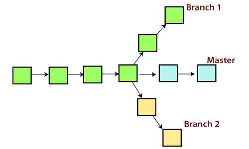
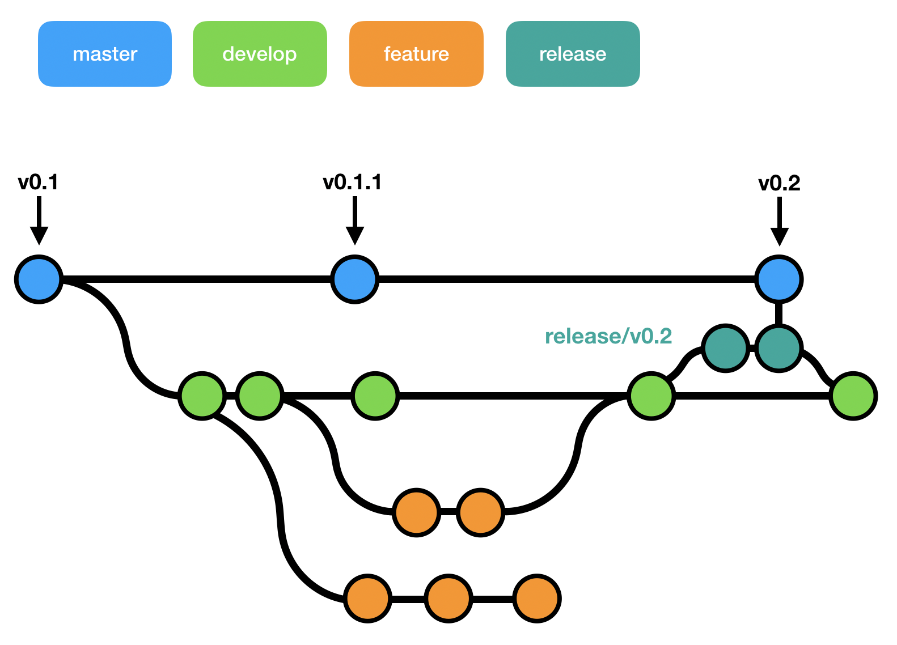

# Šta je Github

**Github** je platforma za hostovanje koda koja koristi **git** kao sistem za kontrolu verzija.

**Sistem za verzionisanje (VCS - Version Control System)** je sistem koji je zadužen za čuvanje i kontrolisanje izmena programskih kodova, dokumenata.

**Alternative:** 

- Gitlab
- AWS CodeCommit

## Zašto se koristi sistem za kontrolu verzija?

Situacije u kojima je sistem za kontrolu verzija koristan:
- Ako smo napravili promene u kodu i onda nakon nekog vremena smo shvatili da je ta promena greška;
- Ako izgubimo lokalne podatke, onda možemo preuzeti podatke poslednje verzije;
- Ako želimo da uporedimo kod sad i pre;
- Ako želimo da dokažemo da je određena promena izazvala greške;
- Ako želimo da analiziramo istoriju koda;
- Ako želimo da delimo kod sa drugim ljudima;
- Ako želimo da dodamo novu "eksperimentalnu" funkcionalnost, ali da ne menjamo trenutni kod.

## Pravljenje naloga

Github nalog može da se napravi na [zvaničnoj github stranici](https://github.com/).

## DVCS vs CVCS

**Definicije:**

- `DVCS (Distributed Vecrsion Control System)`: Distribuirani sistem za kontrolu verzija. Primer: `git`.

- `CVCS (Centralized Version Control System)`: Centralizovani sistem za kontrolu verzija. Primer: `SVN`.

**Razlike:**

- Centralizovani sistem za kontrolu verzija podrazumeva arhitekturu server i klijenta. Repozitorijum (mesto na kojem se čuvaju verzije koda) se nalazi na centralnom serveru i postoji samo jedan repozitorijum. Kada klijent (razvijaoc) želi da postavi novu verziju koda ili da dohvati novu verziju koda mora da komunicira sa centralnim serverom (neophodan je mrežni pristup). Često se pristup repozitorijumu omogućava preko `VPN (Virtual Private Network)`-a.
- Distribuirani sistem nije toliko drugačiji od centralizovanog sistema za kontrolu verzija i lako je prilagođavanje sa jednog sistema na drugi. Razlika je u tome što što pored "centralnog servera" (ne mora da samo jedan), svaki klijent (razvijaoc) ima lokalni repozitorijum (kao lokalni server). Verzije koda mogu da se ažuriraju na lokalnom repozitorijumu (nije neophodan mrežni pristup), a kasnije da se te izmene postave na `glavni repozitorijum` (neophodan mrežni pristup).


**Pitanje:** Kada treba da koristimo `CVCS` a kada `DVCS`?

# Uvod u Git

## Instalacija (linux)

Za linux distribuciju je dovoljno da se pokrenu sledeće komande u okviru terminala za instalaciju osnovnih git operacija:
`sudo apt install git-all`
`sudo apt install git-extra`

## Dokumentacija

Kao i za linux komande i C funkcije, postoje `man` strane za git komande: `man git [KOMANDA]`

Primeri:
- `man git init`
- `man git commit`
- `man git branch`

Na sledećem [linku](https://git-scm.com/doc) možete pronaći dokumentacija koja je identična sa man stranama.

## Kreiranje git repozitorijuma

Lokalni repozitorijum možemo da napravimo tako što koristimo komandu `git init` koja 
pravi prazan git repozitorijum tj. kreira `.git` direktorijum koji je neophodan za rad sa git operacijama. Informacije kao što je istorija komitova se
čuvaju u okviru ovog direktorijuma. Komanda `git clone` takođe kreira `.git` direktorijum.

**Primer**. Kreiranje git repozitorijuma:

- Potrebno je prvo da napravimo novi direktorijum:
  * `mkdir FirstGitRepo`
- Potrebno da se pozicioniramo u taj direktorijum:
  * `cd FirstGitRepo`
- Sada možemo da od ovog `FirstGitRepo` repozitorijuma napravimo git repozitorijum:
  * `git init`, Očekivani oblik rezultat:

```
Initialized empty Git repository in /home/mokoyo/Desktop/AZRS/cas01/VectorExtension/.git/
```

- `ls -a`, Očekivani oblik rezultata:

```
.  ..  .git
```

**Napomena:** Na Linux-u su sve datoteke oblika `.[IME]` sakrivene u smislu da se ignorišu od strane `ls` komande. Ako se pokrene `ls` komanda, ne može se da se vidi `.git` direktorijum. Potrebno je da se doda opcija `-a` tj. da se koristi komanda `ls -a`.

## Indeks

Kada menjamo kod na računaru, zapravo ažuriramo `radni direktorijum (working directory/working tree)`. Te promene se ne ažuriraju u okviru git repozitorijuma dok se eksplicitno ne dodaju i onda komituju na lokalni repozitorijum. 

Komandom `git add [IME DATOTEKE]` se datoteka dodaje na `oblast za postavljanje (staging area)`, koja
otprilike predstavlja sledeći potencijalni komit tj. izmenu lokalnog repozitorijuma. Komandom `git commit` se zapisuju izmene zabeležene u okviru `staging area` na git repozitorijum (beleži se u `.git/objects`).\
\
Potrebno je da se nekako razlikuju promene datoteka u okviru tri sekcije (za sada se sve posmatra lokalno):

- radni direktorijum,
- oblast za postavljanje,
- git repozitorijum.

Ove promene se beleže u `indeksu` tj. `.git/index` datoteci.

Koristeći kamandu `git status` možemo da vidimo promene posle poslednjeg komita tj. promene u okviru radnog direktorijuma koji se nalaze u `staging area` i promene koje se ne nalaze u okviru `staging area` (nalaze se samo u okviru radnog direktorijuma). 

**Primer: Ekstenzija za vektor kolekciju standardne C++ biblioteke**. Hoćemo da napravimo mini biblioteku za funkcije koje ne postoje u standardnoj biblioteci za rad sa vektorima ili postoje, ali ako implementiramo našu verziju, onda imamo veću fleksibilnost u načinu na koji koristimo te funkcije. Konkretno, želimo da implementiramo `load` (učitava vektor iz toka podataka) i `store` (upisuje vektor u tok podataka) funkcije.

Kreiranje git repozitorijuma:

- `mkdir VectorExtension`
- `cd VectorExtension`
- `git init`, Očekivani oblik rezultata:
```
Initialized empty Git repository in /home/mokoyo/Desktop/AZRS/cas01/VectorExtension/.git/
```
- Možemo da napravimo datoteke `main.cpp` i `input.txt` i da ih dodamo u `lokalni git repozitorijum`:
    * `touch main.cpp input.txt`, komanda `touch` pravi prazne datoteke.
    * `git add main.cpp input.txt`, ovom komandom su dodate datoteke na `staging area`. Alternativa: `git add *` (`*` je sve).
    * `git commit -m "Inicijalni komit"`, ovom komandom su komitovane promene u git repozitorijum sa odgovarajućim opisom (deo posle `-m`. Očekivani rezultat:
```
[master (root-commit) 4fabb01] Inicijalni komit
 2 files changed, 0 insertions(+), 0 deletions(-)
 create mode 100644 input.txt
 create mode 100644 main.cpp
```

**Primer**. Rad sa `staging area`:

- U radnom direktorijumu sada postoje dve datoteke (napravljeni u okviru prethodnog komita):
    * `main.cpp`
    * `input.txt`
- Implementiramo skelet za `main.cpp`:

```c++
#include <iostream>
#include <vector>

int main()
{
	return 0;
}
```

* `echo "1 2 3" >> input.txt`, Objašnjenje: `echo "1 2 3"` ispisuje `1 2 3` u terminalu (standardni izlaz), a `>>` preusmeruje taj izlaz u datoteku `input.txt`. Razlika između `>>` i `>` je u tome što `>` vrši `trunc` operaciju (briše sadržaj), a `>>` dodaje izlaz na kraj datoteke tj. vrši `append` operaciju.

- Komanda `git status` nam daje informacije o stanju naših datoteka u repozitorijumu tj. da li se datoteka nalazi u `working directory` (odnosno ima izmene koje nismo obeližili za sledeći komit), da li se datoteka nalazi u `staging area` (odnosno ima izmene koje smo obeležili za sledeći komit), ili se sadržaj repozitorijuma poklapa sa verzijom lokalnog repozitorijuma (nema izmena od poslednjeg komita). Očekivani rezultat komande `git status`:
```
On branch master
Changes not staged for commit:
  (use "git add <file>..." to update what will be committed)
  (use "git restore <file>..." to discard changes in working directory)
	modified:   input.txt
	modified:   main.cpp

no changes added to commit (use "git add" and/or "git commit -a")
```
- Izvršimo sad komandu `git add main.cpp`.
- Očekivani rezultat `git status` komande je:
```
On branch master
Changes to be committed:
  (use "git restore --staged <file>..." to unstage)
	modified:   main.cpp

Changes not staged for commit:
  (use "git add <file>..." to update what will be committed)
  (use "git restore <file>..." to discard changes in working directory)
	modified:   input.txt
```
- Ovo znači da se promene za `main.cpp` nalaze u okviru `staging area`, jer se izvršena komanda `git add` i zbog toga će te promene biti zabeležene na git repozitorijum kad se pozove `git commit` komanda, dok će promene na `input.txt` ostati samo u okviru radnog direktorijum.
- Komandom `git reset main.cpp HEAD` sklanjamo promene sa `staging area` i one neće biti zabeležene sledećim komitom. Možemo opet testirati komandu `git status`. Očekivani oblik rezultata (`M` je oznaka za `modified`):

```
Unstaged changes after reset:
M	input.txt
M	main.cpp
```

- Dodajmo sve izmene na `staging area` komandom `git add *` i komitujmo izmene komandom `git commit -m "Implementiran je skelet koda"

**Napomena:** Datoteka `.git/index` je binarna datoteka i na sledećem [linku](https://mincong.io/2018/04/28/git-index/) se može pročitati detaljnije o strukturi indeksa.

## Istorija projekta

Komandom `git log` se u terminalu ispisuje istorija komitova:
```
commit f7d0d1d4f453fc3401a130e6376988e74283e238 (HEAD -> master)
Author: Robotmurlock <momir.adzemovic@gmail.com>
Date:   Sat Oct 2 13:59:24 2021 +0200

    Implementiran je skelet koda

commit 4fabb0111b8330dc45fd6cda7a3ae3b8134326ee
Author: Robotmurlock <momir.adzemovic@gmail.com>
Date:   Sat Oct 2 13:45:19 2021 +0200

    Inicijalni komit
```

Svaki komit ima svoj `SHA-1 hash` koji jedinstven. Koriste se različiti metapodaci kao što su ime autora, vreme komita, ... za računanje heš koda. Heš kod je jedinstven.

Skraćena verzija `git log --pretty=oneline`:
```
f7d0d1d4f453fc3401a130e6376988e74283e238 (HEAD -> master) Implementiran je skelet koda
4fabb0111b8330dc45fd6cda7a3ae3b8134326ee Inicijalni komit
```

Ako se doda opcija `--graph` ispisuje se stablo što je korisno ako želimo da vizuelizujemo grane (branches): `git log --graph`, ali umesto toga može da
se koristi neki softver za vizuelizaciju. Očekivani oblik rezultat:

```
* f7d0d1d4f453fc3401a130e6376988e74283e238 (HEAD -> master) Implementiran je skelet koda
* 4fabb0111b8330dc45fd6cda7a3ae3b8134326ee Inicijalni komit
```

- Sa `*` je označeno stablo komitova koje je trenutno linearno. To neće važiti kada počnemo da koristimo grane.

Postoji ogroman broj opcija i različiti formati za komandu `git log`: `man git log`.

## Definisanje aliasa

Možemo definisati aliase (skraćenice) za neke duže komande.

Primer:
- `git config --global alias.ci commit`

Ovo je korisno ako često koristimo neku komandu sa istim parametrima (dodatnim opcijama). 

**Primer**. Istorija:

- `git config --global alias.hist "log --pretty=format:'%h %ad | %s%d [%an]' --graph --date=short"`
- `git hist`, Očekivani oblik izlaza:

```
* f7d0d1d 2021-10-02 | Implementiran je skelet koda (HEAD -> master) [Robotmurlock]
* 4fabb01 2021-10-02 | Inicijalni komit [Robotmurlock]
```

## Verzije

Postoji opcija da se vratimo na određeni komit. To znači da se sve promene koje postoje između trenutnog komita i komita na koji se prelazi postaju invertovane u okviru radnog repozitorijuma.
- Prelazak na drugi komit: `git checkout [KOMIT HES]`;
- Komandom `git log --pretty=oneline` se prikazuju komitovi sa njihovim heš kodovima;
- Primer: `git checkout 4fabb0111b8330dc45fd6cda7a3ae3b8134326ee` (zameniti sa pravim nazivom). Sada smo se vratili na prvi komit i ako pokrenemo `cat main.cpp` ili `cat input.txt`, vidimo da su prazne datoteke.
- Prethodni primer predstavlja skok na "apsolutnu verziju". Alternativa je da se skače na "relativnu verziju" preko "pokazivača" na trenutni komit `HEAD`.
- Primer: `git checkout HEAD~` skače na prethodni komit.
- Primer: `git checkout HEAD~2` skače na pretprethodni komit. Možemo da izaberemo proizvoljan broj.
- Primer: `git checkout HEAD` skaeče na trenutni komit.
- Primer: `git checkout master` skače na najnoviji komit na `master` grani.

Takođe je moguće stavljati tagove verzija na bitne komitove. Na te komitove možemo da skočimo na sledeći način: `git checkout [TAG]`. Ako postavimo tag, onda ne moramo da pamtimo heš indeks tog bitnog komita.

**Primer**.

- `git tag v1`, postavlja se tag `v1` na trenutni komit;
- `git checkout HEAD~`, skače se na prethodni komit;
- `git tag v1-prior`, postavlja se tag `v1-prior` na trenutni komit;
- `git checkout v1`, skače se na komit sa `v1` tagom.

**Pitanje:** Koje komitove želimo da označimo?

## Invertovanje poslednjeg komita

Šta ako smo izvršili komit i shvatili da su to zapravo loše promene i da ih treba odbaciti. Sledećom komandom se pravi novi komit koji invertuje promene poslednjeg komita. Ako je komit koji se briše imao poruku `[PORUKA]`, onda će novi komit imati poruku `Revert "[PORUKA]"`.

**Primer**. Treba nam funkcija koja obrće redosled elemenata u vektoru. Implementacija:

```c++
void reverse(std::vector<int>& v)
{
	unsigned n = v.size();
	for(unsigned i=0; i<n/2; i++)
		std::swap(v[i], v[n-1-i]);
}
```

- Dodatno inicijalizujemo vektor sa elementima `{1, 2, 3, 4 5}`

```c++
std::vector<int> v{1, 2, 3, 4, 5};
```

- Pregled cele `main.cpp` datoteke:

```c++
#include <iostream>
#include <vector>

void reverse(std::vector<int>& v)
{
    unsigned n = v.size();
    for(unsigned i=0; i<n/2; i++)
        std::swap(v[i], v[n-1-i]);
}

int main()
{
    std::vector<int> v{1, 2, 3, 4, 5};
    reverse(v);
    for(auto value: v)
        std::cout << value << " ";
    std::cout << std::endl;
    return 0;
}
```

- Dodajemo `main.cpp` na `staging area`: `git add main.cpp`
- Komitujemo izmene: `git commit -m "Implementirana je funkcionalnost obrtanja"`
```
* e8712f8 2021-10-02 | Implementirana je funkcionalnost obrtanja (HEAD -> master) [Robotmurlock]
* f7d0d1d 2021-10-02 | Implementiran je skelet koda [Robotmurlock]
* 4fabb01 2021-10-02 | Inicijalni komit [Robotmurlock]
```
- **Problem:** Nakon daljeg istraživanja smo saznali da ova funkcionalnost već postoji u standardnoj biblioteci kao `std::reverse`. Nema potrebe da implementiramo stvari koje već postoje.
- Sledeća komanda otvara interfejs, gde možemo da biramo ime za komit koji briše poslednji komit (komit pre ovog): `git revert HEAD`. Sadržaj komita:

```
Restauracija: Implementirana je funkcionalnost obrtanja

Nakon daljeg istraživanja smo saznali da ova funkcionalnost već postoji u standardnoj biblioteci kao `std::reverse`. 
Nema potrebe da implementiramo stvari koje već postoje.

sha: e8712f8
```

- Kada završimo sa izmenama, neophodno je da se sačuva sadržaj i isključi interfejs (editor). 

- **Napomena:** Isti interfejs se otvara i kada izvršimo `git commit` bez `-m` opcije. Interfejs je zapravo podrazumevani editor. Možemo da podesimo podrazumevani editor sledećom komandom: `git config --global core.editor kate` (umesto kate može bilo koji editor).
- Očekivani sadržaj za `main.cpp`:

```c++
#include <iostream>
#include <vector>

int main()
{
	return 0;
}

```

- Očekivani oblik rezultata za `git hist`:
```
* a76882e 2021-10-02 | Restauracija: Implementirana je funkcionalnost obrtanja (HEAD -> master) [Robotmurlock]
* e8712f8 2021-10-02 | Implementirana je funkcionalnost obrtanja [Robotmurlock]
* f7d0d1d 2021-10-02 | Implementiran je skelet koda [Robotmurlock]
* 4fabb01 2021-10-02 | Inicijalni komit [Robotmurlock]
```

- Ovaj niz komandi ne menja datoteke, ali u istoriji ostaje obrisan komit, posle kojeg ide komit koji je taj prethodni komit "obrisao". To znači da se git drvo ne ažurira (u smislu da stari komit ostaje). Ako je potrebno da se promeni i git drvo, onda koristimo komandu `git reset --hard [KOMIT]` (ovaj pristup nije preporučen). 
- Ako kasnije shvatimo da nam je ipak ta funkcionalnost bila neophodna, onda možemo da da se vratimo na taj komit `checkout` komandom.

**Primer**. Sada ćemo da napravimo praznu datoteku `bad.txt`, da je komitujemo, a onda da obrišemo taj komit komandom `git reset --hard [KOMIT]`.

- `touch bad.txt`
- `git add bad.txt`
- `git commit -m "Dodata je losa datoteka bad.txt"`. Očekivani oblik izlaza

- Očekivani oblik rezultata za `git hist:
```
* 12debba 2021-10-02 | Dodat je los datoteka bad.txt (HEAD -> master) [Robotmurlock]
* a76882e 2021-10-02 | Restauracija: Implementirana je funkcionalnost obrtanja (HEAD -> master) [Robotmurlock]
* e8712f8 2021-10-02 | Implementirana je funkcionalnost obrtanja [Robotmurlock]
* f7d0d1d 2021-10-02 | Implementiran je skelet koda [Robotmurlock]
* 4fabb01 2021-10-02 | Inicijalni komit [Robotmurlock]
```
- `git reset --hard HEAD~` (resetujemo na stanje pretposlednjeg komita)
- Očekivani oblik rezultata za `git hist`:
```
* a76882e 2021-10-02 | Restauracija: Implementirana je funkcionalnost obrtanja (HEAD -> master) [Robotmurlock]
* e8712f8 2021-10-02 | Implementirana je funkcionalnost obrtanja [Robotmurlock]
* f7d0d1d 2021-10-02 | Implementiran je skelet koda [Robotmurlock]
* 4fabb01 2021-10-02 | Inicijalni komit [Robotmurlock]
```

- Vidimo da se poslednji komit sada obrisan, kao da se ništa nije desilo. Očekivani izlaz za komandu `ls -a`:

```
input.txt  main.cpp
```

- **Napomena:** Ova komanda briše komit u istoriji i briše promene u radnom direktorijumu. **Veoma opasno** i mogu se obrisati bitne promene koje su dodate prethodnim komitom ili slično. Umesto opcije `--hard` se može koristiti opcija `--soft` koja ne briše lokalne promena nad datotekama, ali briše na repozitorijumu.

  

- To što smo obrisali poslednji komit ne znači da je on potpuno obrisan. Ako relativno brzo reagujemo, možemo da povratimo obrisane izmene pomoću komande `git reflog`. Očekivani oblik izlaza:

```
a76882e (HEAD -> master) HEAD@{0}: reset: moving to HEAD~
7b1440b HEAD@{1}: reset: moving to 7b1440b
7b1440b HEAD@{2}: commit: Dodata je losa datoteka bad.txt
a76882e (HEAD -> master) HEAD@{3}: revert: Restauracija: Implementirana je funkcionalnost obrtanja
e8712f8 HEAD@{4}: commit: Implementirana je funkcionalnost obrtanja
f7d0d1d HEAD@{5}: checkout: moving from 4fabb0111b8330dc45fd6cda7a3ae3b8134326ee to master
4fabb01 HEAD@{6}: checkout: moving from master to 4fabb0111b8330dc45fd6cda7a3ae3b8134326ee
f7d0d1d HEAD@{7}: commit: Implementiran je skelet koda
4fabb01 HEAD@{8}: commit (initial): Inicijalni komit
```

- Komandom `git checkout 7b1440b` se vraćamo na obrisani komit gde su sve izmene tog komita sačuvane.

## Izmena poslednjeg komita

Recimo da smo ažurirali `README.md` datoteku i primetili smo da ima stamparske greške. Jedan način da se ovo reši je da se komituju ispravke kao novi komit. Alternativa je da se koristi `--amend`, gde se stari komit zamenjuje sa novim.

**Primer**:

- `vim README.md` (izmeniti datoteku, može i `kate` ili bilo koji drug editor umesto `vim`-a). Neka je sadržaj `# VectorExtension`.
- `git add README.md`
- `git commit -m "Dodat je README.md"`
- Možemo naknadno da izmenimo poslednji komit.
- `vim README.md` (popraviti greške);
- `git add README.md`
- `git commit --amend -m "Dodat je README.md"`;

**Napomena:** Opciju `--amend` treba da koristimo samo za komitove koji nisu deljeni sa ostalim članovima tima. Problem je u tome što vrši izmene nad `git` grafom, jer ova opcija zapravo obriše stari komit i zameni ga novim (u to možemo da se uverimo tako što uporedimo njihove heš kodove).

## Brisanje i pomeranje datoteka

Slično kao komande `mv` i `rm` na linux sistemima, postoje analogne komande `git mv` i `git rm` koje dodaju promene na `staging area`, što znači da je potrebno komitovati promene.

Ako želimo da se datoteka obriše iz git repozitorijuma, ali da ostane u radnom direktorijumu, koristi se komanda `git rm --cached [IME DATOTEKE]`

**Primer**. Potrebno je pomeriti `main.cpp` datoteku u `src` direktorijum: 

- `git mv main.cpp src`

**Primer**. Potrebno je obrisati `1.txt` i `2.txt` datoteke:

- `git rm 1.txt 2.txt`

## Branching (grananje)



Do sada smo sve radili na jednog grani tj. `master` grani (podrazumevano ime za inicijalnu granu). Zbog toga je naš graf izgledao linearno (kao lista, a ne graf). U opštem slučaju `git` graf je `DAG (Directed Acyclic Graph)` graf. U ovoj sekciji ćemo obraditi način kreiranja grana i njihove primene.

### Kreiranje grane

Nova grana se kreira komandom `git branch [IME GRANE]`. Da bismo skočili na drugu granu, potrebno je da iskoristimo komandu `git checkout [IME GRANE]` (slično kao za verzionisanje). Kada skačemo na neku granu sa `git checkout`, skačemo na poslednji komit. Ako ne želimo da skočimo na poslednji komit, nego npr. pretposlednji komit, onda možemo to da uradimo komandom: `git checkout [IME GRANE]~`.

**Primer**. Kreiranje grane na prvi način:

- `git branch prvi_nacin`
- `git checkout prvi_nacin`

**Primer**. Kreiranje grane na drugi način:

- `git checkout -b drugi_nacin`

Uvek možemo da skočimo nazad na `master` granu:
- `git checkout master`

### Pregled aktivnih grana

- Komandom `git branch -a` se ispisuju lokalne i remote grane. Trenutna grana ima `*` sa leve strane. Primer:

```
* drugi_nacin
  master
  prvi_nacin
```

- Komandom `git branch -r` vidimo `remote` grane (trenutno nam nije od koristi). 

- Komandom `git show-branch` se ispisuju grane i njihovi komitova:

```
* [drugi_nacin] Dodat je README.md
 ! [master] Dodat je README.md
  ! [prvi_nacin] Dodat je README.md
---
*++ [drugi_nacin] Dodat je README.md
```

### Kada treba da se prave grane

- Treba da napravimo granu svaki put kada se dodaje neka nova `funkcionalnost (feature)`.
- Treba da napravimo novu granu svaki put kada se vrši neki `eksperiment`.
- Grananje ima više smisla kada se radi u timu.
- Grane pravimo po odgovarajućem modelu grananja koji primenjujemo. Primer:  `git workflow`.
- **Napomena:** Za projekat je neophodno da se koristi neki model grananja!

### Brisanje grana

Grana može da se obriše komandom `git branch -d [IME GRANE]` ako je grana spojena (`merge`) ili
`git branch -D [IME GRANE]` ako grana nije spojena. Brišemo grane koje smo prethodno napravili:

- `git branch -D prvi_nacin`

```
Deleted branch prvi_nacin (was 20b6eef).
```

- `git branch -D drugi_nacin`. Ako smo i dalje na ovoj grani, onda je očekivani rezulat:

```
error: Cannot delete branch 'drugi_nacin' checked out at '/home/mokoyo/Desktop/AZRS/cas01/VectorExtension'
```

- Ne možemo da obrišemo granu na kojoj se trenutno nalazimo. Ispravan način: 
  - `git checkout master`  
  - `git branch -D drugi_nacin`

### Primena grana

Napokon ćemo da implementiramo čitanje vektora iz datoteka i pisanje vektora u datoteku tj. `load` i `store` funkcije. Za ovu celinu pravimo granu `feature/load-store`, gde `feature` označava da se grana odnosi na funkcionalnost. Umesto `feature` može da se stavi i `bugfix`, `hotfix`, `release`, ... Ovi prefiksi nemaju nikakav značaj za `git` alat, već mi to možemo da koristimo za klasifikaciju naših grana po nekom pravilu:

- `git checkut -b "feature/load-store"`

```
Switched to a new branch 'feature/load-store'
```

- Prvo implementiramo `load` funkciju:

```c++
std::vector<int> load(std::istream& input)
{
     std::vector<int> v;
     int value;
     while(input >> value)
         v.push_back(value);
     return v;
}
```

- Klasa `std::istream` je natklasa za ulazne tokove podataka. Analogno za `std::ostream`. Ovo nam omogućava da kroz funkciju prosledimo kao argumente `std::cin` (standardni ulaz) ili neki objekat klase `std::ifstream` (datoteka), a da pritom ne menjamo ništa u osnovnoj funkciji. Ceo kod:

```c++
#include <iostream>
#include <vector>

std::vector<int> load(std::istream& input)
{
    std::vector<int> v;
    int value;
    while(input >> value)
        v.push_back(value);
    return v;
}

int main()
{
	auto v = load(std::cin);
    return 0;
}
```

- `git add main.cpp`
- `git commit -m "Implementirana je load funkcija"`
- sad implementiramo `store` funkciju:

```c++
void store(const std::vector<int>& v, std::ostream& output)
{
    for(auto value: v)
        output << v;
}
```

- Ako vektor ne planiramo da menjamo u funkciji, onda je poželjno da se postavi `const` modifikator. Motivacije:
  - Onemogućava potecijalne greške tj. ako slučajno prosledimo vektor u funkciju koja može da ga izmene, kompilacija neće proći.
  - Daje kompilatoru više prostora za optimizacija.
  - Povećava čitljivost koda.
- Ako ne postavimo referencu `&` kao deo tipa, onda prosleđujemo kopiju vektor (kopiranje vektora nije jeftina operacija kada to nije neophodno). Ovako koristimo isti objekat tj. prosleđujemo referencu koji neće sigurno biti izmenjen zbog `const` modifikatora. Dodavanje reference može da bude  ključan faktor za performanse kada se vektor prosleđuje kroz rekurziju. 
- U `main` funkciji dodajemo tok podataka ulazne datoteke i izlazne datoteke. Za ovo koristimo `fstream` modul. Korišćenje je veoma klasa `std::ifstream` i `std::ofstream` je jednostavno. Funkcija `main`:

```c++
int main()
{
    // test load
    std::ifstream input("input.txt");
	auto v = load(input);

    // test store
    std::ofstream output("output.txt");
    store(v, output);
    return 0;
}
```

- Objašnjenje: Učitavamo kod iz `input.txt` tj. vektor `{1, 2, 3}`, a onda ga upisujemo u `{1, 2, 3}` u `output.txt`. Možemo da testiramo ove dve funkcije pomoću linux `diff` komande koja pronalazi razlike dve datoteke, a ako su identične, onda ništa ne ispisuje: 
  - `diff input.txt output.txt` 
- **Napomena:** Ako prosledimo `std::cout` kao drugi parametar u `store`, onda dobijamo ispis na standardni izlaz.
- Ceo kod:

```c++
#include <iostream>
#include <vector>
#include <fstream>

std::vector<int> load(std::istream& input)
{
    std::vector<int> v;
    int value;
    while(input >> value)
        v.push_back(value);
    return v;
}

void store(const std::vector<int>& v, std::ostream& output)
{
    for(int value: v)
        output << value << " ";
}

int main()
{
    // test load
    std::ifstream input("input.txt");
	auto v = load(input);

    // test store
    std::ofstream output("output.txt");
    store(v, output);
    return 0;
}
```

- Komitujemo izmene:
  - `git add main.cpp`
  - `git commit -m "Implementirana je store funkcionalnost"`

- Pretpostavimo da se paralelno na `master` grani implementira ažurira `README.md`:
  - Neophodno je da se vratimo na `master` granu: `git checkout mater`

```
# VectorExtension

Ekstenzija standardne biblioteke za rad sa vektorima.
```

- `git add README.md`
- `git commit -m "Azuriran je README.md"`
- Očekivani rezultat sa `git hist`

```
* 9b495dd 2021-10-02 | Azuriran je README (HEAD -> master) [Robotmurlock]
* 20b6eef 2021-10-02 | Dodat je README.md [Robotmurlock]
* a76882e 2021-10-02 | Restauracija: Implementirana je funkcionalnost obrtanja [Robotmurlock]
* e8712f8 2021-10-02 | Implementirana je funkcionalnost obrtanja [Robotmurlock]
* f7d0d1d 2021-10-02 | Implementiran je skelet koda [Robotmurlock]
* 4fabb01 2021-10-02 | Inicijalni komit [Robotmurlock]
```

- Primetimo da nam ovde prikazuje samo komitove sa `master` grane. Ako želimo da vidimo sve komitove, onda koristimo `git hist --all`

```
* 9b495dd 2021-10-02 | Azuriran je README (HEAD -> master) [Robotmurlock]
| * 642a448 2021-10-02 | Implementirana je store funkcionalnost (feature/load-store) [Robotmurlock]
| * 2700cb0 2021-10-02 | Implementirana je load funkcija [Robotmurlock]
|/  
* 20b6eef 2021-10-02 | Dodat je README.md [Robotmurlock]
* a76882e 2021-10-02 | Restauracija: Implementirana je funkcionalnost obrtanja [Robotmurlock]
* e8712f8 2021-10-02 | Implementirana je funkcionalnost obrtanja [Robotmurlock]
* f7d0d1d 2021-10-02 | Implementiran je skelet koda [Robotmurlock]
* 4fabb01 2021-10-02 | Inicijalni komit [Robotmurlock]
```

- Sada više nemamo linearni `git` graf, već imamo i jedno račvanje.

### Spajanje grana

- Sada kad smo završili sve predefinisane poslove na `feature/load-store` grani, želimo da spojimo nove funkcionalnosti sa `master` granom. To se vrši preko komande `git merge [IME GRANE]`.
  - Potrebno je prvo skočiti na `master` granu: `git checkout master`.
  - Onda je potrebno spojiti grane: `git merge feature/load-store`.
  - Ovo će nam otvoriti izabrani editor gde definišemo ime poruke. U ovom slučaju može da ostane već kao što je popunjeno: `Merge branch 'feature/load-store'`. Prvo sačuvamo datoteku, pa izađemo. Očekivani oblik rezulata:

```
Already on 'master'
➜  VectorExtension git:(master) ✗ git merge feature/load-store 
Merge made by the 'recursive' strategy.
 main.cpp | 25 ++++++++++++++++++++++++-
 1 file changed, 24 insertions(+), 1 deletion(-)
```

- `git hist --all`. Očekivani oblik rezultata:

```
*   ca669e3 2021-10-02 | Merge branch 'feature/load-store' (HEAD -> master) [Robotmurlock]
|\  
| * 642a448 2021-10-02 | Implementirana je store funkcionalnost (feature/load-store) [Robotmurlock]
| * 2700cb0 2021-10-02 | Implementirana je load funkcija [Robotmurlock]
* | 9b495dd 2021-10-02 | Azuriran je README [Robotmurlock]
|/  
* 20b6eef 2021-10-02 | Dodat je README.md [Robotmurlock]
* a76882e 2021-10-02 | Restauracija: Implementirana je funkcionalnost obrtanja [Robotmurlock]
* e8712f8 2021-10-02 | Implementirana je funkcionalnost obrtanja [Robotmurlock]
* f7d0d1d 2021-10-02 | Implementiran je skelet koda [Robotmurlock]
* 4fabb01 2021-10-02 | Inicijalni komit [Robotmurlock]
```

- Vidimo da su nam grane spojene. Grana `feature/load-store` i dalje postoji. U to se možemo da se uverimo preko `git branch -a`:

```
  feature/load-store
* master
```

- Spojene grane brišemo komandom `git branch -d [GRANA]` tj. u ovom slučaju `git branch -d "feature/load-store"`. Očekivani oblik rezultata:

```
Deleted branch feature/load-store (was 642a448).
```

- **Napomena:** Uvek spajamo izabranu granu tj. argument sa trenutnom granom tj. moramo da se sa `checkout` pozicioniramo na granu na koju spajamo izabranu granu.

- Ako pogledamo `main.cpp` i `README.md`, vidimo da su nam sve izmene tu. Spajanja ne moraju da budu uvek ovako laka.

## Konflitki

**Primer.** Posmatramo sledeću situaciju:

- Napravili smo granu za implementaciju `drop_duplicates` funkcije tj. `feature/drop-duplicates` granu. Tokom implementacije funkcije je menjana `main` funkcija.
- Na `master` grani su dodate izmene u `main` funkciji. 

**Simulacija**:

- `git checkout -b "feature/drop-duplicates"`
- Ceo kod:

```c++
#include <iostream>
#include <vector>
#include <fstream>

std::vector<int> load(std::istream& input)
{
    std::vector<int> v;
    int value;
    while(input >> value)
        v.push_back(value);
    return v;
}

void store(const std::vector<int>& v, std::ostream& output)
{
    for(int value: v)
        output << value << " ";
}

std::vector<int> drop_duplicates(const std::vector<int>& v)
{
    unsigned n = v.size();

    std::vector<int> result;
    for(int i=0; i<n; i++)
    {
        bool add = true;
        for(int j=0; j<i-1; j++)
        {
            if(v[i] == v[j])
            {
                add = false;
                break;
            }
        }
        if(add)
            result.push_back(v[i]);
    }
    return result;
}

int main()
{
    // test load
    std::ifstream input("input.txt");
	auto v = load(input);

    v = drop_duplicates(v);

    // test store
    std::ofstream output("output.txt");
    store(v, output);
    return 0;
}
```

- Sadržaj `input.txt` datoteke:

```
1 2 3 1 4 5 3 3 6
```

- Testiramo rad funkcije i ako radi sve kako treba, komitujemo: 
  - `git add main.cpp input.txt` 
  - `git commit -m "Implementirana je drop_duplicates funkcionalnost"`.
- **Napomena:** Kada može da se nešto uradi u jednom komitu, nema potrebe da se pravi posebna grana kao u ovom slučaju.

- Sad se vraćamo na `master` granu i menjamo `main` funkciju. Označavamo gde treba da se testira `drop_duplicates`. U ovom slučaju ovo deluje neprirodno kada jedna osoba radi, ali prilikom rada u timu je skroz prirodno:

```c++
int main()
{
    // test load
    std::ifstream input("input.txt");
	auto v = load(input);
    // Test
    // Drop Duplicates
    // Right Here
    // test store
    std::ofstream output("output.txt");
    store(v, output);
    return 0;
}
```

- Komitujemo izmene: 
  - `git add main.cpp`
  - `git commit -m "Obelezeno je mesto za testiranje drop_duplicates"`
- Očekivani rezultat za `git hist --all`

```
* 188122e 2021-10-02 | Obelezeno je mesto za testiranje drop_duplicates (HEAD -> master) [Robotmurlock]
| * 105d348 2021-10-02 | Implementirana je drop_duplicates funkcionalnost (feature/drop-duplicates) [Robotmurlock]
|/  
*   ca669e3 2021-10-02 | Merge branch 'feature/load-store' [Robotmurlock]
|\  
| * 642a448 2021-10-02 | Implementirana je store funkcionalnost [Robotmurlock]
| * 2700cb0 2021-10-02 | Implementirana je load funkcija [Robotmurlock]
* | 9b495dd 2021-10-02 | Azuriran je README [Robotmurlock]
|/  
* 20b6eef 2021-10-02 | Dodat je README.md [Robotmurlock]
* a76882e 2021-10-02 | Restauracija: Implementirana je funkcionalnost obrtanja [Robotmurlock]
* e8712f8 2021-10-02 | Implementirana je funkcionalnost obrtanja [Robotmurlock]
* f7d0d1d 2021-10-02 | Implementiran je skelet koda [Robotmurlock]
* 4fabb01 2021-10-02 | Inicijalni komit [Robotmurlock]
```

- Sada želimo da spojimo ove dve grane. Već smo na `master` grani, tako da je dovoljno `git merge "feature/drop-duplicates"`. Očekivani oblik rezultata:

```
Auto-merging main.cpp
CONFLICT (content): Merge conflict in main.cpp
Automatic merge failed; fix conflicts and then commit the result.
```

- **Problem:** U prethodnom slučaju je spajanje prošlo bez problema jer su se na različitim granama menjala dva različita dokumenta. Ako se menjaju isti dokumenti na različitim granama, onda može da dođe do konflitka jer `git` ne ume sam da zaključi kako da spoji te dve datoteke (u ovom slučaju su izmenjene linije i nemoguće je da se to zaključi). 
- Moramo sami da spojimo izmene. Ako su dve različite osobe rade na ove dve grane, onda je neophodno da kroz komunikaciju izvrše spajanje. Ako su zadaci baš dobro podeljeni u timu, onda konflitki nisu toliko česti.

- Možemo da koristimo neki alat za rešavanje `konflitka spajanja (merge conflicts)` preko komande `git mergetool`. Postoji više izbora za ovakav alat. Jedan od takvih alata je `meld`. Alternativa je da koristimo neki napredniji editor kao što je `visual studio code` ili `PyCharm IDE` koji ima integrisan alat za rešavanje konflikta. Još jedna alternativa je da ručno vršimo rešavanje konflitka kroz običan editor. 

#### Instalacija i konfiguracija Meld alata

`sudo apt-get update -y`\
`sudo apt-get install -y meld`\
`git config --global merge.tool meld`\
`git config --global mergetool.prompt false`

- Potrebno je pokrenuti alat `meld` preko komande `git mergetool` koja će otvoriti program sa tri prozora: 


- Komponente (nalaze se u datotekama sa odgovarajućim oznakama u našem repozitorijumu):
  - Lokalne izmene (izmene na `master` grani u ovom slučaju) - levo (ime datoteke je označeno crveno).
  - Spojene izmene (sredina) tj. rezultat razrešavanje konflikata - sredina (ime datoteke je označeno ljubičasto),
  - Izmene na grani "dolaznoj" grani (izmene na `feature/drop-duplicates` grani u ovom slučaju) - desno (ime datoteke je označeno plavo).
- Klikom na strelice biramo koje izmene ulaz u krajnju veriju:
  - Sa desne strane prihvatamo sve, a sa leve odbacujemo sve. Na kraju je potrebno sačuvati izmene u `meld` alatu.

- Nakon rešenih konflikta je potrebno izvršiti komit:
    * `git commit -m "Razrešeni konflikti"`
- Očekivani rezultat `git hist --all` komande:
```
*   b920588 2021-10-02 | Razrešeni konflikti (HEAD -> master) [Robotmurlock]
|\  
| * 105d348 2021-10-02 | Implementirana je drop_duplicates funkcionalnost (feature/drop-duplicates) [Robotmurlock]
* | 188122e 2021-10-02 | Obelezeno je mesto za testiranje drop_duplicates [Robotmurlock]
|/  
*   ca669e3 2021-10-02 | Merge branch 'feature/load-store' [Robotmurlock]
|\  
| * 642a448 2021-10-02 | Implementirana je store funkcionalnost [Robotmurlock]
| * 2700cb0 2021-10-02 | Implementirana je load funkcija [Robotmurlock]
* | 9b495dd 2021-10-02 | Azuriran je README [Robotmurlock]
|/  
* 20b6eef 2021-10-02 | Dodat je README.md [Robotmurlock]
* a76882e 2021-10-02 | Restauracija: Implementirana je funkcionalnost obrtanja [Robotmurlock]
* e8712f8 2021-10-02 | Implementirana je funkcionalnost obrtanja [Robotmurlock]
* f7d0d1d 2021-10-02 | Implementiran je skelet koda [Robotmurlock]
* 4fabb01 2021-10-02 | Inicijalni komit [Robotmurlock]
```
## Rebase

**Primer**. U okviru prvog komita je implementiran jednostavan `C++` program:

```c++
#include <iostream>

void hello()
{
    std::cout << "Hello Warld!" << std::endl;
}

void nPlusHello(unsigned n)
{
    while(n >= 0)
    {
        hello();
        n--;
    }
}

int main()
{
    int n;
    std::cin >> n;
    nPlusHello(n);
    return 0;
}
```
- Pravi se git direktorijum: `git init`
- Dodaje se `main.cpp` datoteka na `staging area`: 
    * `git add main.cpp`
- Postavlja se prvi komit: 
    * `git commit -m "Inicijalni komit"`
- U prethodnom kodu možemo da uočimo dve relativno očigledne greške:
    * Piše `Hello Warld!` umesto `Hello World`;
    * Pošto je promenljiva `n` tipa `unsigned`, uslov `n >= 0` je uvek tačan i posledica je beskonačna petlja.
- Pretpostavimo da ove greške nisu uočene. Pravimo novu granu `bugFix` za debagovanje beskonačne petlje: `git checkout -b bugFix`.
- Usput je uočena (i ispravljena) stamparska greška i izvršen je komit: 
    * `git add main.cpp`
    * `git commit -m "Ispravljena štamparska greška u f-ji hello()"`
- Pošto razlog beskonačne petlje nije očigledan, dodaje se u petlji linija:
    * `std::cerr << "n = " << n << std::endl;`
    * `git add main.cpp`
    * `git commit -m "Dodat ispis za debagovanje"`
- Sada je razlog beskonačne petlje očigledan i vrši se ispravka `unsigned n` u `int n`:
    * `git add main.cpp`
    * `git commit -m "Uklonjena beskonačna petlja"`
- Git stablo trenutno ima oblik sličan sledećem:
```
* 29adf28 2021-10-03 | Uklonjena beskonačna petlja (HEAD -> bugFix) [Robotmurlock]
* 56c4a16 2021-10-03 | Dodat ispis za debagovanje [Robotmurlock]
* 2564245 2021-10-03 | Ispravljena štamparska greška u f-ji hello() [Robotmurlock]
* 86ee08f 2021-10-03 | Inicijalni komit (master) [Robotmurlock]
```
- Pretpostavimo još da je u `master` grani dodat neki komit koji uključuje novu datoteku `input.txt`:
```
5
```
- Izvšene su sledeće komande:
    * `git checkout master`
    * `vim input.txt`, unesen je prethodni sadržaj
    * `git add input.txt`
    * `git commit -m "Dodat je primer unosa za buduću mnogo dobru funkcionalnost"`
- Očekivani oblik rezultata za `git hist --all`:
```
* bdf7653 2021-10-03 | Dodat primer unosa za buduću mnogo dobru funkcionalnost (HEAD -> master) [Robotmurlock]
| * 29adf28 2021-10-03 | Uklonjena beskonačna petlja (bugFix) [Robotmurlock]
| * 56c4a16 2021-10-03 | Dodat ispis za debagovanje [Robotmurlock]
| * 2564245 2021-10-03 | Ispravljena štamparska greška u f-ji hello() [Robotmurlock]
|/  
* 86ee08f 2021-10-03 | Inicijalni komit [Robotmurlock]
```
- Potrebno je dodati ispravke na `master` granu. To se može da se izvrši na sledeće načine:
    1. Može da se izvrši spajanje i onda brisanje dela za debagovanje u okviru `master` grane;
    2. Može da se obriše deo za debagovanje u okviru `bugFix` grane i onda da se izvrši spajanje;
    3. Može da se izvrši `git rebase master` komanda koja menja strukturu git drveta. Dobijeni rezultat je ekvivalentan kao da su od početka vršeni komitovi na `master` grani tj. kao da `bugFix` grana nikad nije ni postojala. Dobijeno drvo je sada postalo `linearno` i samim tim i čitljvije. I u tom slučaju je potrebno naknadno obrisati deo za debagovanje.
    4. Modifikacije prethodnog je da se koristi `git rebase -i master`, gde se komit za dodavanje koda za debagovanje odbacuje kao da nikad nije ni postojao. Ako je instaliran i konfigurisan `git interactive rebase tool`, onda je korisnički interfejs malo prikladniji. Instalacija i 
    konfiguracija ovog alata je objašnjenja u sledećoj sekciji. Potrebno je da se izabere `pick` opcija za prvi i poslednji komit grane `bugFix` (to znači da će komitovi biti prebačeni na `master` granu) i opciju `drop` za drugi komit (to znači da će komit biti odbačen).
- Primenom poslednjeg rešenja se dobija sledeća struktura git drveta:
```
* df26046 2020-10-20 | Uklonjena je beskonačna petlja (HEAD -> bugFix) [Robotmurlock]
* 068b021 2020-10-20 | Ispravljena štamparska greška u f-ji hello() [Robotmurlock]
* 3979e3a 2020-10-20 | Dodat je primer unosa za buduću mnogo dobru funkcionalnost (master) [Robotmurlock]
* 9e98493 2020-10-20 | Implementiran main.cpp [Robotmurlock]
```
- Prikaz svih koraka:
    - `git checkout bugFix`
    - `git rebase -i master`


- U datoteci `main.cpp` su ostale ispravke, ali kod za debagovanje je odbačen.
- Ostalo je još samo da se `bugFix` spoji sa trenutnim komitom:
    * `git checkout master`
    * `git merge bugFix`
    * `git branch -d bugFix`
- Očekivani rezultat za `git hist --all`:
```
* 05cf5e7 2021-10-03 | Uklonjena beskonačna petlja (HEAD -> master, bugFix) [Robotmurlock]
* 391396f 2021-10-03 | Ispravljena štamparska greška u f-ji hello() [Robotmurlock]
* bdf7653 2021-10-03 | Dodat primer unosa za buduću mnogo dobru funkcionalnost [Robotmurlock]
* 86ee08f 2021-10-03 | Inicijalni komit [Robotmurlock]
```

- Primetimo ovde da imamo mnogo čistiju istoriju, nego kad smo koristili `git merge`.

U okviru `git interactive rebase tool` postoji i opcija `squash` koja spaja komitove u jedan. Ovo je korisno ako su ti komitovi vezani za rešavanje iste greške i ima smisla da predstavljaju celinu. 

Opcija `squash` se često koristi kada se radi na nekoj novoj funkcionalnost, a nije bitno da znamo sve komitove u unutar te implementacije. Time se dobija čitljivija istorija komitova.

**Primer upotrebe za Rebase komandu**: Pretpostavimo da paralelno radimo sa nekim drugim timom, gde je implementiran deo koda na našoj grani i deo koda na grani drugog tima. U nekom trenutku je potrebna deo funkcionalnosti koja je implementirana na grani drugog tima. U tom slučaju može da se izvrši `rebase` grane našeg tima na granu drugog tima. Ako se promene šalju na `remote`, onda je potrebno da se koristi `git push --force` (detaljnije objašnjenje u kasnijim sekcijama).

### git interactive rebase tool

Za instalaciju `git interactive rebase tool` posetiti sledeću [stranicu](https://gitrebasetool.mitmaro.ca/).

### Cherry-pick

- Postoji još jedan način da se dobije isti rezultat iz prethodnog primera preko komande `git cherry-pick`:
    * `git checkout master`
    * `git cherry-pick 2564245 29adf28` 
- Ova komanda bira niz komitova i kopira ih na trenutnu `master` granu. Očekivani rezultat:
```
* 2572742 2021-10-03 | Uklonjena beskonačna petlja (HEAD -> master) [Robotmurlock]
* 17601ad 2021-10-03 | Ispravljena štamparska greška u f-ji hello() [Robotmurlock]
* bdf7653 2021-10-03 | Dodat primer unosa za buduću mnogo dobru funkcionalnost [Robotmurlock]
| * 29adf28 2021-10-03 | Uklonjena beskonačna petlja (bugFix) [Robotmurlock]
| * 56c4a16 2021-10-03 | Dodat ispis za debagovanje [Robotmurlock]
| * 2564245 2021-10-03 | Ispravljena štamparska greška u f-ji hello() [Robotmurlock]
|/  
* 86ee08f 2021-10-03 | Inicijalni komit [Robotmurlock]
```
- Grana `bugFix` nam više nije od koristi:
    * `git branch -D bugFix` (Koristimo opciju `-D` jer je to grana koja nije spojena)
- Očekivani konačan rezultat:
```
* 2572742 2021-10-03 | Uklonjena beskonačna petlja (HEAD -> master) [Robotmurlock]
* 17601ad 2021-10-03 | Ispravljena štamparska greška u f-ji hello() [Robotmurlock]
* bdf7653 2021-10-03 | Dodat primer unosa za buduću mnogo dobru funkcionalnost [Robotmurlock]
* 86ee08f 2021-10-03 | Inicijalni komit [Robotmurlock]
```

**Primer**: Problem je pronađen na produkcionoj `master` grani (za detaljnije objašnjenje pogledati gitflow sekciju). Problem je nastao na grani `H`, ali `develop` grani nije potreban komit `G`. Zbog toga se `git cherry-pick` komandom bira komit `H` sa grane `master` i dodaje se kao kopija `H'`
na `develop` granu, gde se može nastaviti dalje razvoj. Ako bismo spajali produkcionu granu `master` sa `develop` granom, onda bismo preneli i komit `G` na `develop` granu.


## Vežbanje

Uraditi zadatake na sledećoj [stranici](https://learngitbranching.js.org/).

## Kloniranje repozitorijuma

Kloniranje repozitorijuma se vrši komandom`git clone [LOKACIJA REPOZITORIJUMA] [IME NOVOG DIREKTORIJUMA]`,  gde lokacija može da bude relativna putanja do lokalnog git repozitorijuma ili URL Github stranice repozitorijuma koji se klonira. 

**Primer**. Već imamo repozitorijum `VectorExtension` (ako nemamo onda možemo da ga dohvatimo iz `kontrolni_punkti/VectorExtensionPartOne.zip` i raspakujemo. Kloniranje repozitorijuma je jednostavno:

- `git clone 01_VectorExtension 01_VectorExtensionClone`
```
Cloning into '01_VectorExtensionClone'...
done.
```
- Ako pogledamo sadržaj novog `01_VectorExtensionClone` direktorijuma, videćemo da on takođe sadrži skriveni `.git` direktorijum i da sadrži identične datoteke. Takođe, ako pogledamo istoriju koristeći komandu `git hist`, rezultat je isti kao u originalnom repozitorijumu.

## Remote repozitorijum

Komandom `git remote` dobijamo listu svih `remote`-ova:

- `git remote` u `01_VectorExtension` daje praznu listu, a `git remote` u `01_VectorExtensionClone` daje `origin`, što je podrazumevano ime za `remote`. 
- `remote` predstavlja git repozitorijum (skup verzija projekta) koji se uglavnom nalazi na nekoj platformi (npr. Github-u). Timski rad podrazuvema korišćenje `remote` repozitorijuma.

- Pozicionirajmo se u `01_VectorExtensionClone`. Komandom `git remote -v` dobijamo listu svih `remote`-ova i njihovih URL-ova.
```
origin	/home/mokoyo/Desktop/AZRS/cas01/01_VectorExtension (fetch)
origin	/home/mokoyo/Desktop/AZRS/cas01/01_VectorExtension (push)
```
Postoji skup komandi oblika `git remote [OPCIJA]` koja služi za rad sa `remote` repozitorijumima u smislu ispisivanja informacija o njima, dodavanja, brisanja, preimonovanja itd... Više informacija na `man git remote`.

## Fetch, Merge i Pull

**Šta se dešava ako izvršimo promenu na remote repozitorijumu?**

**Primer**. Vratimo se na originalni repozitorijum:

* `cd ../01_VectorExtension`
* Dodajmo implementaciju nove funkcije `nduplicates()` koja vraća broj duplikata u vektoru. Ovo možemo da implementiramo direktno preko `drop_duplicates` funkcije.

```
unsigned nduplicates(const std::vector<int>& v)
{
    auto v_unq = drop_duplicates(v);
    return v.size() - v_unq.size();
}
```
- **Napomena:** `auto` je ključna koja nam omogućava da ostavimo kompajleru da zaključi tip (`std::vector<int>` u ovom slučaju).
- I dodajmo njen poziv u glavnu funkciju:
```c++
#include <iostream>
#include <vector>
#include <fstream>

std::vector<int> load(std::istream& input)
{
    std::vector<int> v;
    int value;
    while(input >> value)
        v.push_back(value);
    return v;
}

void store(const std::vector<int>& v, std::ostream& output)
{
    for(int value: v)
        output << value << " ";
}

std::vector<int> drop_duplicates(const std::vector<int>& v)
{
    unsigned n = v.size();

    std::vector<int> result;
    for(int i=0; i<n; i++)
    {
        bool add = true;
        for(int j=0; j<i-1; j++)
        {
            if(v[i] == v[j])
            {
                add = false;
                break;
            }
        }
        if(add)
            result.push_back(v[i]);
    }
    return result;
}

unsigned nduplicates(const std::vector<int>& v)
{
    auto v_unq = drop_duplicates(v);
    return v.size() - v_unq.size();
}

int main()
{
    // test load
    std::ifstream input("input.txt");
	auto v = load(input);

    std::cout << nduplicates(v) << std::endl;
    v = drop_duplicates(v);

    // test store
    std::ofstream output("output.txt");
    store(v, output);
    return 0;
}
```
- Potrebno je da komitujemo izmene:
    * `git add main.cpp`
    * `git commit -m "Implementirana je funkcija nduplicates()"` 
    * Očekivani rezultat za `git hist --all`:
```
* 9fc05e0 2021-10-04 | Implementirana je funkcija nduplicates() (HEAD -> master) [Robotmurlock]
*   b920588 2021-10-02 | Razrešeni konflikti [Robotmurlock]
|\  
| * 105d348 2021-10-02 | Implementirana je drop_duplicates funkcionalnost (feature/drop-duplicates) [Robotmurlock]
* | 188122e 2021-10-02 | Obelezeno je mesto za testiranje drop_duplicates [Robotmurlock]
|/  
*   ca669e3 2021-10-02 | Merge branch 'feature/load-store' [Robotmurlock]
|\  
| * 642a448 2021-10-02 | Implementirana je store funkcionalnost [Robotmurlock]
| * 2700cb0 2021-10-02 | Implementirana je load funkcija [Robotmurlock]
* | 9b495dd 2021-10-02 | Azuriran je README [Robotmurlock]
|/  
* 20b6eef 2021-10-02 | Dodat je README.md [Robotmurlock]
* a76882e 2021-10-02 | Restauracija: Implementirana je funkcionalnost obrtanja [Robotmurlock]
* e8712f8 2021-10-02 | Implementirana je funkcionalnost obrtanja [Robotmurlock]
* f7d0d1d 2021-10-02 | Implementiran je skelet koda [Robotmurlock]
* 4fabb01 2021-10-02 | Inicijalni komit [Robotmurlock]
```
- Ako se sada vratimo na `01_VectorExtensionClone`, možemo da vidmo da je `main.cpp` nepromenjen, što je i očekivano, jer smo ga takvog i ostavili u tom direktorijumu. Čak i `git hist --all` daje stari rezultat:
```
*   b920588 2021-10-02 | Razrešeni konflikti (HEAD -> master, origin/master, origin/HEAD) [Robotmurlock]
|\  
| * 105d348 2021-10-02 | Implementirana je drop_duplicates funkcionalnost (origin/feature/drop-duplicates) [Robotmurlock]
* | 188122e 2021-10-02 | Obelezeno je mesto za testiranje drop_duplicates [Robotmurlock]
|/  
*   ca669e3 2021-10-02 | Merge branch 'feature/load-store' [Robotmurlock]
|\  
| * 642a448 2021-10-02 | Implementirana je store funkcionalnost [Robotmurlock]
| * 2700cb0 2021-10-02 | Implementirana je load funkcija [Robotmurlock]
* | 9b495dd 2021-10-02 | Azuriran je README [Robotmurlock]
|/  
* 20b6eef 2021-10-02 | Dodat je README.md [Robotmurlock]
* a76882e 2021-10-02 | Restauracija: Implementirana je funkcionalnost obrtanja [Robotmurlock]
* e8712f8 2021-10-02 | Implementirana je funkcionalnost obrtanja [Robotmurlock]
* f7d0d1d 2021-10-02 | Implementiran je skelet koda [Robotmurlock]
* 4fabb01 2021-10-02 | Inicijalni komit [Robotmurlock]
```
- Potrebno je da ažuriramo istoriju. To se može da se izvrši preko komande `git fetch`. Očekivani oblik rezultata:

```
remote: Enumerating objects: 5, done.
remote: Counting objects: 100% (5/5), done.
remote: Compressing objects: 100% (3/3), done.
remote: Total 3 (delta 2), reused 0 (delta 0)
Unpacking objects: 100% (3/3), 395 bytes | 395.00 KiB/s, done.
From /home/mokoyo/Desktop/AZRS/cas01/01_VectorExtension
   b920588..9fc05e0  master     -> origin/master
```

- Sada je očekivani rezultat za `git hist --all`:
```
* 9fc05e0 2021-10-04 | Implementirana je funkcija nduplicates() (origin/master, origin/HEAD) [Robotmurlock]
*   b920588 2021-10-02 | Razrešeni konflikti (HEAD -> master) [Robotmurlock]
|\  
| * 105d348 2021-10-02 | Implementirana je drop_duplicates funkcionalnost (origin/feature/drop-duplicates) [Robotmurlock]
* | 188122e 2021-10-02 | Obelezeno je mesto za testiranje drop_duplicates [Robotmurlock]
|/  
*   ca669e3 2021-10-02 | Merge branch 'feature/load-store' [Robotmurlock]
|\  
| * 642a448 2021-10-02 | Implementirana je store funkcionalnost [Robotmurlock]
| * 2700cb0 2021-10-02 | Implementirana je load funkcija [Robotmurlock]
* | 9b495dd 2021-10-02 | Azuriran je README [Robotmurlock]
|/  
* 20b6eef 2021-10-02 | Dodat je README.md [Robotmurlock]
* a76882e 2021-10-02 | Restauracija: Implementirana je funkcionalnost obrtanja [Robotmurlock]
* e8712f8 2021-10-02 | Implementirana je funkcionalnost obrtanja [Robotmurlock]
* f7d0d1d 2021-10-02 | Implementiran je skelet koda [Robotmurlock]
* 4fabb01 2021-10-02 | Inicijalni komit [Robotmurlock]
```
- Sa druge strane, datoteka `main.cpp` i dalje nema učitane promene. Da bi se spojile promene, potrebno je iskoristimo komandu `git merge [LOKACIJA]` tj. u ovom slučaju `git merge origin/master`, što spaja promene sa `remote`, odnosno `01_VectorExtension` repozitorijumom i `master` granom. Očekivani rezultat:
```
Updating b920588..9fc05e0
Fast-forward
 main.cpp | 7 +++++++
 1 file changed, 7 insertions(+)
```
- Ove dve komande se često koriste jedna za drugom:
    * `git fetch`
    * `git merge`
- Zbog toga postoji komanda `git pull` koji predstavlja kombinaciju prethodne dve komande tj. izvršava prvo `git fetch` operaciju, pa onda `git merge` operaciju.

## Push

Promene mogu da se vrše i na kloniranim repozitorijuma koji nisu `remote` repozitorijumi i da se onda `gurnu (pull)` na `remote` repozitorijum. 

**Primer**. Želimo da izvršimo promene na `01_VectorExtensionClone` repozitorijumu:

- `cd 01_VectorExtensionClone`

- Dodajemo simetričnu funkciju `nunique()`:
```c++
unsigned nunique(const std::vector<int>& v)
{
    return v.size() - nduplicates(v);
}
```
- Ažuriramo i `main()` funkciju tj. deo gde se ispisuje broj duplikata:

```c++
std::cout << "duplicates(" << nduplicates(v) << ") + uniques(" << nunique(v) << ") == " << v.size() << std::endl;
```

- Ceo kod:

```c++
#include <iostream>
#include <vector>
#include <fstream>

std::vector<int> load(std::istream& input)
{
    std::vector<int> v;
    int value;
    while(input >> value)
        v.push_back(value);
    return v;
}

void store(const std::vector<int>& v, std::ostream& output)
{
    for(int value: v)
        output << value << " ";
}

std::vector<int> drop_duplicates(const std::vector<int>& v)
{
    unsigned n = v.size();

    std::vector<int> result;
    for(int i=0; i<n; i++)
    {
        bool add = true;
        for(int j=0; j<i-1; j++)
        {
            if(v[i] == v[j])
            {
                add = false;
                break;
            }
        }
        if(add)
            result.push_back(v[i]);
    }
    return result;
}

unsigned nduplicates(const std::vector<int>& v)
{
    auto v_unq = drop_duplicates(v);
    return v.size() - v_unq.size();
}

unsigned nunique(const std::vector<int>& v)
{
    return v.size() - nduplicates(v);
}

int main()
{
    // test load
    std::ifstream input("input.txt");
	auto v = load(input);

    std::cout << "duplicates(" << nduplicates(v) << ") + uniques(" << nunique(v) << ") == " << v.size() << std::endl;
    v = drop_duplicates(v);

    // test store
    std::ofstream output("output.txt");
    store(v, output);
    return 0;
}
```

- Potrebno je dat komitujemo promene:
    * `git add main.cpp`
    * `git commit -m "Implementacija nunique() funckije"`
    * Očekivani izlaz za `git hist --all -n 5` (ovde već postaje glomazno da se gleda cela istorija, pa možemo da prikažemo samo poslednjih 5 komitova) :
```
* ea25aa9 2021-10-04 | implementacija nunique() funkcije (HEAD -> master) [Robotmurlock]
* 9fc05e0 2021-10-04 | Implementirana je funkcija nduplicates() (origin/master, origin/HEAD) [Robotmurlock]
*   b920588 2021-10-02 | Razrešeni konflikti [Robotmurlock]
|\  
| * 105d348 2021-10-02 | Implementirana je drop_duplicates funkcionalnost (origin/feature/drop-duplicates) [Robotmurlock]
* | 188122e 2021-10-02 | Obelezeno je mesto za testiranje drop_duplicates [Robotmurlock]
|/  
```
- Ako se sada vratimo na `01_VectorExtension` repozitorijum i izvršimo `git fetch`, onda se ništa neće desiti:
    * `cd ../01_VectorExtension`
    * `git fetch`
- To je zato što `remote` repozitorijum nije ažuriran. Potrebno je da se vratimo u `01_VectorExtensionClone` repozitorijum i gurnemo izmene na `remote` komandom `git push`:
    * `git push `
    * Očekivani oblik izlaza:
```
Enumerating objects: 5, done.
Counting objects: 100% (5/5), done.
Delta compression using up to 4 threads
Compressing objects: 100% (3/3), done.
Writing objects: 100% (3/3), 401 bytes | 401.00 KiB/s, done.
Total 3 (delta 2), reused 0 (delta 0)
remote: error: refusing to update checked out branch: refs/heads/master
remote: error: By default, updating the current branch in a non-bare repository
remote: is denied, because it will make the index and work tree inconsistent
remote: with what you pushed, and will require 'git reset --hard' to match
remote: the work tree to HEAD.
remote: 
remote: You can set the 'receive.denyCurrentBranch' configuration variable
remote: to 'ignore' or 'warn' in the remote repository to allow pushing into
remote: its current branch; however, this is not recommended unless you
remote: arranged to update its work tree to match what you pushed in some
remote: other way.
remote: 
remote: To squelch this message and still keep the default behaviour, set
remote: 'receive.denyCurrentBranch' configuration variable to 'refuse'.
To /home/mokoyo/Desktop/AZRS/cas01/01_VectorExtension
 ! [remote rejected] master -> master (branch is currently checked out)
error: failed to push some refs to '/home/mokoyo/Desktop/AZRS/cas01/01_VectorExtension'
```
- Ne može da se izvrši `push` osim ako `remote` repozitorijum nije `bare`. Detaljnije objašnjenje o tome šta su `bare` repozitorijumi je u sledećoj sekciji.
- Potrebno je da postavimo da `01_VectorExtension` repozitorijum bude `bare`:
    * `cd ../01_VectorExtension`
    * `cd .git`
    * Zameniti linuju `bare = false` u datoteci `config` unutar `.git` direktorijuma sa linijom `bare = true` i sačuvati izmene.
- Alternativa je da se iskoristi komanda `git config --bool core.bare true` koja daje isti rezultat.
- Sada možemo da se vratimo u `01_VectorExtensionClone` i gurnemo promene:
    * `cd ../../01_VectorExtension`
    * `git push`
    * Očekivani oblik izlaza:
```
Enumerating objects: 5, done.
Counting objects: 100% (5/5), done.
Delta compression using up to 4 threads
Compressing objects: 100% (3/3), done.
Writing objects: 100% (3/3), 401 bytes | 401.00 KiB/s, done.
Total 3 (delta 2), reused 0 (delta 0)
To /home/mokoyo/Desktop/AZRS/cas01/01_VectorExtension
   9fc05e0..ea25aa9  master -> master
```
- Ako se vratimo u `01_VectorExtension` repozitorijum i izvršimo `git hist --all -n 5` dobijamo sledeći oblik izlaza:
```
* ea25aa9 2021-10-04 | implementacija nunique() funkcije (HEAD -> master) [Robotmurlock]
* 9fc05e0 2021-10-04 | Implementirana je funkcija nduplicates() [Robotmurlock]
*   b920588 2021-10-02 | Razrešeni konflikti [Robotmurlock]
|\  
| * 105d348 2021-10-02 | Implementirana je drop_duplicates funkcionalnost (feature/drop-duplicates) [Robotmurlock]
* | 188122e 2021-10-02 | Obelezeno je mesto za testiranje drop_duplicates [Robotmurlock]
|/  
```
- Kao da je automatski izvršen `git fetch`. Međutim, promene nisu izvršene i `git pull` vraća sledeću poruku:
```
fatal: this operation must be run in a work tree
```

## Bare repozitorijum

Razlog zašto u prethodnom nije radila komanda `git pull` je skroz logičan. Nema smisla da gurnemo izmene na neku granu na `remote` repozitorijumu na kojoj je neko aktivan (`checkout`-ovan), jer bi to obrisalo njegove lokalne nekomitovane izmene. Repozitorijum koji je `bare` nema nijednu granu koja je aktivna (`checkout`) i ne treba da se vrše izmene na ovom repozitorijumu. Ovaj repozitorijum možemo posmatrati kao repozitorijum koji ima samo `.git` sadržaj. Možda deluje beskoristan, ali ovaj tip repozitorijuma je neophodan i služi kao posrednik u komunikaciji između više `non-bare` repozitorijuma. 

- Možemo napraviti još jedan klonirani repozitorijum:
    * `git clone 01_VectorExtension 01_VectorExtensionClonedOnceMore`
    * `cd 01_VectorExtensionClonedOnceMore`
- U okviru ovog repozitorijuma možemo da vršimo promene i da ih šaljemo na `remote` repozitorijum. Onda se te izmene mogu lako povući na `01_VectorExtensionClone` i obrnuto:

- Sada je `remote` repozitorijum `bare` repozitorijum koji predstavlja posrednika između `01_VectorExtensionClone` i `01_VectorExtensionClonedOnceMore` repozitorijuma:
    - `cd 01_VectorExtensionClonedOnceMore`
    - `vim main.cpp` (implementiramo `transfer` funkciju)
```c++
inline void transfer(std::istream& input, std::ostream& output)
{
    store(load(input), output);
}
```
- Funkcija `transfer` nam omogućava da preusmerimo ulaz iz nekog toka podataka u izlaz nekog drugog toka podataka. Dodajemo i deo za testiranje u `main` funkciju:

```c++
int main()
{
    // test load
    std::ifstream input("input.txt");
	auto v = load(input);

    std::cout << "duplicates(" << nduplicates(v) << ") + uniques(" << nunique(v) << ") == " << v.size() << std::endl;
    v = drop_duplicates(v);

    // test store
    std::ofstream output("output.txt");
    store(v, output);

    // test transfer
    std::ifstream another_input("input.txt");
    std::ofstream another_output("transfered.txt");
    transfer(another_input, another_output);
    return 0;    
}
```

- Nastavak:
    - `git add main.cpp`
    - `git commit -m "Implementirana je transfer() funkcija"`
    - `git push`
- Pređimo u `01_VectorExtensionClone`:
    * `cd ../01_VectorExtensionClone`
    * `git pull`
- Rezultat:
```
remote: Enumerating objects: 5, done.
remote: Counting objects: 100% (5/5), done.
remote: Compressing objects: 100% (3/3), done.
remote: Total 3 (delta 2), reused 0 (delta 0)
Unpacking objects: 100% (3/3), 447 bytes | 447.00 KiB/s, done.
From /home/mokoyo/Desktop/AZRS/cas01/01_VectorExtension
   ea25aa9..3e4127e  master     -> origin/master
Updating ea25aa9..3e4127e
Fast-forward
 main.cpp | 12 +++++++++++-
 1 file changed, 11 insertions(+), 1 deletion(-)
```


Repozitorijumi koji su `bare` se koriste za deljenje. Ako radimo u timu i potrebna je saradnja, onda je potrebno mesto za čuvanje promena repozitorijuma. U tom slučaju je potreban `bare` repozitorijum u centralizovanom smislu, gde svi korisnici mogu da šalju svoje promene i preuzimaju tuđe promene. Pošto se samo čuvaju promene, onda `radni direktorijum (working tree)` nije potreban.

**Primer**. Dovoljno je da `remote` repozitorijum bude `bare` za komunikaciju između ostalih `non-bare` repozitorijuma:

- Pravimo `bare` repozitorijum:
    * `mkdir github`
    * `cd github`
    * `git --bare init`
- Ako pokrenemo komandu `ls -a`, vidimo da su napravljene neke datoteke i ne postoji `.git` direktorijum. Pošto `bare` direktorijum nema `working tree`, on predstavlja samo `.git` direktorijum. Sadržaj ovog direktorijuma odgovara `.git` direktorijumu.
- Prvo kloniranje:
    * `clone github klon1`
    * `cd klon1`
- Implementacija funkcionalnosti `f1` u okviru klon1:
    * `touch main.txt`
    * `echo "f1" >> main.txt`
    * `git add .`
    * `git commit -m "Implementina funkcionalnost f1"`
    * `git push`
- Drugo kloniranje:
    * `clone github klon2`
    * `cd klon2`
- Ako pokrenemo komandu `cat main.txt` rezultat je `f1`. To je zato što smo klonirali ažuriran `remote` (ažuriran je kada smo uradili `git push` iz `klon1`). 
- Implementacija funkcionalnost `f2` u okviru klon2:
    * `echo "f2" >> main.txt`
    * `git add main.txt`
    * `git commit -m "Implementirana funkcionalnost f2"`
    * `git push`
- Implementacija funkcionalnost `f3` u okviru klon1:
    * `cd ../klon1`
    * `git pull` (moramo da povučemo izmene sa `remote`)
    * `echo "f3" >> main.txt`
    * `git add main.txt`
    * `git commit -m "Implementirao f3"`
    * `git push`

### Pravljenje Github repozitorijuma

Na [github](https://github.com/) stranici je moguće napraviti `remote` repozitorijum. Taj repozitorijum je zapravo `bare` repozitorijum, a veb interfejs nam nudi reprezentaciju sadržaja.

## Rezime


Pogledati sledeći [video](https://www.youtube.com/watch?v=3a2x1iJFJWc&ab_channel=Udacity) kao rezime.

## Gitignore

Često želimo da komitujemo izmene sa više datoteka. Komandom `git add *` dodajemo sve izmene u okviru našeg lokalnog repozitorijuma. Postoje ekstenzije datoteka koje nikad ne želimo da komitujemo, kao što su objektne datoteke `*.o`, izvršne datoteke `*.exe` itd... Zbog ovih datoteka morali bismo da vršimo dodavanje na `staging area` jedan po jedan (ili da dodamo sve pa da ih brišemo sa `staging area` preko `git reset`). Čak i tada, `git status` će nam davati informacije da ove promene nisu postavljene na `staging area`, a nas ne interesuju informacije o ovim datotekama (spam). Zbog toga postoji opcija da dodamo `.gitignore` datoteku na naš repozitorijum u okviru koje se definišu pravila za ignorisanje datoteka.

**Primer**. Vratimo se na `01_VectorExtensionClone` (neklonirani je `bare`):

- Testiramo program:
    * `g++ main.cpp -o program.out` (generiše `program.out` datoteku).
    * `./program.out` (generiše `output.txt` i `transfered.txt` datoteku)
    * Lista datoteka koje ne mogu da se generišu:
      * `input.txt`, `main.cpp`, `README.md`
    * Lista datoteka koje mogu da se generišu:
      * `program.out`, `output.txt`, `transfered.txt`
- Nepotrebno je da čuvamo datoteke koje mogu da se generišu na osnovu izvornog programa (izvrši programi uglavnom više zauzimaju memorijski). Još jedan problem je što je velika verovatnoća da dođe do konflikata pri spajanju generisanih datoteka. Rezultat za `git status`:

```
On branch master
Your branch is up to date with 'origin/master'.

Changes to be committed:
  (use "git restore --staged <file>..." to unstage)
	new file:   output.txt
	new file:   program.out
	new file:   transfered.txt

```

- Idealno bi bilo ako možemo u potpunosti da ih ignorišemo (čak i u okviru `git status`). Rešenje za ovaj problem je `.gitignore`. 
- Pravimo `.gitignore` datoteku (`vim .gitignore`):
```
*.out
*.txt
!input.txt
```
- Objašnjenje:
    * `*.o` je pravilo kojim se ignorišu sve datoteke sa ekstenzijom `.o`.
    * `*.txt` ignoriše sve datoteke sa `txt` ekstenzijom.
    * `!input.txt` postavlja izuzetak prethodnom pravilu za `input.txt` datoteku.
- Komitujemo `.gitignore` datoteku:
    * `git add .gitignore`
    * `git commit -m "Dodat .gitignore`
- Sada ako pokrenemo komandu `git status`, očekivani izlaz je (prvi deo poruke nam samo sugeriše da uradimo `push` na `remote`):
```
On branch master
Your branch is ahead of 'origin/master' by 1 commit.
  (use "git push" to publish your local commits)

nothing to commit, working tree clean
```
- Ako pokrenemo komandu `git add *`, očekivani izlaz je:
```
The following paths are ignored by one of your .gitignore files:
output.txt
program.out
transfered.txt
Use -f if you really want to add them.
```

**Pravila**:

- Sve datoteke sa egzaktnim imenom u `.gitignore` se ignorišu.
- Razmaci se ignorišu osim ako se ne navede ispred razmaka `\`
    * `hello\ world`
- Za komentare se koristi `#`, a `\#` za baš taj karakter:
    * `# ovo je jedan komentar`
- Operator `!` se koristi za izuzetke (oznaka za neignorisanje):
    * Ako dodamo pravilo `*.txt` u `.gitignore`, onda se ignorišu sve `.txt` datoteke;
    * Ako dodamo ispod toga pravilo `!log.txt`, onda se ignorišu sve `.txt` datoteke sem `log.txt`.
- Može da se navodi relativna putanja, gde se ignorišu datoteke:
    * `src/*.txt`
    * `docs/images/*.txt`
- Dupla zvezdica `**` predstavlja nula ili više direktorijuma u putanji:
    * `**/*.txt`, ignoriše sve `.txt` datoteke u svim direktorijumima.
- Jedna zvezdica označava bilo koji karakter šta sem `/`.
- Upitnik označava bilo koji karakter sem `/` (kao zvezdica za jedan karakter).
- Notacija za opseg: `[a-zA-Z]`.
- Za više informacije treba da se pogleda ova [stranica](https://git-scm.com/docs/gitignore).

## Kako se pišu komitovi?

Pisanje komitova kroz komandu:
    * `git commit -m "title" -m "description"`

Postavljanje podrazumevanog editora za `git commit` komandu:
    * `git config --global core.editor "vim --wait"`

### Zašto je bitno pisati dobre komitove?

- **Bolja saradnja:** Ako radimo u firmi ili projektu otvorenog koda onda je neophodno da se poštuju određena pravila za bolju saradnju. Potrebno je da se poštuju pravila projekta, što povećava efikasnost izrade softvera. Ovo povećava efikasnost čak i kada radimo sami na projektu i ostavlja prostor da se neko lakše priključi kasnije. Prazne komit poruke su neprihvatljive.
- **Bolje razumevanje:** Bitno je da se pišu čiste i jednostavne poruke. Primer komitova gde se ništa ne razume: 

- **Generisanje changelog-a:** Lista promena - [link](https://herewecode.io/blog/a-beginners-guide-to-git-what-is-a-changelog-and-how-to-generate-it/)

### Kako treba da se pišu dobri komitovi?

- **Poželjno je da budu gramatički ispravni** (štamparske greške treba izbegavati, ali nije smak sveta sve dok je poruka razumljiva).
- **Jedan komit za jednu promenu:** Želimo da imamo svaku `promenu` na jednom komitu. Na taj način je lakše da se vratimo na prethodni posao. Šta tačno označava `promena` može da varira i zavisi koliko je zadatak dekomponovan. Primer:
  - `Implementirana je Point klasa` - Ova klasa može ima napredne funkcionalnosti (računanje različitih mera udaljenosti između dve tačke) i u tom slučaju je poželjno da bude podeljena na više delova, ali ako je to samo struktura sa konstruktorom, onda je dovoljno da bude jedan komit.
  - `Implementirane su Point, Cirle, Rectangle, Square, Triangle klase` - Ovde nam sama poruka sugeriše da komit treba da se dekomponuje.
- **Izbegavati dvosmislenost**.
- **Objasniti šta je promenjeno**.
- **Koristiti Git smernice (guidelines)**.

### Udacity guidelines

Struktura komita:
```
type: subject

body

footer
```

#### The Type (tip)
- **feat:** Nova funkcionalnost (feature)
- **fix:** Ispravka greške
- **docs:** Izmena dokumentacije
- **style:** Stvari koje nisu vezane za kod kao što su formatiranje i slično
- **refactor:** Refaktorisanje koda
- **test:** Dodavanje testova, refaktorisanje testova
- **chore:** Ažuriranje biblioteka, menadžera paketa, ...

#### The Subject (predmet)
- Predmet je dužine ispod 50 karaktera. 
- Predmet počinje velikim slovom.
- Predmet nema tačku na kraju.
- Treba pisati u imperativu. Primer: `change`, ne `changes` ili `changed`. 

#### The Body (telo)
- Telo je opcionalno i može se izostaviti u slučaju jednostavnih komitova. 
- U telu se objašnjava `šta` i `zašto` u okviru komita, a ne `kako`.
- Potrebno je razdvojiti predmet i telo praznom linijom.
- Dužina svake stavke ne bi trebalo da bude duža od 72 karaktera.

#### The Footer (podnožje)
- Podnožje se opciono i koristi se za referisanje `issue ID`-ova i slično. 

#### Primer

```
feat: Summarize changes in around 50 characters or less

More detailed explanatory text, if necessary. Wrap it to about 72
characters or so. In some contexts, the first line is treated as the
subject of the commit and the rest of the text as the body. The
blank line separating the summary from the body is critical (unless
you omit the body entirely); various tools like `log`, `shortlog`
and `rebase` can get confused if you run the two together.

Explain the problem that this commit is solving. Focus on why you
are making this change as opposed to how (the code explains that).
Are there side effects or other unintuitive consequenses of this
change? Here's the place to explain them.

Further paragraphs come after blank lines.

 - Bullet points are okay, too

 - Typically a hyphen or asterisk is used for the bullet, preceded
   by a single space, with blank lines in between, but conventions
   vary here

If you use an issue tracker, put references to them at the bottom,
like this:

Resolves: #123
See also: #456, #789
```

- Često može sve što je promenjeno da se objasni u okviru naslova. Ukoliko naslov nije dovoljan (npr. implementacija nekog algoritma ili razrešavanje nezgodnog baga), onda je potrebno da se opiše detaljnije u telu komita.
- **Primeri projekata otvorenog koda**:
  - [Homebrew-commits](https://github.com/Homebrew/brew/commits/master?after=6747474148b13bd6d399b05de38ffed515d4c395+34&branch=master)
  - [Cloud-factory](https://github.com/cloudfoundry/cf-for-k8s/commits/develop)
  - [imgui](https://github.com/ocornut/imgui/commits/master)

## Dodatak

Na sledećem [linku](https://training.github.com/downloads/github-git-cheat-sheet/) možete da pogledate rezime komandi za git. Dobar kandidat za `bookmark`.

# Gitflow


## Šta je gitflow?

`Gitflow` je uspešan model za grananje. Autor je `Vincent Driessen`. Napravljen je takav da bude pogodan za saradnju i skalabilan.

## Teorija

### Grane

Postoje dve glavne glavne grane: 
- `master` grana na kojoj se nalazi produkcioni kod. Ovde se ne dešavaju promene dok neko ne pusti kod u produkciju.
- `develop` grana je za kod koji je trenutno u izradnji. Funkcionalnost i popravke grešaka se ovde spajaju. Na ovoj grani ima više gužve.

- Pored ove dve grane postoje i pomoćne `feature`, `release` i `hotfix` grane.

### Feature grana

Grana `feature` služi za implementaciju nove funkcionalnosti. Na ovaj način se odvajamo od `develop` grane dok se vrši implementacija nove funkcionalnost i kasnije se vraćamo na `develop` granu kada se ta implementacija završi. Svi delovi koda koji su i dalje u izradnji se trenutno nalaze u nekoj `feature` grani. Ako je potrebno da se izvrši eksperiment, ovo je idealna grana za to, a kasnije je možemo samo da je orbišemo ako nam nije od koristi.


### Release grana

Grana `release` služi za kod koji je dovoljno testiran za produkciju. Ovde se ne vrše implementacije novih funkcionalnost, već se samo ispravljaju neke sitne greške u poslednjim trenutku ili slično. Grana `release` se pravi u okviru `develop` grane i spaja se sa `develop` i `master` granom. Razlog za ovu granu je mogućnost da se gleda kod za produkciju, dok se na `develop` grani ne prestaje sa implementacijom novih funkcionalnosti. Kada se napravi `release` grana, ona dobije svoju verziju.


### Hotfix grana

Grana `hotfix` služi za ispravke koda u trenutku kada je on već pušten u produkciju. Ova grana se pravi nad `master` granom, gde se vrše potrebne ispravke i onda se spaja sa `master` i `merge` granom. Grane `hotfix` dobijaju broj verzije kada se naprave (Primer. ako je release 1.2, onda je hotfix 1.2.1). Za popravke ne `develop` grani se često prave `bugfix` grane.


### Bonus

Pogledajte sledeći [video](https://www.youtube.com/watch?v=1SXpE08hvGs&ab_channel=Devchild) kao rezime.

## Alat

### Instalacija alata

Instalacija alata na linux-u: `sudo apt install git-flow`.

### Rad sa gitflow alatom

Lista komandi:
- Inicijalizacija: `git flow init`.
- Inicijalizacija nove funkcionalnosti: `git flow feature create feature-name`.
- Završavanje nove funkcionalnosti: `git flow feature finish feature-name`.
- Inicijalizacija novog izdanja: `git flow release start version-number`
- Završavanje novog izdvanja: `git flow release finish version-number`
- Inicijalizacija nove hitne ispravke: `git flow hotfix start new-version-number`
- Završavanje nove hitne ispravke: `git flow hotfix finish new-version-number`

**Napomena:** Preporuka je da se i dalje držimo osnovnih `git` komandi, jer se lako prave greške sa `spojenim git` komandama što `git flow` zapravo i jeste. Takođe, ukoliko koristimo osnovan `git`, onda imamo fleksibilnost da modifikujemo model grananja.

## Reference
`[0] git strane`

[[1] githowto](https://githowto.com/)

[[2] medium-hackernoon-understanding-git-index](https://medium.com/hackernoon/understanding-git-index-4821a0765cf)

[[3] farreachinc-cherry-pick-why-and-how](https://www.farreachinc.com/blog/git-cherry-pick-why-and-how)

[[4] thoughtram-the-anatomy-of-a-git-commit](https://blog.thoughtram.io/git/2014/11/18/the-anatomy-of-a-git-commit.html)

[[5] devto-galethomas-git-commits-guide](https://dev.to/gaelthomas/a-beginner-s-guide-to-git-how-to-write-a-good-commit-message-2j49)

[[6] herewecode-git-changelog](https://herewecode.io/blog/a-beginners-guide-to-git-what-is-a-changelog-and-how-to-generate-it/)

[[7] udacity-commit-message-style-guide](http://udacity.github.io/git-styleguide/)

[[8] codewall-git-flow](https://www.codewall.co.uk/a-git-flow-explainer-how-to-tutorial/)
