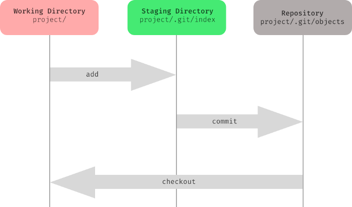
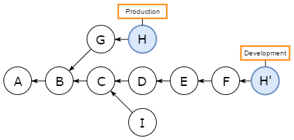
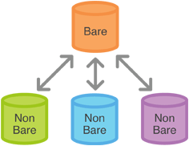

# Šta je Github

**Github** je platforma za hostovanje koda koja se sastoji iz **Git**-a, sistema za kontrolu verzija.

**Sistem za verzionisanje** je sistem koji je zadužen za čuvanje i kontrolisanje izmena programskih kodova, dokumenata i slično.

## Zašto koristiti sistem za kontrolu verzija?

Situacije u kojima je sistem za kontrolu verzija koristan:
- Ako smo napravili promene u kodu i onda nakon nekog vremena smo shvatili da je ta promena greška;
- Ako izgubimo lokalne podatke, onda možemo preuzeti podatke poslednje verzije;
- Ako želimo da uporedimo kod sad i pre;
- Ako želimo da dokažemo da je određena promena izazvala greške;
- Ako želimo da analiziramo istoriju koda;
- Ako želimo da delimo kod sa drugim ljudima;
- Ako želimo da dodamo novu "eksperimentalnu" funkcionalnost, ali da ne menjamo trenutni kod.

## Pravljenje naloga

Github nalog možete napraviti na [zvaničnoj github stranici](https://github.com/).

# Uvod u Git

## Instalacija (linux)

Za linux distribuciju je dovoljno pokrenuti sledeće komande u okviru terminala za instalaciju osnovnih git operacija:\
`sudo apt install git-all` \
`sudo apt install git-extra`

## Dokumentacija

Kao i za linux komande i C funkcije, postoje `man` strane za git komande: `man git [KOMANDA]`

Primeri:
- `man git init`
- `man git commit`
- `man git branch`

Na sledećem [linku](https://git-scm.com/doc) možete pronaći dokumentacija koja je identična sa man stranama.

## Kreiranje git repozitorijuma

Lokalni repozitorijum možemo napraviti koristeći komandu `git init` koja 
pravi prazan git repozitorijum tj. kreira `.git` direktorijum koji je neophodan za rad sa git operacijama. Informacije kao što je istorija komitova se
čuvaju u okviru ovog direktorijuma. Komanda `git clone` takođe kreira `.git` direktorijum.

Na Linux-u su sve datoteke oblika `.[IME]` sakrivene u smislu da se ignorišu od strane `ls` komande. Ako se pokrene `ls` komanda, ne može se videti `.git` direktorijum. Potrebno je dodati opciju `-a` tj. pokrenuti komandu `ls -a`.

## Indeks

Kada menjamo kod na računaru, zapravo ažuriramo `radni direktorijum (working directory/working tree)`. Te promene se ne ažuriraju u okviru git repozitorijuma dok se 
eksplicitno ne dodaju i onda komituju. 

Komandom `git add [IME DATOTEKE]` se datoteka dodaje na `oblast za postavljanje (staging area)`, koja
otprilike predstavlja sledeći potencijalni komit tj. izmenu lokalnog git repozitorijuma. Komandom `git commit` se zapisuju izmene zabeležene u okviru `staging area` na git repozitorijum (beleži se u `.git/objects`).\
\
Potrebno je da se nekako razlikuju promene datoteka u okviru tri sekcije:
- radni direktorijum,
- oblast za postavljanje,
- git repozitorijum.

Ove promene se beleže u `indeksu` tj. `.git/index` datoteci.

Koristeći kamandu `git status` možemo videti promene posle poslednjeg komita tj. promene u okviru radnog direktorijum koji se nalaze u `staging area` i
promene koje se ne nalaze u okviru `staging area` (nalaze se samo u okviru radnog direktorijuma). 

Primer. Kreiranje git repozitorijuma:
- Potrebno je prvo da napravimo novi direktorijum:
    * `mkdir hello`
- Potrebno da se pozicioniramo u taj direktorijum:
    * `cd hello`
- Sada možemo da od ovog `hello` repozitorijuma napravimo git repozitorijum:
    * `git init`
    * Očekivani rezultat:
```
Initialized empty Git repository in /home/mokoyo/Desktop/ALATI/cas2/bonus/hello/.git/
```
- Možemo da napravimo datoteke `1.txt` i `2.txt` i da ih dodamo u git repozitorijum:
    * `touch 1.txt 2.txt`, komanda `touch` pravi prazne datoteke.
    * `git add 1.txt 2.txt`, ovom komandom su dodate datoteka na `staging area`.
    * `git commit -m "Inicijalni komit"`, ovom komandom su komitovane promene u git repozitorijum. Očekivani rezultat:
```
[master (root-commit) 566876f] Inicijalni komit
 2 files changed, 0 insertions(+), 0 deletions(-)
 create mode 100644 1.txt
 create mode 100644 2.txt
```

Primer. Rad sa `staging area`:
- U radnom direktorijumu postoje dve tekstualne datoteke (neka su napravljeni u okviru prethodnog komita - prethodni primer):
    * `1.txt`
    * `2.txt`
- Dodat je `Hello World` tekst na kraju obe datoteke:
    * `echo "Hello World" >> 1.txt`
    * `echo "Hello World" >> 2.txt`
- Očekivani rezltat komande `git status`:
```
On branch master
Changes not staged for commit:
  (use "git add <file>..." to update what will be committed)
  (use "git checkout -- <file>..." to discard changes in working directory)

        modified:   1.txt
        modified:   2.txt

no changes added to commit (use "git add" and/or "git commit -a")
```
- Izvršimo sad komandu `git add 2.txt`.
- Očekivani rezultat `git status` komande je:
```
On branch master
Changes to be committed:
  (use "git reset HEAD <file>..." to unstage)

        modified:   2.txt

Changes not staged for commit:
  (use "git add <file>..." to update what will be committed)
  (use "git checkout -- <file>..." to discard changes in working directory)

        modified:   1.txt
```
- Ovo znači da se promene na `2.txt` nalaze u okviru `staging area`, jer se izvršena komanda `git add` i zbog toga će te promene biti zabeležene na git repozitorijum kad se pozove `git commit` komanda, dok će promene na `1.txt` ostati samo u okviru radnog direktorijum.
- Komandom `git reset 2.txt HEAD` se sklanjamo promene sa `staging area` i
one neće biti zabeležene sledećim komitom. Možemo opet testirati komandu `git status`

Datoteka `.git/index` je binarna datoteka i na sledećem [linku](https://mincong.io/2018/04/28/git-index/) se može pročitati detaljnije o strukturi indeksa.

## Istorija projekta

Komandom `git log` se u terminalu ispisuje istorija komitova:
```
commit 0388628561d9d2155980f26851b46727f77ba7a2
Author: Robotmurlock <momir.adzemovic@gmail.com>
Date:   Thu Oct 8 17:49:31 2020 +0200

    Azuriranje .gitignore za qt

commit 1d6219dca4e13221e58f10d3b2d1d93140f05133
Author: Robotmurlock <momir.adzemovic@gmail.com>
Date:   Thu Oct 8 17:18:47 2020 +0200

    Dodato upustvo za instalaciju i dodavanje cppreference u qtcreator

commit 544995c2b22c158497eec9315e0a8a43f81b871d
Author: Robotmurlock <32575918+Robotmurlock@users.noreply.github.com>
Date:   Thu Oct 8 14:37:28 2020 +0200

    Initial commit
```

Svaki komit ima svoj `SHA-1 hash` koji jedinstven. Koriste se različiti metapodaci kao što su ime autora, vreme komita, ... za računanje heš koda. Heš kod je jedinstven.

Skraćena verzija `git log --pretty=oneline`:
```
0388628561d9d2155980f26851b46727f77ba7a2 Azuriranje .gitignore za qt
1d6219dca4e13221e58f10d3b2d1d93140f05133 Dodato upustvo za instalaciju i dodavanje cppreference u qtcreator
544995c2b22c158497eec9315e0a8a43f81b871d Initial commit
```

Ako se doda opcija `--graph` ispisuje se stablo što je korisno ako želimo da vizuelizujemo grane (branches): `git log --graph`, ali umesto toga može da
se koristi neki softver za vizuelizaciju.

Postoji ogroman broj opcija i različiti formati koji: `man git log`.

## Definisanje aliasa

Možemo definisati aliase (skraćenice) za neke duže komande.

Primer:
- `git config --global alias.ci commit`

Ovo je korisno ako često koristimo neku komandu sa istim parametrima (dodatnim opcijama). 

Primer(istorija):
- `git config --global alias.hist "log --pretty=format:'%h %ad | %s%d [%an]' --graph --date=short"`

## Git vizuelizacija drveta verzija/komitova

Na [ovoj stranici](https://nic-hartley.github.io/git-gud/) se možete igrati sa git-om i vežbati uz vizuelizaciju.

## Verzije

Postoji opcija da se vratimo na određeni komit. To znači da se sve promene koje postoje između trenutnog komita i komita na koji se prelazi postaju invertovane u okviru radnog repozitorijuma.
- Prelazak na drugi komit: `git checkout [KOMIT HES]`;
- Komandom `git log --pretty=oneline` se prikazuju komitovi sa njihovim heš kodovima;
- Primer: `git checkout f8d50f6f60721edc7d3663a69cf0e5e55ea989a7`
- Prethodni primer predstavlja skok na "apsolutnu verziju". Alternativa je da se skače na "relativnu verziju" preko "pokazivača" na trenutni komit `HEAD`.
- Primer: `git checkout HEAD~` skače na prethodni komit.
- Primer: `git checkout HEAD~2` skače na pretprethodni komit. Možemo izabrati proizvoljan broj.
- Primer: `git checkout master` skače na najnoviji komit na `master` grani.

Takođe je moguće stavljati tagove verzija na bitne komitove. Na te komitove 
možemo skočiti na sledeći način: `git checkout [TAG]`. Ako postavimo tag, onda ne moramo da pamtimo heš indeks tog bitnog komita.

Primer:
- `git tag v1`, postavlja se tag `v1` na trenutni komit;
- `git checkout HEAD~`, skače se na prethodni komit;
- `git tag v1-prior`, postavlja se tag `v1-prior` na trenutni komit;
- `git checkout v1`, skače se na komit sa `v1` tagom.

## Invertovanje poslednjeg komita

Šta ako smo izvršili komit i shvatili da su to zapravo loše promene i da ih treba odbaciti. Sledećom komandom se pravi novi komit koji invertuje promene poslednjeg komita. Ako je komit koji se briše imao poruku `[PORUKA]`, onda će novi komit imati poruku `Revert "[PORUKA]"`.

Primer:
- Pravimo novu praznu datoteku: `git touch 3.txt`
- Dodajemo `3.txt` na `staging area`: `git add 3.txt`
- Komitujemo izmene: `git commit -m "Dodat je 3.txt"`
- Očekivani oblik rezultata za `git hist --all`:
```
* 47c4988 2020-10-20 | Dodat 3.txt (HEAD -> master) [Robotmurlock]
* e991818 2020-10-20 | Dodat je Hello World u 1.txt i 2.txt (tag: v1) [Robotmurlock]
* 566876f 2020-10-20 | Inicijalni komit [Robotmurlock]
```
- Sledeća komanda otvara interfejs, gde možemo da biramo ime za komit koji briše poslednji komit (komit pre ovog): `git revert HEAD`. Neka se komit zove `Ipak ne bih...`.
- Očekivani oblik rezultata za `git hist --all`:
```
* f0d061d 2020-10-20 | Ipak ne bih... (HEAD -> master) [Robotmurlock]
* 47c4988 2020-10-20 | Dodat 3.txt [Robotmurlock]
* e991818 2020-10-20 | Dodat je Hello World u 1.txt i 2.txt (tag: v1) [Robotmurlock]
* 566876f 2020-10-20 | Inicijalni komit [Robotmurlock]
```

Ovaj niz komandi ne menja datoteke, ali u istoriji ostaje obrisan komit, posle
kojeg ide komit koji je taj prethodni komit obrisao. To znači da se git drvo ne ažurira (u smislu da stari komit ostaje). Ako je potrebno da se promeni i git drvo, onda koristimo komandu `git reset --hard [KOMIT]`

Primer. Isti primer kao prethodni:
- `touch 3.txt`
- `git add 3.txt`
- `git commit -m "Opet dodat 3.txt"`
- Očekivani oblik rezultata za `git hist --all`:
```
* bdab846 2020-10-20 | Opet dodat 3.txt (HEAD -> master) [Robotmurlock]
* f0d061d 2020-10-20 | Ipak ne bih... [Robotmurlock]
* 47c4988 2020-10-20 | Dodat 3.txt [Robotmurlock]
* e991818 2020-10-20 | Dodat je Hello World u 1.txt i 2.txt (tag: v1) [Robotmurlock]
* 566876f 2020-10-20 | Inicijalni komit [Robotmurlock]
```
- `git reset --hard HEAD~`
- Očekivani oblik rezultata za `git hist --all`:
```
* f0d061d 2020-10-20 | Ipak ne bih... (HEAD -> master) [Robotmurlock]
* 47c4988 2020-10-20 | Dodat 3.txt [Robotmurlock]
* e991818 2020-10-20 | Dodat je Hello World u 1.txt i 2.txt (tag: v1) [Robotmurlock]
* 566876f 2020-10-20 | Inicijalni komit [Robotmurlock]
```

Ovde vidimo da se poslednji komit sada obrisan, kao da se ništa nije desilo. **Napomena:** Ova komanda briše komit u istoriji i briše promene u radnom direktorijumu. **Veoma opasno** i mogu se obrisati bitne promene koje su dodate prethodnim komitom ili slično. Umesto opcije `--hard`
se može koristiti opcija `--soft` koja ne briše lokalne promena nad datotekama.

## Izmena poslednjeg komita

Recimo da smo ažurirali `README.md` datoteku i primetili smo da ima dve stamparske greške. Jedan način da se ovo reši je da se komituju ispravke kao novi komit. Alternativa je da se koristi `--amend`, gde se stari komit zamenjuje sa novim.

Primer:
- `code README.md` (izmeniti datoteku, može i `kate` ili bilo koji drug editor umesto `code`);
- `git add README.md`;
- `git commit -m "Azurirao README.md"`;
- Ako je `remote` repozitorijum: `git push`
- ovde je primećena greška!
- `code README.md` (ispraviti greške);
- `git add README.md`
- `git commit -m "Azurirao README.md"`;
- Ako je `remote` repozitorijum: `git push --force`.

**Napomena:** Opciju `--amend` koristiti samo za komitove koji nisu deljeni sa ostalim članovima tima.

## Brisanje i pomeranje datoteka

Slično kao komande `mv` i `rm` na linux sistemima, postoje analogne komande `git mv` i `git rm` koje dodaju promene na `staging area`, što znači da je potrebno komitovati promene.

Ako želimo da se datoteka obriše iz git repozitorijuma, ali da ostane u radnom direktorijumu, koristi se komanda `git rm --cached [IME DATOTEKE]`

Primer. Potrebno je pomeriti `main.cpp` datoteku u `src` direktorijum: 
- `git mv main.cpp src`

Primer. Potrebno je obrisati `1.txt` i `2.txt` datoteke:
- `git rm 1.txt 2.txt`

## Branching (grananje)


### Kreiranje grane

Nova grana se kreira komandom `git branch [IME GRANE]`. Da bi skočili na drugu granu, potrebno je da iskoristimo komandu `git checkout [IME GRANE]` (slično kao za verzionisanje). Kada skačemo na neku granu sa `git checkout`, skačemo na poslednji komit. Ako ne želimo da skočimo na poslednji komit, nego npr. pretposlednji komit, onda možemo to da uradimo komandom: `git checkout [IME GRANE]~`.

Primer. Prvi način:
- `git branch feature`
- `git checkout feature`

Primer. Drugi način:
- `git checkout -b feature`

Uvek možemo da skočimo nazad na `master` granu:
- `git checkout master`

### Pregled aktivnih grana

Komandom `git branch -a` se ispisuju lokalne i remote grane. Trenutna grana ima `*` sa leve strane. Primer:
```
  hello
* main_input
  master
```

Komandom `git branch -r` se ispisuje remote grane. 

Komandom `git show-branch` se ispisuju grane i njihovi komitova:
```
! [hello] Implemented hello class
 * [main_input] Implemented n input
  ! [master] Implemented n input
---
 *+ [main_input] Implemented n input
+   [hello] Implemented hello class
+   [hello^] Implemented hello class template
+*+ [main_input^] Initial commit
```

### Kada praviti grane

- Treba praviti granu svaki put kada se dodaje neka nova `funkcionalnost (feature)`.
- Treba praviti novu granu svaki put kada se vrši neki `eksperiment`.
- Grananje ima znatno više smisla kada se radi u timu.
- `git workflow`.

### Spajanje grana

Potrebno je u nekom trenutku spojiti granu (ako se grana ne odbaci) sa glavnom granom (npr. master grana). To se vrši preko komande `git merge [IME GRANE]`.
Ova komanda se generalno koristi za spajanje trenutne grane sa izabranim komitovima tj. može se koristiti u opštijem slučaju.

Primer. Pretpostavimo da imamo git repozitorijum koji do sada ima samo jedan komit u okviru kojeg je implementiran `main.cpp` koji trenutno ne radi ništa:
- Inicijalizacija:
    * `mkdir hellocpp`
    * `cd hellocpp`
    * `git init`
    * `code main.cpp`
    * Oblik `main.cpp` datoteke:
```
#include <iostream>

int main()
{
    return 0;
}
```

- Nastavak inicijalizacije:
    * `git add main.cpp`
    * `git commit -m "Inicijalni komit"`

- Pravimo granu koja će implementirati klasu `Hello` i njene funkcionalnost: `git checkout -b hello-class`. Očekivani oblik rezultata:
```
Switched to a new branch 'hello-class'
```
- Implementira se `hello.hpp`  i opciono `Makefile` (ako ne postoji). Nije toliko bitno šta je poenta klase. Neka se objekat `Hello` pravi preko konstruktora koji prima jedan ceo broj `val`. Ovaj objekat ima jednu metodu `hey()` i pozivom ove metode se ispisuje `val` puta `"Hello World!"`.
- Ovo se može odraditi kroz jedan ili više komitova:
    * `git commit -m "Implementirana osnova struktura za hello klasu"`.
    * `git commit -m "Implementiran Makefile"`. Tip: Napisati `qmake` datoteku i generisati `Makefile` datoteku.
    * `git commit -m "Implementirane osnovne funkcionalnost hello klase"`.
- Očekivani oblik rezultata za `git hist --all`:
```
* e6cc675 2020-10-20 | Implementirane osnovne funkcionalnost hello klase (HEAD -> hello-class) [Robotmurlock]
* 7dbedec 2020-10-20 | Implementiran Makefile [Robotmurlock]
* 8c94b76 2020-10-20 | Implementirana osnova struktura za hello klasu [Robotmurlock]
* 8f674b5 2020-10-20 | Inicijalni komit (master) [Robotmurlock]
```
- Sada je potrebno spojiti `hello-class` granu sa `master` granom. Ovo je veoma jednostavno ako ne postoje promene na master grani od kad je kreirana nova grana:
    * Potrebno je prvo skočiti na `master` granu: `git checkout master`.
    * Onda je potrebno spojiti grane: `git merge hello-class`.
- Očekivani oblik rezultata za `git hist --all`:
```
* e6cc675 2020-10-20 | Implementirane osnovne funkcionalnost hello klase (HEAD -> master, hello-class) [Robotmurlock]
* 7dbedec 2020-10-20 | Implementiran Makefile [Robotmurlock]
* 8c94b76 2020-10-20 | Implementirana osnova struktura za hello klasu [Robotmurlock]
* 8f674b5 2020-10-20 | Inicijalni komit [Robotmurlock]
```

### Brisanje grana

Grana se može obrisati komandom `git branch -d [IME GRANE]` ako je grana spojena (`merge`) ili
`git branch -D [IME GRANE]` ako grana nije spojena. 

## Konflitki

Posmatramo sledeću situaciju(pogledati `hello-class` direktorijum):
- Napravili smo `Hello` klasu u okviru `hello-class` grane i potrebno je spojiti ovu granu sa `master` granom.
- Razlika u odnosu na prethodni primer je to što je `master` takođe izmenjena. Zbog toga je spajanje otežano i potrebno je odlučiti koje promene želimo da prihvatimo.

Možemo da koristimo neki alat za rešavanje `konflitka spajanja (merge conflicts)` preko komande `git mergetool`. Postoji više izbora za ovakav alat. Jedan od takvih alata je `meld`.

Alternativa je da koristimo neki napredniji editor kao što je `visual studio code` koji ima integrisan alat za rešavanje konflikta.

Još jedna alternativa je da ručno vršimo rešavanje konflitka. 

### Instalacija i konfiguracija Meld alata

`sudo apt-get update -y`\
`sudo apt-get install -y meld`\
`git config --global merge.tool meld`\
`git config --global mergetool.prompt false`

### Primer konflitka

Sledeći niz komandi pravi konflikt spajanje:
- Pravljenje novog direktorijuma za git repozitorijum: 
    * `mkdir makeconflict`
    * `cd makeconflict`
- Pravljenje novog git repozitorijuma: 
    * `git init`
- Prvi komit:
    * `touch main.txt` 
    * `echo "m1" >> main.txt` 
    * `git add .`
    * `git commit -m "Prvi komit"`
- Očekivani oblik izlaza za `git hist --all`:
```
* ffa86da 2020-10-20 | Prvi komit (HEAD -> master) [Robotmurlock]
```
- Pravljenje nove grane `newFeature` koja implementira funkcionalnost `f1`, `f2` i `f3`:
    * `git checkout -b newFeature`
    * `echo "f1" >> main.txt`
    * `git add main.txt`
    * `git commit -m "Dodata funkcionalnost f1"`
    * `echo "f2" >> main.txt`
    * `git add main.txt`
    * `git commit -m "Dodata funkcionalnost f2"`
    * `echo "f3" >> main.txt`
    * `git add main.txt`
    * `git commit -m "Dodata funkcionalnost f3"`
- Očekivani oblik izlaza za `git hist --all`:
```
* fe6f518 2020-10-20 | Dodata funkcionalnost f3 (HEAD -> newFeature) [Robotmurlock]
* e896068 2020-10-20 | Dodata funkcionalnost f2 [Robotmurlock]
* cb07f11 2020-10-20 | Dodata funkcionalnost f1 [Robotmurlock]
* ffa86da 2020-10-20 | Prvi komit (master) [Robotmurlock]
```
- Skok na granu `master` i dodavanje nove funkcionalnost `m2` (pretpostavimo da u realnoj situaciji dva različita člana tima vrše poslednja dva koraka tj. jedan radi na `master` grani, a drugi na `newFeature` grani):
    * `git checkout master`
    * `echo "m2" >> main.txt`
    * `git add main.txt`
    * `git commit -m "Dodata funkcionalnost m2"`
- Očekivani oblik izlaza `git hist --all`:
```
* 7a369bd 2020-10-20 | Dodata funkcionalnost m2 (HEAD -> master) [Robotmurlock]
| * fe6f518 2020-10-20 | Dodata funkcionalnost f3 (newFeature) [Robotmurlock]
| * e896068 2020-10-20 | Dodata funkcionalnost f2 [Robotmurlock]
| * cb07f11 2020-10-20 | Dodata funkcionalnost f1 [Robotmurlock]
|/  
* ffa86da 2020-10-20 | Prvi komit [Robotmurlock]
```
- Leva grana je `master` grana, a desna je `newFeature` grana. Komitovi su poređani hronološki.
- Sada je potrebno da se `newFeature` grana spoji sa granom `master`, jer su u "međuvremenu" implementirane sve funkcionalnosti:
    * `git checkout master`
    * `git merge newFeature`
- Očekivani izlaz:
```
Auto-merging main.txt
CONFLICT (content): Merge conflict in main.txt
Automatic merge failed; fix conflicts and then commit the result.
```
- Potrebno je pokrenuti alat `meld` preko komande `git mergetool` koja će otvoriti program sa tri prozora: 
    * Promene na trenutnoj grani (levo),
    * Spojene promene (sredina),
    * Promene na grani "dolaznoj" grani (desno).
- Kombinovanjem promena na trenutnoj i dolaznoj grani dobijamo spojene promene.
- Nakon rešenih konflikta je potrebno izvršiti komit:
    * `git commit -m "Rešeni konflikti"`
- Očekivani rezultat `git hist --all` komande:
```
*   9963f5b 2020-10-20 | Rešeni konflikti (HEAD -> master) [Robotmurlock]
|\  
| * fe6f518 2020-10-20 | Dodata funkcionalnost f3 (newFeature) [Robotmurlock]
| * e896068 2020-10-20 | Dodata funkcionalnost f2 [Robotmurlock]
| * cb07f11 2020-10-20 | Dodata funkcionalnost f1 [Robotmurlock]
* | 7a369bd 2020-10-20 | Dodata funkcionalnost m2 [Robotmurlock]
|/  
* ffa86da 2020-10-20 | Prvi komit [Robotmurlock]
```
- Grane su spojene u jednu granu, što je u ovom slučaju `master` grana.

## Rebase

Primer. U okviru prvog komita je implementiran jednostavan `C++` program:
```
#include <iostream>

void hello()
{
    std::cout << "Hello Warld!" << std::endl;
}

void nPlusHello(unsigned n)
{
    while(n >= 0)
    {
        hello();
        n--;
    }
}

int main()
{
    int n;
    std::cin >> n;
    nPlusHello(n);
    return 0;
}
```
- Pravi se git direktorijum: `git init`
- Dodaje se `main.cpp` datoteka na `staging area`: 
    * `git add main.cpp`
- Postavlja se prvi komit: 
    * `git commit -m "Implementiran main.cpp"`
- U prethodnom kodu možemo uočiti dve relativno očigledne greške:
    * Piše `Hello Warld!` umesto `Hello World`;
    * Pošto je promenljiva `n` tipa `unsigned`, uslov `n >= 0` je uvek tačan i posledica je beskonačna petlja.
- Pretpostavimo da ove greške nisu uočene. Pravimo novu granu `bugFix` za debagovanje beskonačne petlje: `git checkout -b bugFix`.
- Usput je uočena (i ispravljena) stamparska greška i izvršen je komit: 
    * `git add main.cpp`
    * `git commit -m "Ispravljena štamparska greška u f-ji hello()"`
- Pošto razlog beskonačne petlje nije očigledan, dodaje se u petlji linija:
    * `std::cerr << "n = " << n << std::endl;`
    * `git add main.cpp`
    * `git commit -m "Dodat ispis za debagovanje"`
- Sada je razlog beskonačne petlje očigledan i vrši se ispravka `unsigned n` u `int n`:
    * `git add main.cpp`
    * `git commit -m "Uklonjena je beskonačna petlja"`
- Git stablo trenutno ima oblik sličan sledećem:
```
* 6bc80e9 2020-10-20 | Uklonjena je beskonačna petlja (HEAD -> bugFix) [Robotmurlock]
* f76787e 2020-10-20 | Dodat ispis za debagovanje [Robotmurlock]
* a581d8d 2020-10-20 | Ispravljena štamparska greška u f-ji hello() [Robotmurlock]
* 9e98493 2020-10-20 | Implementiran main.cpp (master) [Robotmurlock]
```
- Pretpostavimo još da je u `master` grani dodat neki komit koji uključuje novu datoteku `input.txt`:
```
5
1 2 3 4 5
```
- Izvšene su sledeće komande:
    * `git checkout master`
    * `code input.txt`, unesen je prethodni sadržaj
    * `git add input.txt`
    * `git commit -m "Dodat je primer unosa za buduću mnogo dobru funkcionalnost"`
- Očekivani oblik rezultata za `git hist --all`:
```
* 3979e3a 2020-10-20 | Dodat je primer unosa za buduću mnogo dobru funkcionalnost (HEAD -> master) [Robotmurlock]
| * 6bc80e9 2020-10-20 | Uklonjena je beskonačna petlja (bugFix) [Robotmurlock]
| * f76787e 2020-10-20 | Dodat ispis za debagovanje [Robotmurlock]
| * a581d8d 2020-10-20 | Ispravljena štamparska greška u f-ji hello() [Robotmurlock]
|/  
* 9e98493 2020-10-20 | Implementiran main.cpp [Robotmurlock]
```
- Potrebno je dodati ispravke na `master` granu. To se može izvršiti na sledeće načine:
    1. Može se izvršiti spajanje i onda obrisati deo za debagovanje u okviru `master` grane;
    2. Može se obrisati deo za debagovanje u okviru `bugFix` grane i onda izvršiti spajanje;
    3. Može se izvršiti `git rebase master` komanda koja menja strukturu git drveta. Dobijeni rezultat je
    ekvivalentan kao da su od početka vršeni komitovi na `master` grani tj. kao da `bugFix`
    grana nikad nije ni postojala. Dobijeno drvo je sada postalo `linearno` i samim tim i čitljvije. I u tom slučaju je potrebno naknadno obrisati deo za debagovanje.
    4. Modifikacije prethodnog je da se koristi `git rebase -i master`, gde se komit za dodavanje
    koda za debagovanje odbacuje kao da nikad nije ni postojao. Ako se instaliran i konfigurisan `git interactive rebase tool`, onda je korisnički interfejs malo prikladniji. Instalacija i 
    konfiguracija ovog alata je objašnjenja u sledećoj sekciji. Potrebno je izabrati `pick` opciju
    za prvi i poslednji komit grane `bugFix` (to znači da će komitovi biti prebačeni na `master` granu) i opciju `drop` za drugi komit (to znači da će komit biti odbačen).
- Primenom poslednjeg rešenja se dobija sledeća struktura git drveta:
```
* df26046 2020-10-20 | Uklonjena je beskonačna petlja (HEAD -> bugFix) [Robotmurlock]
* 068b021 2020-10-20 | Ispravljena štamparska greška u f-ji hello() [Robotmurlock]
* 3979e3a 2020-10-20 | Dodat je primer unosa za buduću mnogo dobru funkcionalnost (master) [Robotmurlock]
* 9e98493 2020-10-20 | Implementiran main.cpp [Robotmurlock]
```
- U datoteci `main.cpp` su ostale ispravke, ali kod za debagovanje je odbačen.

- Ostalo je još samo da se `bugFix` spoji sa trenutnim komitom:
    * `git checkout master`
    * `git merge bugFix`
- Očekivani rezultat za `git hist --all`:
```
* df26046 2020-10-20 | Uklonjena je beskonačna petlja (HEAD -> master, bugFix) [Robotmurlock]
* 068b021 2020-10-20 | Ispravljena štamparska greška u f-ji hello() [Robotmurlock]
* 3979e3a 2020-10-20 | Dodat je primer unosa za buduću mnogo dobru funkcionalnost [Robotmurlock]
* 9e98493 2020-10-20 | Implementiran main.cpp [Robotmurlock]
```

- Primetimo ovde da imamo mnogo čistiju istoriju, nego kad smo koristili `git merge`.

U okviru `git interactive rebase tool` postoji i opcija `squash` koja spaja komitove u jedan. Ovo je korisno ako su ti komitovi vezani za rešavanje iste greške i ima smisla da predstavljaju celinu. 

Opcija `squash` se često koristi kada se radi na nekoj novoj funkcionalnost, a nisu butno da znamo sve komitove u unutar te implementacije. Time se dobija čitljivija istorija komitova.

### git interactive rebase tool

Za instalaciju `git interactive rebase tool` posetiti sledeću [stranicu](https://gitrebasetool.mitmaro.ca/).

### Upotreba rebase

Primer upotrebe: Pretpostavimo da paralelno radimo sa nekim drugim timom, gde je implementiran deo koda na našoj grani i deo koda na grani drugog tima. U nekom trenutku je potrebna deo funkcionalnosti koja je implementirana na grani drugog tima. U tom slučaju može da se izvrši `rebase` grane našeg tima na granu drugog tima. Ako se promene guraju na `remote`, onda je potrebno da se koristi `git push --force` (detaljnije objašnjenje u kasnijim sekcijama)

### Cherry-pick

- Postoji još jedan način da se dobije isti rezultat iz prethodnog primera preko komande `git cherry-pick`:
    * `git checkout master`
    * `git cherry-pick da63caf a847380`
- Ova komanda bira niz komitova i kopira ih na trenutnu `master` granu. Očekivani rezultat:
```
* 1ab57e4 2020-10-20 | Uklonjena je beskonačna petlja (HEAD -> master) [Robotmurlock]
* ab69264 2020-10-20 | Ispravljena štamparska greška u f-ji hello() [Robotmurlock]
* f311874 2020-10-20 | Dodat je primer unosa za buduću mnogo dobru funkcionalnost [Robotmurlock]
| * 02641c6 2020-10-20 | Uklonjena je beskonačna petlja (bugFix) [Robotmurlock]
| * 3b1e768 2020-10-20 | Dodat ispis za debagovanje [Robotmurlock]
| * f6b2c45 2020-10-20 | Ispravljena štamparska greška u f-ji hello() [Robotmurlock]
|/  
* 789911e 2020-10-20 | Implementiran main.cpp [Robotmurlock]
```
- Grana `bugFix` nam više nije od koristi:
    * `git branch -D bugFix` (Koristimo opciju `-D` jer je to grana koja nije spojena)
- Očekivani konačan rezultat:
```
* 1ab57e4 2020-10-20 | Uklonjena je beskonačna petlja (HEAD -> master) [Robotmurlock]
* ab69264 2020-10-20 | Ispravljena štamparska greška u f-ji hello() [Robotmurlock]
* f311874 2020-10-20 | Dodat je primer unosa za buduću mnogo dobru funkcionalnost [Robotmurlock]
* 789911e 2020-10-20 | Implementiran main.cpp [Robotmurlock]
```

Primer: Problem je pronađen na produkcionoj `master` grani (za detaljnije objašnjenje pogledati gitflow sekciju). Problem je nastao na grani `H`, ali `develop` grani nije potreban komit `G`. Zbog toga se `git cherry-pick` komandom bira komit `H` sa grane `master` i dodaje se kao kopija ``H` ``
na `develop` granu, gde se može nastaviti dalje razvoj.



## Vežbanje

Uraditi zadatake na sledećoj [stranici](https://learngitbranching.js.org/).

## Kloniranje repozitorijuma

Kloniranje repozitorijuma se vrši komandom: \
`git clone [LOKACIJA REPOZITORIJUMA] [IME NOVOG DIREKTORIJUMA]`, \
gde lokacija može da bude relativna putanja do lokalnog git repozitorijuma ili URL Github stranice repozitorijuma koji se klonira. 

Primer: 
- Pretpostavimo da imamo git repozitorijum `hello` koji sadrži datoteku `main.cpp`:
    * `mkdir hello`
    * `cd hello`
    * `git init`
    * `code main.cpp` (ovde umetnuti naredni kod)
```
#include <iostream>
#include <vector>
#include <algorithm>

void hello()
{
    std::cout << "Hello World!" << std::endl;
}

void nPlusHello(int n)
{
    while(n >= 0)
    {
        hello();
        n--;
    }
}

int main()
{
    int n;
    std::cin >> n;
    nPlusHello(n);
    return 0;
}
```
- Postavljamo inicijalni komit:
    * `git add .`
    * `git commit -m "Inicijalni komit"`
- Pravimo klon repozitorijuma: `git clone hello hello_cloned`
```
Cloning into 'hello_cloned'...
done.
```
- Ako pogledamo sadržaj novog `hello_cloned` direktorijuma, videćemo da on takođe sadrži skriveni `.git` direktorijum i da sadrži identične datoteke.
- Ako pogledamo istoriju koristeći komandu `git hist`, rezultat je isti kao u originalnom repozitorijumu.

## Remote repozitorijum

Komandom `git remote` dobijamo listu svih `remote`-ova. Ovde `remote` predstavlja git repozitorijum (skup verzija projekta) koji se uglavnom nalazi na internetu (npr. Github-u). Timski rad podrazuvema korišćenje `remote` repozitorijuma.
- Podrazumevano ime za `remote` repozitorijum je `origin`, što i jeste rezultat prethodne komande u ovom slučaju. 
- Komandom `git remote -v` dobijamo listu svih `remote`-ova i njihovih URL-ova.
```
origin  /home/mokoyo/Desktop/ALATI/cas2/hello (fetch)
origin  /home/mokoyo/Desktop/ALATI/cas2/hello (push)
```
Postoji skup komandi oblika `git remote [OPCIJA]` koja služi za rad sa `remote` repozitorijumima
u smislu ispisivanja informacija o njima, dodavanja, brisanja, preimonovanja itd... Detaljnije: `man git remote`.

## Fetch, Merge i Pull

**Šta se dešava ako izvršimo promenu na remote repozitorijumu?**

Primer:
- Vratimo se na originalni repozitorijum:
    * `cd ../hello`
    * Dodajmo novu implementaciju nove funkcije `bye()`:
```
void bye()
{
    std::cout << "Goodbye!" << std::endl;
}
```
- I dodajmo njen poziv pri kraju glavne funkcije.
```
#include <iostream>

void hello()
{
    std::cout << "Hello World!" << std::endl;
}

void nPlusHello(int n)
{
    while(n >= 0)
    {
        hello();
        n--;
    }
}

void bye()
{
    std::cout << "Goodbye!" << std::endl;
}

int main()
{
    int n;
    std::cin >> n;
    nPlusHello(n);
    bye();
    return 0;
}
```
- Potrebno je da se komituju izmene:
    * `git add main.cpp`
    * `git commit -m "Implementirana je bye() funkcija"` 
    * Očekivani rezultat za `git hist --all`:
```
* 9bd65e2 2020-10-18 | Implementirana je bye() funkcija (HEAD -> master) [Robotmurlock]
* 3c14a07 2020-10-18 | Inicijalni komit [Robotmurlock]
```
- Ako se sada vratimo na `hello_cloned`, možemo videti da je `main.cpp` nepromenjen, što je i očekivano, jer smo ga takvog i ostali u tom direktorijumu. Čak i `git hist --all` daje stari rezultat:
```
* 3c14a07 2020-10-18 | Inicijalni komit (HEAD -> master, origin/master, origin/HEAD) [Robotmurlock]
```
- Potrebno je da ažuriramo istoriju. To se može izvršiti preko komande `git fetch`. 
- Sada je očekivani rezultat za `git hist --all`:
```
* 9bd65e2 2020-10-18 | Implementirana je bye() funkcija (origin/master, origin/HEAD) [Robotmurlock]
* 3c14a07 2020-10-18 | Inicijalni komit (HEAD -> master) [Robotmurlock]
```
- Sa druge strane, datoteka `main.cpp` i dalje nema učitane promene. Da bi se spojile promene, potrebno je iskoristi komandu `git merge [LOKACIJA]` tj. u ovom slučaju `git merge origin/master`, što spaja promene sa `remote`, odnosno `hello` repozitorijumom. Očekivani rezultat:
```
Updating 3c14a07..9bd65e2
Fast-forward
 main.cpp | 6 ++++++
 1 file changed, 6 insertions(+)
```
- Ove dve komande se često korist jedna za drugom:
    * `git fetch`
    * `git merge`
- Zbog toga postoji komanda `git pull` koji predstavlja kombinaciju prethodne dve komande tj. izvršava prvo `git fetch` operaciju, pa onda `git merge` operaciju.

## Push

Promene mogu da se vrše i na kloniranim repozitorijuma koji nisu `remote` repozitorijumi i da se onda `gurnu (pull)` na `remote` repozitorijum. 

Primer:
- Želimo da izvršimo promene na `hello_cloned` repozitorijumu:
    * `cd hello_cloned`
- Menjamo ispis funkcije `bye()`:
```
void bye()
{
    std::cout << "Cya later alligator!" << std::endl;
}
```
- Potrebno je komitovati promene:
    * `git add main.cpp`
    * `git commit -m "Dodat lepši tekst u bye() funkciji"`
    * Očekivani izlaz za `git hist --all`:
```
* 380a25e 2020-10-18 | Dodat lepši tekst u bye() funkciji (HEAD -> master) [Robotmurlock]
* 9bd65e2 2020-10-18 | Implementirana je bye() funkcija (origin/master, origin/HEAD) [Robotmurlock]
* 3c14a07 2020-10-18 | Inicijalni komit [Robotmurlock]
```
- Ako se sada vratimo na `hello` repozitorijum i izvršimo `git fetch`, onda se ništa neće desiti:
    * `cd ../hello`
    * `git fetch`
- To je zato što `remote` repozitorijum nije ažuriran. Potrebno je da se vratimo u `hello_cloned` repozitorijum i gurnemo izmene:
    * `git push remote origin`
    * Očekivani oblik izlaza:
```
Counting objects: 3, done.
Delta compression using up to 4 threads.
Compressing objects: 100% (2/2), done.
Writing objects: 100% (3/3), 327 bytes | 327.00 KiB/s, done.
Total 3 (delta 1), reused 0 (delta 0)
remote: error: refusing to update checked out branch: refs/heads/master
remote: error: By default, updating the current branch in a non-bare repository
remote: is denied, because it will make the index and work tree inconsistent
remote: with what you pushed, and will require 'git reset --hard' to match
remote: the work tree to HEAD.
remote: 
remote: You can set the 'receive.denyCurrentBranch' configuration variable
remote: to 'ignore' or 'warn' in the remote repository to allow pushing into
remote: its current branch; however, this is not recommended unless you
remote: arranged to update its work tree to match what you pushed in some
remote: other way.
remote: 
remote: To squelch this message and still keep the default behaviour, set
remote: 'receive.denyCurrentBranch' configuration variable to 'refuse'.
To /home/mokoyo/Desktop/ALATI/cas2/hello
 ! [remote rejected] master -> master (branch is currently checked out)
error: failed to push some refs to '/home/mokoyo/Desktop/ALATI/cas2/hello'
```
- Ne može se izvršiti push osim ako `remote` repozitorijum nije `bare`. Detaljnije objašnjenje o tome šta su `bare` repozitorijumi u sledećoj sekciji.
- Potrebno je postaviti da `hello` repozitorijum bude `bare`:
    * `cd ../hello`
    * `cd .git`
    * Zameniti linuju `bare = false` u datoteci `config` unutar `.git` direktorijuma sa linijom `bare = true` i sačuvati izmene.
- Alternativa je da se iskoristi komanda `git config --bool core.bare true` koja daje isti rezultat.
- Sada možemo da se vratimo u `hello_cloned` i gurnemo promene:
    * `cd ../../hello_cloned`
    * `git push origin master`
    * Očekivani oblik izlaza:
```
Counting objects: 3, done.
Delta compression using up to 4 threads.
Compressing objects: 100% (2/2), done.
Writing objects: 100% (3/3), 327 bytes | 327.00 KiB/s, done.
Total 3 (delta 1), reused 0 (delta 0)
To /home/mokoyo/Desktop/ALATI/cas2/hello
   9bd65e2..380a25e  master -> master
```
- Ako se vratimo u `hello` repozitorijum i izvršimo `git hist --all` dobijamo sledeći oblik izlaza:
```
* 380a25e 2020-10-18 | Dodat lepši tekst u bye() funkciji (HEAD -> master) [Robotmurlock]
* 9bd65e2 2020-10-18 | Implementirana je bye() funkcija [Robotmurlock]
* 3c14a07 2020-10-18 | Inicijalni komit [Robotmurlock]
```
- Kao da je automatski izvršen `git fetch`. Međutim, promene nisu izvršene i `git pull` vraća sledeću poruku:
```
fatal: this operation must be run in a work tree
```

## Bare repozitorijum

Razlog zašto u prethodnom nije radila komanda `git pull` je skroz logičan. Nema smisla da gurnemo izmene na neku granu na `remote` na kojoj je neko aktivan (`checkout`-ovan), jer bi to obrisalo njegove lokalne nekomitovane izmene. Repozitorijum koji je `bare` nema nijednu granu koja je aktivan (`checkout`) i
ne treba vršiti izmene na ovom repozitorijumu. Ovaj repozitorijum možemo posmatrati kao repozitorijum koji ima samo `.git` sadržaj. Možda deluje beskoristan, ali ovaj tip repozitorijuma je neophodan i služi kao posrednik u komunikaciji između više `non-bare` repozitorijuma. 

- Možemo napraviti još jedan klonirani repozitorijum:
    * `git clone hello hello_another_cloned`
    * `cd hello_another_cloned`
    * `git pull origin master`
- U okviru ovog repozitorijuma možemo vršiti promene i gurati ih na `remote` repozitorijum i 
onda te izmene se mogu lako povući na `hello_cloned` i obrnuto:

- Sada je `remote` repozitorijum `bare` repozitorijum koji predstavlja posrednika između `hello_cloned` i `hello_another_cloned` repozitorijuma:
    * `cd hello_another_cloned`
    * `code main.cpp` (izmeniti bye() funkciju)
    * `git add main.cpp`
    * `git commit -m "Izmenjena bye() funkcija"`
    * `git push`
```
void bye()
{
    std::cout << "Cya later alligator! <3" << std::endl;
}
```
- Pređimo u `hello_cloned`:
    * `cd ../hello_cloned`
    * `git pull`
- Rezultat:
```
remote: Counting objects: 3, done.
remote: Compressing objects: 100% (2/2), done.
remote: Total 3 (delta 1), reused 0 (delta 0)
Unpacking objects: 100% (3/3), done.
From /home/mokoyo/Desktop/ALATI/cas2/klon/hello
   7f5285d..2db08ca  master     -> origin/master
Updating 7f5285d..2db08ca
Fast-forward
 main.cpp | 2 +-
 1 file changed, 1 insertion(+), 1 deletion(-)
```



Repozitorijumi koji su `bare` se koriste za deljenje. Ako radimo u timu i potrebna je saradnja, onda je potrebno mesto za čuvanje promena repozitorijuma. U tom slučaju je potreban `bare` repozitorijum u centralizovanom smislu, gde svi korisnici mogu da guraju svoje promene i vuku tuđe promene. Pošto se samo čuvaju promene, onda `radni direktorijum (working tree)` nije potreban.

Primer. Dovoljno je da `remote` repozitorijum bude `bare` za komunikaciju između ostalih `non-bare` repozitorijuma:
- Pravimo `bare` repozitorijum:
    * `mkdir github`
    * `cd github`
    * `git --bare init`
- Ako pokrenemo komandu `ls -a`, vidimo da su napravljene neke datoteke i ne postoji `.git` direktorijum. Pošto `bare` direktorijum nema `working tree`, on predstavlja samo `.git` direktorijum. Sadržaj ovog direktorijuma odgovara `.git` direktorijumu.
- Prvo kloniranje:
    * `clone github klon1`
    * `cd klon1`
- Implementacija funkcionalnosti "f1" u okviru klon1:
    * `touch main.txt`
    * `echo "f1" >> main.txt`
    * `git add .`
    * `git commit -m "Implementirao f1"`
    * `git push`
- Drugo kloniranje:
    * `clone github klon2`
    * `cd klon2`
- Ako pokrenemo komandu `cat main.txt` rezultat je `f1`. To je zato što smo klonirali ažuriran `remote` (ažuriran je kada smo uradili `git push` iz `klon1`). 
- Implementacija funkcionalnost "f2" u okviru klon2:
    * `echo "f2" >> main.txt`
    * `git add main.txt`
    * `git commit -m "Implementirao f2"`
    * `git push`
- Implementacija funkcionalnost "f3" u okviru klon1:
    * `cd ../klon1`
    * `git pull` (moramo da povučemo izmene sa `remote`)
    * `echo "f3" >> main.txt`
    * `git add main.txt`
    * `git commit -m "Implementirao f3"`
    * `git push`

### Pravljenje Github repozitorijuma

Na [github](https://github.com/) stranici je moguće napraviti `remote` repozitorijum. Taj repozitorijum je zapravo `bare` repozitorijum, a veb interfejs nam nudi reprezentaciju sadržaja.

## Rezime


Pogledati sledeći [video](https://www.youtube.com/watch?v=3a2x1iJFJWc&ab_channel=Udacity) kao rezime.

## Gitignore

Komandom `git add *` dodajemo sve izmene u okviru našeg lokalnog repozitorijuma. Postoje ekstenzije datoteka koje nikad ne želimo da komitujemo, kao što su objekte datoteke `*.o`, izvršne datoteke `*.exe` itd... Zbog ovih datoteka bi morali da vršimo dodavanje na `staging area` jedan po jedan. Čak i tada, `git status` će nam davati informacije da ove promene nisu postavljene na `staging area`, a nas ne interesuju informacije o ovim datotekama. Zbog toga postoji opcija da dodamo `.gitignore` datoteku u okviru koje se definišu pravila za ignorisanje datoteka.

Primer. Posmatrajmo `helloClass` primer:
- Neka to bude novi git repozitorjum:
    `git init`
- Inicijalni komit:
    * `git add *`
    * `git commit -m "Inicijalni komit"`
- Imamo sledeće datoteke: `hello.cpp` `hello.hpp` `hello.pro` `main.cpp`
- Ove datoteke su dovoljne za generisanje svih ostalih datoteka:
    * `qmake -o Makefile hello.pro` (ova komanda generiše Makefile)
    * `make` (ovo generiše objekte i izvršne datoteke)
- Sada imamo sledeće dodatne datoteke: `helloworld` `hello.o` `main.o` `Makefile`
- Ako obrišemo ove datoteke, možemo ih generisati na isti način. Ne želimo da dodajemo datoteke koje se uvek mogu generisati, a dodatno mogu praviti neke konflitke koje možemo izbeći.
- Dodatno ako pokrenemo komandu `git status` očekivani izlaz je:
```
On branch master
Untracked files:
  (use "git add <file>..." to include in what will be committed)

        .qmake.stash
        Makefile
        hello.o
        helloworld
        main.o

nothing added to commit but untracked files present (use "git add" to track)
```
- Ne interesuje nas status za ove datoteke.
- Pravimo `.gitignore` datoteku:
```
*.o
Makefile
.qmake.*
helloworld
```
- Objašnjenje:
    * `*.o` je pravilo kojim se ignorišu sve datoteke sa ekstenzijom `.o`.
    * `Makefile` ignoriše baš tu datoteku.
    * `.qmake.*` ignoriše sakrivene datoteke koje generiše `qmake`.
    * `helloworld` ignoriše baš tu datoteku.
- Komitujemo `.gitignore` datoteku:
    * `git add .gitignore`
    * `git commit -m "Dodat .gitignore`
- Sada ako pokrenemo komandu `git status`, očekivani izlaz je:
```
On branch master
nothing to commit, working tree clean
```
- Ako pokrenemo komandu `git add *`, očekivani izlaz je:
```
The following paths are ignored by one of your .gitignore files:
Makefile
hello.o
helloworld
main.o
Use -f if you really want to add them.
```

Pravila:
- Razmaci se ignorišu osim ako se ne navede ispred razmaka `\`"
    * `hello\ world`
- Za komentare se koristi `#`, a `\#` za baš taj karakter:
    * `# ovo je jedan komentar`
- Operator `!` vrši suprotnu operaciju tj. neignoriše datoteke:
    * Ako dodamo pravilo `*.txt` u `.gitignore`, onda se ignorišu sve `.txt` datoteke;
    * Ako dodamo ispod toga pravilo `!log.txt`, onda se ignorišu sve `.txt` datoteke sem te.
- Može da se navodi relativna putanja, gde se ignorišu datoteke:
    * `src/*.txt`
    * `docs/images/*.txt`
- Dupla zvezdica `**` predstavlja nula ili više datoteka:
    * `**/*.txt`, ignoriše sve `.txt` datoteke u svim direktorijumima.
- Jedna zvezdica označava bilo koji šta sem `/`.
- Upitnik označava bilo koji karakter sem `/` (kao zvezdica za jedan karakter).
- Notacija za opseg: `[a-zA-Z]`.
- Celu dokumentaciju pogledati na sledećoj [stranici](https://git-scm.com/docs/gitignore).

## Kako pisati komitove?

Pisanje komitova kroz komandu:
    * `git commit -m "title" -m "description"`

Postavljanje podrazumevanog editora za `git commit` komandu:
    * `git config --global core.editor "code --wait"`

### Zašto je bitno pisati dobre komitove?

- **Bolja saradnja:** Ako radimo u firmi ili projektu otvorenog koda onda je neophodno da se poštuju određena pravila za bolju saradnju. Potrebno je da se poštuju pravila projekta, što povećava efikasnost izrade softvera. Ovo povećava efikasnost čak i kada radimo sami na projektu i ostavlja prostor da se neko lakše priključi da radi na projektu.
- **Bolje razumevanje:** Bitno je da se pišu čiste i jednostavne poruke. Primer komitova gde se ništa ne razume: 

- **Generisanje changelog-a:** Lista promena - [link](https://herewecode.io/blog/a-beginners-guide-to-git-what-is-a-changelog-and-how-to-generate-it/)

### Kako pisati dobre komitove?

- **Komitovi moraju da budu gramatički ispravni**.
- **Jedan komit za jednu promenu:** Želimo da imamo svaku promenu na jednom komitu. Na taj način je lakše da se vratimo na prethodni posao.
- **Izbegavati dvosmislenost**.
- **Objasniti šta je promenjeno**.
- **Git smernice (guideline)**.

### Udacity guidelines

Struktura komita:
```
type: subject

body

footer
```

#### The Type (tip)
- **feat:** Nova funkcionalnost (feature)
- **fix:** Ispravka greške
- **docs:** Izmena dokumentacije
- **style:** Stvari koje nisu vezane za kod kao što su formatiranje i slično
- **refactor:** Refaktorisanje koda
- **test:** Dodavanje testova, refaktorisanje testova
- **chore:** "updating build tasks, package manager configs, etc"

#### The Subject (predmet)
- Predmet je dužine ispod 50 karaktera. 
- Predmet počinje velikim slovom.
- Predmet nema tačku na kraju.
- Potrebno je pisati u imperativu. Primer: `change`, ne `changes` ili `changed`.

#### The Body (telo)
- Telo je opcionalno i može se izostaviti u slučaju jednostavnih komitova. 
- U telu se objašnjava `šta` i `zašto` u okviru komita, a ne `kako`.
- Potrebno je razdvojiti predmet i telo praznom linijom.
- Dužina svake stavke ne bi trebalo da bude duža od 72 karaktera.

#### The Footer (podnožje)
- Podnožje se opciono i koristi se za referisanje `issue ID`-ova i slično. 

#### Primer

```
feat: Summarize changes in around 50 characters or less

More detailed explanatory text, if necessary. Wrap it to about 72
characters or so. In some contexts, the first line is treated as the
subject of the commit and the rest of the text as the body. The
blank line separating the summary from the body is critical (unless
you omit the body entirely); various tools like `log`, `shortlog`
and `rebase` can get confused if you run the two together.

Explain the problem that this commit is solving. Focus on why you
are making this change as opposed to how (the code explains that).
Are there side effects or other unintuitive consequenses of this
change? Here's the place to explain them.

Further paragraphs come after blank lines.

 - Bullet points are okay, too

 - Typically a hyphen or asterisk is used for the bullet, preceded
   by a single space, with blank lines in between, but conventions
   vary here

If you use an issue tracker, put references to them at the bottom,
like this:

Resolves: #123
See also: #456, #789
```

Primeri:
- [homebrew-commits](https://github.com/Homebrew/brew/commits/master?after=6747474148b13bd6d399b05de38ffed515d4c395+34&branch=master)
- [cloud-factory](https://github.com/cloudfoundry/cf-for-k8s/commits/develop)
- [imgui](https://github.com/ocornut/imgui/commits/master)

## Dodatak

Na sledećem [linku](https://training.github.com/downloads/github-git-cheat-sheet/) možete pogledati rezime komandi za git. Dobar kandidat za `bookmark`.

## Reference
`git strane`

[githowto](https://githowto.com/)

[medium-hackernoon-understanding-git-index](https://medium.com/hackernoon/understanding-git-index-4821a0765cf)

[cherry-pick-example](https://www.farreachinc.com/blog/git-cherry-pick-why-and-how)

[thoughtram-the-anatomy-of-a-git-commit](https://blog.thoughtram.io/git/2014/11/18/the-anatomy-of-a-git-commit.html)

[git-commits](https://dev.to/gaelthomas/a-beginner-s-guide-to-git-how-to-write-a-good-commit-message-2j49)

[git-changelog](https://herewecode.io/blog/a-beginners-guide-to-git-what-is-a-changelog-and-how-to-generate-it/)

[udacity-commit-message-style-guide](http://udacity.github.io/git-styleguide/)