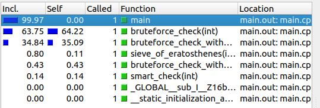

# Valgrind

[Valgrind](https://valgrind.org/) je `framework` za alate za dinamičku analizu programa. Koristi se kao pomoć u otklanjanju bagova sa memorijom i nitima. Dakle, `Valgrind` je profajler i debager, jer predstavlja alat za debagovanje. Ovaj alat se pretežno koristi za `C/C++`.

## Instalacija

### Linux

`sudo apt install valgrind` (Ubuntu, Debian, etc.)

`sudo yum install valgrind` (RHEL, CentOS, Fedora, etc.)

## Callgrind

`Callgrind` je alat za profajliranje koji čuva istoriju poziva funkcija u programu kao graf poziva. Informacije koje nam pruža za dati program su:
  * broj izvršenih instrukcija
  * odnosi izvršenih instrukcija sa odgovarajućim linijama koda
  * `caller/callee` odnos između funkcija (sa frekvencijama)
  * informacije o keširanju (promašaji, pogađaji, ...)
  * itd...

Ideja profajlera je da koji delovi koda (npr. funkcije) najviše utiču na performanse programa (vreme, memorija, ...). Ako se 60% izvršavanja programa svede na jednu funkciju, onda je to dobro mesto za optimizaciju. 

`KCachegrind` je pomoćni alata za vizuelizaciju podataka dobijenih iz `callgrind` analize.


### Uvod u Callgrind (01_callgrind)

- Pogledajmo sledeći program:
```c++
#include <stdio.h>

int global_value = 0;

void f() {
    for(int i=0; i<1000; i++)
        global_value++;
}

void g() {
    for(int i=0; i<2000; i++)
        global_value++;
}

void a() {
    f();
}

void b() {
    f(); f();
}

void c() {
    f(); g();
}

int main() {
    a(); a(); a(); b(); a(); c();
    return 0;
}
```
- Ovde možemo ručno da izračunamo koliko će koja f-ja procentualno da se izvršava tako što prebrojimo "instrukcije":
  * Jedan poziv f-je `f()` vredi `1000`
  * Jedan poziv f-je `g()` vredi `2000`
  * `a()`: Poziva se `4` puta u `main`-u i poziva `1` `f()` => vredi `4*1*1000=4000`
  * `b()`: Poziva se `1` puta u `main`-u i poziva `2` `f()` => vredi `1*2*1000=2000`
  * `c()`: Poziva se `1` puta u `main`-u, poziva `1` `f()` i poziva `1` `g()` => vredi `1*1*1000 + 1*1*2000 = 3000`
  * `f()`: Poziva se `4+2+1 = 7` puta i vredi `7*1000=7000`
  * `g()`: Poziva se `1` puta i vredi `2000`
  * `main()`: Na osnovu `a()`, `b()` i `c()` vidimo da vredi `4000+2000+3000=9000`
- Primetimo da imamo tri nivoa poziva: `main` poziva `a`, `b` i `c`, a ove f-je pozivaju `f` i `g`. Ima smisla da izračunamo procentualno vreme izvršavanja za svaki nivo (nema smisla da mešamo `a` i `f`):
  * `main()`: 9000 tj. 100%
  * `a()`: 4000 tj. 44%; `b()`: 2000 tj. 22%; `c()`: 3000 tj. 33%.
  * `f()`: 7000 tj. 77%; `g()`: 2000 tj. 22%.
- Uz mnogo računa uspeli smo da izračunamo. Ovo je moguće na ovom jednostavnom primeru koji je poprilično deterministički. Ovo nije moguće raditi na malo kompikovanijim primerima. Umesto toga, potrebno je da koristimo profajlere!

Proces (pret)profajliranja:
  * `gcc -g -o main.out main.c`
  * `valgrind --tool=callgrind [options] ./main.out`
  * `kcachegrind [callgrind_output_file_name]`

- Pošto je prethodni proces malo naporan, možemo da napišemo jednostavnu `bash` skriptu koja spaja ove tri komande (ili druge dve ako je proces kompilacije skup):
```
gcc -g -o main.out main.c
valgrind --tool=callgrind --callgrind-out-file=callgrind.out ./main.out
kcachegrind callgrind.out`
```
- Možemo da pokrenemo skriptu `bash run.sh main.c` koja se već nalazi u `01_callgrind` direktorijumu.
- Ako kliknemo na `main` sa leve strane, imamo sledeći očekivani rezultat:


- Ovde imamo oko 12.7% za `f()`, pa 6.4% za `g()`, pa 3.2% za `f()`, pa 6.4% za `f()`. Zapravo gledamo na neku vizualizaciju `grafa poziva (call graph)`. Prvo imamo četiri poziva f-je `a()` u `main()` i to je ukupno 4 poziva `f()` odnosno 12.7% celog programa. Posle toga imamo `g()` i `f()` zajedno (odgovara f-ji `c()`) i na kraju imamo dva poziva f-je `f()` odnosno jedan poziv f-je `b()`. Nažalost, ne izvršavaju se samo ove f-je u programu (postoje neki implicitni pozivi) i zbog toga naš `main()` zauzima samo 29% programa. Ako skaliramo sve procente za `100/29` dobićemo sličan rezultat kao u prethodnom računu.
- Možemo da biramo druge f-je sa leve strane i da vidimo informacije o njima:


- Takođe možemo da vidimo graf poziva, što je veoma korisna stvar. Potrebno je izabrati f-ju i kliknuti na `Call Graph` pri dnu. Nakon toga možemo da `izvozemo (export)` sliku tako što kliknemo desni klik na graf i idemo `Export Graph/As image...`:


- Ovde imamo potpun pregled ukupnog vremenskog zauzeća svake f-je.
- Ako pri vrhu kliknemo na `Source Code`, možemo da vidimo i kod f-je, sa vremenskim zauzećem svake linije:


- Sa leve strane možemo da grupišemo funkcije po izvornim datotekama tako što izaberemo `Source File`


- Pri vrhu možemo da izaberemo opciju da gledamo procente relativne u odnosu na roditelja:


- Sada želimo da isključimo procente i da se igramo sa brojem instrukcija (crveni deo):


- Interpretacija plavog dela:
  * `Incl.`: Broj instrukcija koje ova funkcija generiše po svakom `caller`-u. Moguće je da neki redovi imaju iste vrednosti ako imamo dubok stek. U ovom primeru svi roditelji `main()` f-je imaju istu vrednost kao i `main()` f-ja.
  * `Distance`: Rastojanje između `caller`-a i `callee`-ja. U ovom slučaju je vrednost za `main()` 2, jer
  se f-ja `f()` poziva indirektno iz `main()` preko `a()`, `b()` ili `c()`.
  * `Called`: Ukupan broj poziva ove `callee` (trenutna f-ja) od strane `caller`-a. Ovo podrazumeva direktne i indirektne pozive.
  * `Caller`: Ime `caller`-a.


- Pojmovi:
  * `CEst`: `Cycle Estimation` (procenjeni ukupan broj ciklusa) 
  * `Ir`: `Instruction Fetch` (procenjeni ukupan broj instrukcija)

- Interpretacija:
  * `CEst`: Ukupan broj ciklusa.
  * `CEst per call`: Ukupan broj ciklusa po pozivu
  * `Count`: Broj poziva.

### Benchmark (02_primes)

Na fakultetu smo do sada uglavnom govorili o složenosti programa i na osnovu toga upoređivali koja je implementacija bolja od koje. Ako su algoritmi bili iste složenosti, onda se svelo na neku diskusiju o konstanti. U nastavku imamo `5` implementacija za prebrojavanje prostih brojeva do `100000`. Na osnovu složenosti funkcije možemo da pretpostavimo otprilike koliko iteracija zahtevaju i tako da ih uporedimo.

Prvi način da se prebroje svi prosti brojevi od `1` do `n` je da se za svaki broj `num` između `2` i `n` (1 nije prost broj) proveri da li on ima nekog delitelja između `2` i `num` (bez `num`) tj. da li ima `pravog delitelja`:
```c++
int bruteforce_check(int n)
{
    int cnt = 0;
    for(int num=2; num<=n; num++)
    {
        int is_prime = 1;
        for(int i=2; i<num; i++)
            if(num % i == 0)
            {
                is_prime = 0;
                break;
            }
        cnt += is_prime;
    }
    return cnt;
}
```
- Složenost: `O(n^2)`
- Očekivani broj iteracija: `(10^5)^2 = 10^10`

Za svaki broj `num` važi da je najveći pravi delitelj manji od `num/2`. To možemo da iskoristimo da `duplo` povećamo efikasnost prethodnog programa:

```c++
int bruteforce_check_with_optimization(int n)
{
    int cnt = 0;
    for(int num=2; num<=n; num++)
    {
        int is_prime = 1;
        for(int i=2; 2*i<=num; i++)
            if(num % i == 0)
            {
                is_prime = 0;
                break;
            }
        cnt += is_prime;
    }
    return cnt;
}
```

- **Napomena:** `2*i<=num` je efikasnije od `i<=num/2` (ovo takođe možemo testirati preko `callgrind`-a)
- Složenost: `O(n^2)`
- Očekivani broj iteracija: `(10^5)^2 / 2 = 5*10^9`

Svi pravi deljitelji sem korena broja (ako broj ima pravi koren) idu u paru. Primer za broj `120`: `2 i 60`, `3 i 40`, `4 i 30`, `6 i 20`, `8 i 15`, `10 i 12`. Dovoljno je da tražimo deljitelje do `sqrt(num)`. To odgovara uslovu petlje `i<=sqrt(num)` koji možemo efikasije da zapišemo kao `i*i<=num`.

```c++
int bruteforce_check_with_better_optimization(int n)
{
    int cnt = 0;
    for(int num=2; num<=n; num++)
    {
        int is_prime = 1;
        for(int i=2; i*i<=num; i++)
            if(num % i == 0)
            {
                is_prime = 0;
                break;
            }
        cnt += is_prime;
    }
    return cnt;
}
```

- Složenost `O(n*sqrt(n))`
- Očekivani broj iteracija: `10^5*sqrt(10^5) = 3*10^7`

Ako je broj `p > 3` prost broj, onda je on oblika `p = 6k-1` ili `p = 6k+1`. Na osnovu ovoga možemo da napravimo još efikasniji algoritam:

```c++
int smart_check(int n)
{
    int cnt = 0;
    for(int num=2; num<=n; num++)
    {
        int is_prime = 1;
        if(num > 3)
        {
            if((num%2 == 0) || (num%3 == 0))
            {
                is_prime = 0;
            }
            else
            {
                int i = 5;
                while(i*i <= num)
                {
                    if((num%i == 0) || (num%(i+2) == 0))
                    {
                        is_prime = 0;
                        break;
                    }
                    i += 6;
                }
            }
        }
        cnt += is_prime;
    }
    return cnt;
}
```

- Za ovaj algoritam je već dosta teško da se pretpostavi broj iteracija.
- Složenost `O(n*sqrt(n))`
- Očekivani broj iteracija: `10^5/6*sqrt(10^5/6) = 2*10^6`

Ne moramo za svaki broj posebno da proveramo da li je prost. Umesto toga možemo da iskoristimo algoritam `Erastostenovo sito` kao algoritam:

```c++
int sieve_of_eratosthenes(int n)
{
    std::vector<bool> inset(n+1, true);
    inset[0] = false;
    inset[1] = false;
    for(int i=2; i<=n; i++)
        if(inset[i])
            for(int j=2*i; j<=n; j+=i)
                inset[j] = false;

    int cnt;
    for(bool c: inset)
        cnt += c;
    return cnt;
}
```

- Složenost `O(n*log(log(n)))` (gustina prostih brojeva je `log(log(n))`
- Očekivani broj iteracija: `10^5*log(log(10^5)) = 4*10^5`

Ako prevedemo program i pokrenemo `callgrind` za analizu, možemo da očekujemo sledeći rezultat:


- Alat nam pokazuje samo dve funkcije, jer u ostale implementacije imaju zanemarljive cene u odnosu na ove dve. Ovo je korisno ako radimo na velikom projektu gde imamo preko 100 funkcija.




- Možemo da zaključimo sledeće:
  * Modifikacija `2*i <= num` umesto `i <= num` stvarno jeste duplo ubrzala program;
  * Erastostenovo sito ima gori rezultat od poslednje dve implementacije iako smo očekivali
    da ima najbolji rezultat. To je zbog alokacije i korišćenja vektora. Ako pogledamo `Self` kolonu,
    vidimo da stvarno ima najmanji broj iteracija. 
  * Najbolji rezultat ima `smart_check` funkcija.
  * Ako povećamo broj iteracija, možemo da očekujemo drugačije rezultate, jer Erastostenovo sito
    ima veliku konstantu.

### 03_text

U ovom primeru testiramo pretragu uzorka `pattern` u tekstu `text` pomoću algoritma grube sile koji je složenosti `O(nm)` i pomoću [KMP](https://en.wikipedia.org/wiki/Knuth%E2%80%93Morris%E2%80%93Pratt_algorithm) algoritma koji je složenosti `O(n)`. U prvoj verziji analiziramo efikasnost oba algoritma gde pretražujemo uzorak u celom tekstu kao jednoj nisci. U narednoj verziji tj. verziji `04_text` analiziramo efikasnost oba algoritma gde pretražujemo uzorak u svakoj reči u tekstu kao zasebnoj nisci. Pomoćna skripta:

```bash
#!/bin/bash  
# Constants

vcgout="callgrind.out"
exename="bench.out"
default_input="sample.txt"

# Parameteres
keyword=$1
input=$2

if [[ "$keyword" == "" ]]
then
    echo "Empty keyword!"
    exit
fi

if [[ "$input" == "" ]]
then
    input="$default_input"
fi

# Compilation
g++ -std=c++17 -g -o "$exename" main.cpp

# Callgrind
valgrind --tool=callgrind --callgrind-out-file="$vcgout" "./$exename" "$input" "$keyword"

# Kcachegrind
kcachegrind "$vcgout"

# cleanup
rm "$vcgout" "$exename"
```

- **Funkcionalnosti skripte:**
  - Pokretanje `benchmark`-a sa podrazumevanim ulazom `sample.txt` i odabranim uzorkom: `./benchmark [pattern]`
  - Pokretanje `benchmark`-a sa izabranim ulazom i odabranim uzorkom: `./benchmark [pattern] [input]`
  - Proces: Prevođenje `main.cpp` izvornog koda, pokretanje `callgrind`-a nad izvršnim kodom i pokretanje `kcachegrind`-a nad dobijenim izlazom.
- Za većinu ključnih reči nad `sample.txt` datoteci dobijamo slične performanse za oba algoritma (KMP je za 20-40% efikasniji).
- Za specijalan slučaj (koji nije realan) `./benchmark AAAAAAAAAAAAAAAAAAAAAAAA pseudo_sample.txt`, gde se `pseudo_sample.txt` sastoji samo od dugačkog niza slova A, dobijamo da je `KMP` neuporedivo bolji od grube sile.
- Na ovom primeru vidimo da nekad nije dovoljno da samo posmatramo složenost algoritma kako bismo procenili efikasnost jednog algoritma u odnosu na drugi.

### 04_text

Analogno prethodnom primeru, samo što posmatramo svaku reč kao posebnu nisku za pretragu uzorka, umesto celu datoteku kao jednu nisku.

### 05_sort (domaći)

- Možemo da uporedimo rad različitih funkcija za sortiranje preko `callgrind`-a:
  - MergeSort
  - QuickSort
  - RadixSort

## Qt i analiza koda

Razvojno okruženje `qtcreator` ima opciju `Analyze` kao padajući meni i tu postoje opcije za `Valgrind Memory Analyzer` analizu koda. **Napomena:** Veoma spora operacija.

## Reference

[\[1\] Memcheck](https://www.valgrind.org/docs/manual/mc-manual.html)

[\[2\] Helgrind](https://www.valgrind.org/docs/manual/hg-manual.html)

[\[3\] Callgrind](https://valgrind.org/docs/manual/cl-manual.html)

[\[4\] Callgrind-KCachegrind](http://kcachegrind.sourceforge.net/html/Home.html)

[\[5\] Valgrind-Ana-Vulovic](http://www.verifikacijasoftvera.matf.bg.ac.rs/vs/vezbe/05/vs_vezbe_05.pdf)

[\[6\] Valgrind](https://valgrind.org/)

[\[7\] Stackoverflow-Joshua-Detwiler](https://stackoverflow.com/questions/5134891/how-do-i-use-valgrind-to-find-memory-leaks)
