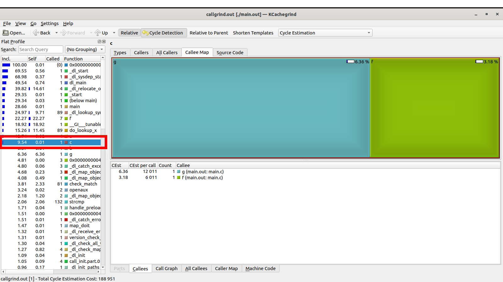

# Valgrind

[Valgrind](https://valgrind.org/) je `framework` za alate za dinamičku analizu programa. Koristi se kao pomoć u otklanjanju bagova sa memorijom i nitima. Dakle, `Valgrind` je profajler i debager, jer predstavlja alat za debagovanje. Ovaj alat se pretežno koristi za `C/C++`.

## Instalacija

### Linux

`sudo apt install valgrind` (Ubuntu, Debian, etc.)

`sudo yum install valgrind` (RHEL, CentOS, Fedora, etc.)

## Memcheck (01_malloc)

Najbolje da prvo testiramo `Valgrind` tj. `memcheck` na nekom jednostavnom primeru:
```
#include <stdlib.h>

int main() {
    char* string = malloc(5 * sizeof(char)); //LEAK: not freed!
    return 0;
}
```
- Unapred znamo da dolazi do curenja memorije koju ne oslobađamo nakon što pozovemo `malloc`.
- Postoje `man` strane za `Valgrind` dokumentaciju: `man valgrind`
- Analizu započinjemo komandom `valgrind [options] [exe_file]` nad izvršnom datotekom.

Opcije:
- `--leak-check=full`: Ispisuje u detalje svako curenje memerije;
- `--show-leak-kinds=all`: Prikazuje `definite, indirect, possible, reachable` tipove curenja memorije (`definite, possible` su podrazumevani);
- `--track-origins=yes`: Pomaže u pronalaženju uzroka curenja memorije, ali značajno usporava rad analize;
- `--log-file=[output_file]`: Izlaz smešta u izabranu datoteku.

Konačno:
```
valgrind --leak-check=full \
         --show-leak-kinds=all \
         --track-origins=yes \
         --log-file=log.txt \
         ./main.out
```
- Sada možemo da pogledamo `log.txt` datoteku (ovde je podeljeno na više delova):
```
Memcheck, a memory error detector
Copyright (C) 2002-2017, and GNU GPL'd, by Julian Seward et al.
Using Valgrind-3.15.0 and LibVEX; rerun with -h for copyright info
```
- Informacije o licenci i verziji `Valgrind`-a. Ovaj deo nam nije toliko interesantan trenutno.
- Prefiks svake linije je izbačen kako bi izlaz bio čitljiji.
```
Command: ./main.out
Parent PID: 4994
```
- Ime programa i `PID (Process ID)` programa. 
```
HEAP SUMMARY:
    in use at exit: 5 bytes in 1 blocks
  total heap usage: 1 allocs, 0 frees, 5 bytes allocated
```
- Ovde vidimo da je pri kraju programa ostalo 5 bajtova u memoriji (što jeste tačno, jer smo toliko i alocirali).
- Takođe vidimo da imamo jednu alokaciju i nula oslobađanja (curenje memorije).
```
5 bytes in 1 blocks are definitely lost in loss record 1 of 1
   at 0x483B7F3: malloc (in /usr/lib/x86_64-linux-gnu/valgrind/vgpreload_memcheck-amd64-linux.so)
   by 0x10915E: main (in /home/mokoyo/Desktop/ALATI/MATF-AZRS/tema06_valgrind/01_malloc/main.out)
```
- Ovaj deo predstavlja niz blokova memorije koji su procureli. 
- Vidimo da je `malloc` u `main`-u "izazvao" curenje memorije. To nam je dovoljno informacija da sada ispravimo grešku za ovaj jednostavan program. Šta ako imamo 15 poziva `malloc` u `main`-u?
```
LEAK SUMMARY:
   definitely lost: 5 bytes in 1 blocks
   indirectly lost: 0 bytes in 0 blocks
     possibly lost: 0 bytes in 0 blocks
   still reachable: 0 bytes in 0 blocks
        suppressed: 0 bytes in 0 blocks

For lists of detected and suppressed errors, rerun with: -s
ERROR SUMMARY: 1 errors from 1 contexts (suppressed: 0 from 0)
```
- Ovde vidimo krajnje statistike.

- Bilo bi mnogo mnogo bolje kad bi `Valgrind` mogao da nam preciznije kaže gde je došlo do curenja memorije (npr. linija komande koja je alocirala blok koji nije oslobođen). Odgovor je pozitivan. Potrebno je da prevedemo naš program sa opcijom `-g` čime dodajemo potrebne informacije: `gcc -g -o main.out main.c`
- Ako opet pokrenemo `valgrind` komandu, onda ćemo videti sledeće:
```
5 bytes in 1 blocks are definitely lost in loss record 1 of 1
   at 0x483B7F3: malloc (in /usr/lib/x86_64-linux-gnu/valgrind/vgpreload_memcheck-amd64-linux.so)
   by 0x10915E: main (main.c:4)
```
- Tačno znamo koji blok nije oslobođen sad!
- Ako dodamo `free(string);` na na kraj `main` f-je dobijamo sledeći očekivani rezultat:
```
HEAP SUMMARY:
    in use at exit: 0 bytes in 0 blocks
  total heap usage: 1 allocs, 1 frees, 5 bytes allocated

All heap blocks were freed -- no leaks are possible

For lists of detected and suppressed errors, rerun with: -s
ERROR SUMMARY: 0 errors from 0 contexts (suppressed: 0 from 0)
```
- Ovo je idealan slučaj: `All heap blocks were freed -- no leaks are possible`.
- **Napomena:** `Valgrind` nam govori koji blok je alociran, a nije oslobođen.

## Primer izgubljene reference (02_function_local_pointer)

Imamo sledeći kod:
```
#include <stdlib.h>
#include <stdint.h>

struct _List {
    int32_t* data;
    int32_t length;
};
typedef struct _List List;

List* resizeArray(List* array) {
    int32_t* dPtr = array->data;
    dPtr = realloc(dPtr, 15 * sizeof(int32_t)); //doesn't update array->data
    return array;
}

int main() {
    List* array = calloc(1, sizeof(List));
    array->data = calloc(10, sizeof(int32_t));
    array = resizeArray(array);

    free(array->data);
    free(array);
    return 0;
}
```
- Ovo je slična greška koja se pojavljuje u jednom primeru za `gdb` alat. Međutim, ovaj program ima `nevidljiv` bag u smislu da ako pokrenemo program, on će raditi bez problema. Ovaj bag utiče samo na performanse (koristi više memorije). Ako pokrenemo program, možemo čak da pomislimo da sve radi kako treba. Uvek možemo `za svaki slučaj` da pokrenemo `valgrind`:
```
valgrind --leak-check=full \
         --show-leak-kinds=all \
         --track-origins=yes \
         --log-file=log.txt \
         ./main.out
```
- Očekivani oblik izlaza:
```
Invalid free() / delete / delete[] / realloc()
   at 0x483CA3F: free (in /usr/lib/x86_64-linux-gnu/valgrind/vgpreload_memcheck-amd64-linux.so)
   by 0x109215: main (main.c:21)
 Address 0x4a61090 is 0 bytes inside a block of size 40 free'd
   at 0x483DFAF: realloc (in /usr/lib/x86_64-linux-gnu/valgrind/vgpreload_memcheck-amd64-linux.so)
   by 0x1091B4: resizeArray (main.c:12)
   by 0x109202: main (main.c:19)
 Block was alloc'd at
   at 0x483DD99: calloc (in /usr/lib/x86_64-linux-gnu/valgrind/vgpreload_memcheck-amd64-linux.so)
   by 0x1091EC: main (main.c:18)
```
- Možemo da primetimo sledeće iz prvog dela analize:
    * Imamo jedno neuspešno oslobadjanje (npr. oslobadjanje pogrešno bloka);
    * Blok od 40 bajtova tj. `calloc(10, sizeof(int32_t))` blok je oslobođen u f-ji `realloc` na `12`-toj liniji, što je i očekivano ponašanje;
    * Blok od 60 bajtova tj. `realloc(dPtr, 15 * sizeof(int32_t))` blok nije oslobođen (procureo je).
```
 HEAP SUMMARY:
     in use at exit: 60 bytes in 1 blocks
   total heap usage: 3 allocs, 3 frees, 116 bytes allocated
 
 60 bytes in 1 blocks are definitely lost in loss record 1 of 1
    at 0x483DFAF: realloc (in /usr/lib/x86_64-linux-gnu/valgrind/vgpreload_memcheck-amd64-linux.so)
    by 0x1091B4: resizeArray (main.c:12)
    by 0x109202: main (main.c:19)
 
 LEAK SUMMARY:
    definitely lost: 60 bytes in 1 blocks
    indirectly lost: 0 bytes in 0 blocks
      possibly lost: 0 bytes in 0 blocks
    still reachable: 0 bytes in 0 blocks
         suppressed: 0 bytes in 0 blocks
 
 For lists of detected and suppressed errors, rerun with: -s
 ERROR SUMMARY: 2 errors from 2 contexts (suppressed: 0 from 0)
```
- Ovde vidimo da postoje 3 alokacije i 3 dealokacije. Pošto je jedna dealokacije neuspešna, ostaje nam jedan procureo blok.
- Razlog zašto je blok iz f-je `resizeArray` procureo je zbog toga što `array->data` nije ažuriran. Ako se doda linija `array->data = dPtr` pre `return` naredbe, problem je rešen.
- **Problem:** izgubljena referenca na blok memorije.

## RAII (03_raii)

- Zadatak nam je da učitamo uzorak iz `input.txt` datoteke, i izračunamo sredinu i standardnu devijaciju tog uzorka koristeći dinamičke nizove u c-u:

%20=%20\frac{\sum_{i=1}^{n}x_i}{n})

%20=%20\sqrt{\frac{\sum_{i=1}^{n}(\overline{x}-x_i)^2}{n-1}})

- Imamo dve problematične operacije ovde:
  * Otvaranje datoteke `input.txt` (potrebno ju je zatvoriti);
  * Alokacija memorije za niz (potrebno je osloboditi memoriju);
- U sledećim situacijama je potrebno prekinuti program:
  * Ako datoteka ne postoji (ovo nije problematično, jer se datoteka ne otvara i niz se ne alocira);
  * Ako je `n<0`, gde je `n` veličina uzorka (prvi broj koji se čita iz datoteke);
  * Ako je `n=1` (zbog `std` formule);
  * Ako je neki broj u nizu jednak `666` (neprihvatljiv broj).
- Ono što je posebno problematično u ovom slučaju je to što curenje memorije ne nastaje uvek. Nema curenja memorije u slučaju ispravnog ulaza. Ovde je korisno da se prave `unit` testovi za specijalne slučajeve (`za domaći`). **Napomena:** Ne pravimo `unit` testove zato što smo našli grešku, nego da bismo mogli da uočimo ovakav tip grešaka i proverimo da li su greške uklonjene nakon odgovarajućih promena.

### main_v1.c

- Pogledajmo sledeći ulaz:
```
5
1 2 3 4 5
```
- Za ovaj ulaz nam komanda `valgrind ./main.out` daje sledeći izlaz:
```
HEAP SUMMARY:
    in use at exit: 0 bytes in 0 blocks
  total heap usage: 4 allocs, 4 frees, 5,632 bytes allocated

All heap blocks were freed -- no leaks are possible
```
- Pogledajmo sledeći ulaz:
```
5
1 2 666 4 5
```
- Za ovaj ulaz nam `valgrind ./main.out` daje sledeći izlaz:
```
HEAP SUMMARY:
    in use at exit: 512 bytes in 2 blocks
  total heap usage: 4 allocs, 2 frees, 5,632 bytes allocated

LEAK SUMMARY:
   definitely lost: 40 bytes in 1 blocks
   indirectly lost: 0 bytes in 0 blocks
     possibly lost: 0 bytes in 0 blocks
   still reachable: 472 bytes in 1 blocks
        suppressed: 0 bytes in 0 blocks
```

### main_v2.c

- Možemo da vodimo računa da u svakom trenutku oslobodimo sve resurse pre nego što prekinemo funkciju. 
- Problem kod ovog rešenja je što previše puta pišemo sličan kod za oslobađanje resursa, a velike su šanse da nam nešto promakne u nekom slučaju.

### main_v3.c

- Bolje rešenje je da imamo jednu promenljivu `status` u kojoj čuvamo status funkcije:
  * ```OKAY       0``` (Ako nije došlo do greške)
  * ```NEGATIVE_N 1``` (Ako `n<0`)
  * ```SMALL_N    2``` (Ako je `n==1`)
  * ```EVIL       4``` (Ako je `xs[i]==666`)
- Funkcija se "uvek" izvršava do kraja. Na kraju funkcije se oslobađaju resursi i proverava se status funkcije. U ovom slučaju `check_status` funkcija proverava `status`. Na ovaj način manje razmišljamo o oslobađanju memorije u svakom specijalno slučaju. Jedini nezgodan slučaj koji ostaje je neuspešna alokacija niza, jer tada tada ne smemo da koristimo taj resurs (taj slučaj rešavamo kao u prethodnom rešenju). Takođe ovo rešenje nam omogućava da ispišemo sve greške koje su se desile ako nam je to od koristi. Potrebno je samo da koristimo stepene dvojke za makroe ili enume i posmatramo celobrojnu promenljivu kao registar sa zastavicama. Ako je vrednost bita `1`, onda je došlo do te greške, a u suprotnom nije došlo do te greške. Ako je vrednost tog registra `0` za svaki bit, onda nije došlo do greške. Primer: Ako je `status==3`, onda je `n<0` i `n==1` (ovo nije moguće ako program ima normalno ponašanje).
- Ovo predstavlja bolju praksu za programiranje u C-u, ali i dalje moramo da vodimo računa da ne koristimo resurse koji su "pokvareni".

### main_v4.cpp

- Ako radimo u `C++`-u, postoji mnogo lakše rešenje: `RAII (Resource Acquisition Is Initialization)`. Ideja je jednostavna: Želimo da spojimo životni vek resursa sa životnim vekom objekta:
  * Pravimo `raii` strukturu za rad sa datotekama (ne koristimo klase i enkapsulaciju, jer želimo da nam kod što više liči na početni).
  * Pravimo `raii` strukturu za rad sa dinamičkim nizovima.
- Ovi objekti funkcionišu na sledeći način:
  * Konstruktor zauzima resurse;
  * Destruktor oslobađa resurse.
- **Dobitak:** Gde god da prekinemo funkciju, poziva se destruktor objekta i oslobađa se memorija. 

Struktura `raii_file`:
```
struct raii_file{
    FILE* m_file;

    raii_file(const char* file_name)
    {
        m_file = fopen(file_name, "r");
        if(m_file == NULL)
        {
            printf("Error: File \"input.m_file.txt\" is missing!\n");
            exit(-1);
        }
    }
    ~raii_file()
    {
        free(m_file);
    }
};
```
- U konstruktoru se vrši provera da li je datoteka uspešno otvorena. Ako nije, program se prekida. 
- Alternativa je da kontruktor izbaci izuzetak (bolje rešenje).

Struktura `raii_array`:
```
struct raii_array{
    double* m_arr;

    raii_array(int n)
    {
        m_arr = (double*)malloc(n*sizeof(double));
        if(m_arr == NULL)
        {
            printf("Errof: Failed to allocate!");
            exit(-1);
        }
    }
    ~raii_array()
    {
        free(m_arr);
    }
};
```
- U konstruktoru se vrši provera da li je niz uspešno alociran. Ako nije, program se prekida. 
- Alternativa je da kontruktor izbaci izuzetak (bolje rešenje).

### main_v5.cpp

- Još bolje rešenje je da koristimo strukture (klase) koje već postoje u `C++`-u:
  * Vektor je `raii` dinamički niz: `std::vector<type_t>`
  * Strimovi mogu da zamene rad sa datotekama: `std::ifstream`

## Niti u C++-u

`Valgrind` nam nudi alat `helgrind` koji služi da pronalaženje grešaka i predikciju potencijalnih grešaka pri radu sa nitima u `C++`-u. Prvo treba da naučimo (obnovimo) osnove sintakse za `C++` niti. Ovde se podrazumeva da znamo šta je `nit (thread)` i šta je `muteks (mutex)`.

### 04_threads

Sinktaksa za pravljenje niti je sledeća: `std::thread threadName(func, arg1, arg2, ...)`. Kada se napravi objekat `thread`, on odmah poziva funkciju `func` i izvršava je. Ne postoji `.start()`  tj `.run()` metod kao u `Java`-i:
```
#include <iostream>
#include <thread>

void hello()
{
    std::cout << "Hello World!" << std::endl;
}

int main()
{
    // Pravi se objekat niti koji odmah zapocinje rad f-je hello()
    std::thread helloThread(hello);
    helloThread.join();
    return 0;
}
```
- Očekivani rezultat programa:
```
Hello World!
```

### 05_helgrind

- Sada možemo da demonstriramo rad alata `helgrind` nad sledećim jednostanim primerom:
```
#include <iostream>
#include <thread>

int global_value = 0;

void inc_value()
{
    global_value++;
}

int main()
{
    std::thread thread(inc_value);
    global_value++;
    thread.join();

    return 0;
}
```
- Imamo neku globalnu promenljivu koju ažuriraju glavna nit i napravljena nit. Da li je ovo problematično? Ako nismo sigurni, možemo da proverimo preko `helgrind` alata:
  * `g++ -g -o main.out main.cpp -lpthread`
  * `valgrind --tool=helgrind --log-file=log.txt ./main.out`
- Ako pogledamo `log.txt`, vidimo da svašta tu piše. Ovde izdvajamo interesatne stvari:
```
Thread #1 is the program's root thread
```
- Alat `helgrind` indeksira glavni program (glavnu nit) sa `#1`
```
---Thread-Announcement------------------------------------------

Thread #2 was created
   at 0x4BB3282: clone (clone.S:71)
   by 0x487A2EB: create_thread (createthread.c:101)
   ....
   by 0x1092B1: main (main.cpp:13)
```
- Takođe nam govori kojim su se redosledom koje niti napravile i gde. Zbog preglednosti su obrisani delovi koji nam nisu interesatni. Ovde nam je rečeno da je nit `#2` napravljena u `main` f-ji na liniji `13` (što i jeste tačno ako pogledamo kod).
```
Possible data race during read of size 4 at 0x10C01C by thread #1
Locks held: none
   at 0x1092B2: main (main.cpp:14)

This conflicts with a previous write of size 4 by thread #2
Locks held: none
   at 0x10927A: inc_value() (main.cpp:8)
```
- Postoji opasnost od [trke za resurse (data race)](https://docs.oracle.com/cd/E19205-01/820-0619/geojs/index.html#:~:text=A%20data%20race%20occurs%20when,their%20accesses%20to%20that%20memory.). Trka za resurse nastaje kada dve niti u okviru jednog procesa:     
  * pristupaju istom resursu (promenljivoj)
  * barem jedna nit piše (menja vrednost)
  * ne postoji međusobno isključivanje (mutex)
- Alat nam kaže da postoji konflikt između niti `#1` na liniji `14` i niti `#2` na liniji `8`. Tu vidimo da je promenljiva tj. resurs `global_value` kritičan i da mora da se napravi eksluzivan pristup (muteks).

### 06_helgrind

- Možemo da uradimo jedan klasičan zadatak za demonstraciju rada sa nitima i alata `helgrind`. Želimo da sumiramo jedan veliki vektor tako što ga podelimo na 10 približno jednakih celina, gde svaka nit sumira tu jednu celinu. 
- U `input.txt` datoteci se nalazi 10000 brojeva od 1 do 10000 (bez ponavljanja). Rešenje možemo da izračunamo [gausovom formulom](https://mathbitsnotebook.com/Algebra2/Sequences/SSGauss.html): `50005000`. 

#### broken.cpp

- U suštini nam je samo interesantna funkcija `vsum`:
```
void vsum(int id, const std::vector<int>& vec, int start, int end, int *result)
{
    std::cout << "[Thread " << id << "] Started!" << std::endl;

    for(int i=start; i<end; i++)
    {
        std::this_thread::sleep_for (std::chrono::nanoseconds(1));
        *result += vec[i];
    }

    std::cout << "[Thread " << id << "] Finished!" << std::endl;
}
```
- **Napomena:** Linija `std::this_thread::sleep_for (std::chrono::milliseconds(1));` je samo tu da poveća šansu da se izračuna pogrešan rezultat. Pošto zadatak nije toliko zahtevan po jednoj niti, može da svaka nit završi svoj posao pre nego što se napravi sledeća i da se tako dobije tačan rezultat.
- Ako pokrenemo kod, onda verovatno nećemo dobiti tačan rezultat zbog `trke za resurse`.
- U tom slučaju je potrebno izvršiti sihronizaciju niti. 
- Možemo da iskoristimo `helgrind` da vidimo u čemu je problem: 
  * `valgrind --tool=helgrind --log-file=log.txt ./broken.out < input.txt`:
```
ERROR SUMMARY: 20461 errors from 18 contexts (suppressed: 582 from 65)
```
- Ovo ne izgleda dobro, ali nam `helgrind` daje dosta informacija:
  * Redosled kreiranih niti (ovo zavisi od `OS`-a)
  * Potencijalne trke za resurse
- Ako pogledamo ispis za trke za resurse, vidimo nešto što nije mnogo čitljivo. To je zato što `helgrind` ispisuje ceo stek (sve što `C++` radi u "pozadini"), a nas interesuje samo `vsum` funkcija. Dovoljno je da ignorišemo sve posle `vsum` funkcije. Takođe možemo da obrišemo "ružan" deo. Rezultat izgleda nešto ovako:
```
Possible data race during read of size 8 at 0x114058 by thread #3
Locks held: none
   at 0x49C88B3: std::basic_ostream
   by 0x49C8D5B: std::basic_ostream
   by 0x10A447: vsum(int, std::vector<int, std::allocator<int> > const&, int, int, int*) (broken.cpp:11)

This conflicts with a previous write of size 8 by thread #2
Locks held: none
   at 0x49C8965: std::basic_ostream
   by 0x49C8D5B: std::basic_ostream
   by 0x10A447: vsum(int, std::vector<int, std::allocator<int> > const&, int, int, int*) (broken.cpp:11)
```
- Sada imamo nešto što je za čoveka čitljivo! Imamo konflitke strimova između niti `#3` i `#2` u funkciji `vsum`. Čak nam `helgrind` govori i da se radi o `11`-toj liniji:
```
std::cout << "[Thread " << id << "] Started!" << std::endl;
```
- Problem je u tome što obe niti koriste strim za standardni izlaz kao zajednički resurs. Potrebno je da napravimo `mutex` i zaključamo ovu liniju (tačnije resurs). Analogno je i za drugi ispis na `19`-toj liniji. 
- Možemo da ispravimo ovo i pokrenemo opet `helgrind` kako bismo videli da li smo ispravili sve greške.
- Postoji još jedna greška koja je možda očiglednija:
```
Possible data race during read of size 4 at 0x1FFEFFF968 by thread #3
Locks held: none
   at 0x10A4CB: vsum(int, std::vector<int, std::allocator<int> > const&, int, int, int*) (broken.cpp:16)

This conflicts with a previous write of size 4 by thread #2
Locks held: none
   at 0x10A4D3: vsum(int, std::vector<int, std::allocator<int> > const&, int, int, int*) (broken.cpp:16)
```
- Problematična linija je: `*result += vec[i];`
- Potrebno je da zaključamo i ovaj resurs.

#### bad_fix.cpp

- Najjednostavniji način da rešimo prethodni problem je da zaključamo celu f-ju `vsum`. Možemo da napravimo katanac na početku f-je koji zauzima globalni muteks i traje koliko i životni vek tog objekta (u ovom slučaju do kraja funkcije `vsum`):
  * `const std::lock_guard<std::mutex> lock(mutex);`
- Ovo je analogno sinhronizovanim blokovima i funkcijama u `Java`-i.
- Opcija `lock_guard` je solidno rešenje ako funkcija ima više `return`-ova. Umesto da vodimo računa da otključamo zaključani muteks, možemo samo da napravimo katanac koji otključava svoj muteks pri pozivanju destruktora (slična priča kao RAII primer).
```
std::mutex mutex;

void vsum(int id, const std::vector<int>& vec, int start, int end, int *result)
{
    const std::lock_guard<std::mutex> lock(mutex);
    std::cout << "[Thread " << id << "] Started!" << std::endl;

    for(int i=start; i<end; i++)
    {
        std::this_thread::sleep_for (std::chrono::nanoseconds(1));
        *result += vec[i];
    }

    std::cout << "[Thread " << id << "] Finished!" << std::endl;
}
```

#### another_bad_fix.cpp

- Možemo i zaključamo sve kritiče delove koda na osnovu `helgrind` analize:
```
std::mutex mutex;

void vsum(int id, const std::vector<int>& vec, int start, int end, int *result)
{
    mutex.lock();
    std::cout << "[Thread " << id << "] Started!" << std::endl;
    mutex.unlock();

    for(int i=start; i<end; i++)
    {
        std::this_thread::sleep_for (std::chrono::nanoseconds(1));
        mutex.lock();
        *result += vec[i];
        mutex.unlock();
    }

    mutex.lock();
    std::cout << "[Thread " << id << "] Finished!" << std::endl;
    mutex.unlock();
}
```

#### better_fix.cpp

- Prethodna rešenja rešavaju problem, ali možemo vrlo jednostavno povećati stepen paralelnosti. Pošto smo već podelili vektor na celine, ima smisla da za svaku celinu prvo izračunamo sumu u posebnoj promenljivoj `sum` (koja je lokalna za svaku nit), pa tek onda da zaključamo `result` i ažuriramo vrednost:
```
std::mutex mutex;

void vsum(int id, const std::vector<int>& vec, int start, int end, int *result)
{
    mutex.lock();
    std::cout << "[Thread " << id << "] Started!" << std::endl;
    mutex.unlock();

    int sum = 0;
    for(int i=start; i<end; i++)
    {
        std::this_thread::sleep_for (std::chrono::nanoseconds(1));
        sum += vec[i];
    }

    mutex.lock();
    *result += sum;
    std::cout << "[Thread " << id << "] Finished!" << std::endl;
    mutex.unlock();
}
```
- Sada se `result` zaključava samo `10` puta (jednom za svaku nit) i jos bitnije, procenat vremena tokom kojeg je ovaj resurs zaključan je značajno manji. 

#### best_fix.cpp

- Poslednja optimizacija se odnosi na činjenicu da je skoro uvek bolje imati više specijalizovanih muteksa nego jedan opšti. Nema potrebe da zaključavamo `result` promenljivu ako je potrebno da pišemo nešto na standardni izlaz! Zamenjujemo `mutex` sa `mutex_result` i `mutex_stdout`.
```
std::mutex mutex_stdout;
std::mutex mutex_result;

void vsum(int id, const std::vector<int>& vec, int start, int end, int *result)
{
    mutex_stdout.lock();
    std::cout << "[Thread " << id << "] Started!" << std::endl;
    mutex_stdout.unlock();

    int sum = 0;
    for(int i=start; i<end; i++)
    {
        std::this_thread::sleep_for (std::chrono::nanoseconds(1));
        sum += vec[i];
    }

    mutex_result.lock();
    *result += sum;
    mutex_result.unlock();

    mutex_stdout.lock();
    std::cout << "[Thread " << id << "] Finished!" << std::endl;
    mutex_stdout.unlock();
}
```

#### best_fix_with_atomic.cpp

- Ovo rešenje je slično kao prethodno, ali umesto muteksa za zaključavanje `result` promenljive se koristi `atomička promenljiva (atomic_value)`. Ovo je kao da smo spojili `mutex_result` i `result` u jedan objekat i potencijalno ubrzali program, jer atomičke promenljive koriste mutekse nižeg nivoa (ovu činjenicu uzeti sa rezervom):
```
void vsum(int id, const std::vector<int>& vec, int start, int end, std::atomic<int> *result)
{
    mutex_stdout.lock();
    std::cout << "[Thread " << id << "] Started!" << std::endl;
    mutex_stdout.unlock();

    int sum = 0;
    for(int i=start; i<end; i++)
    {
        std::this_thread::sleep_for (std::chrono::nanoseconds(1));
        sum += vec[i];
    }

    result->fetch_add(sum);

    mutex_stdout.lock();
    std::cout << "[Thread " << id << "] Finished!" << std::endl;
    mutex_stdout.unlock();
}
```

**Napomena:** Ovde je predstavljeno više rešenja, ali na ispitu je dovoljno znati `helgrind` i barem jedan način za rešavanje datog problema. Uglavnom se svaki problem može rešiti preko muteksa.

## Callgrind

`Callgrind` je alat za profajliranje koji čuva istoriju poziva funkcija u programu kao graf poziva. Informacije koje nam pruža za dati program su:
  * broj izvršenih instrukcija
  * odnosi izvršenih instrukcija sa odgovarajućim linijama koda
  * `caller/callee` odnos između funkcija (sa frekvencijama)
  * informacije o keširanju (promašaji, pogađaji, ...)
  * itd...

Ideja profajlera je da koji delovi koda (npr. funkcije) najviše utiču na performanse programa (vreme, memorija, ...). Ako se 60% izvršavanja programa svede na jednu funkciju, onda je to dobro mesto za optimizaciju. 

`KCachegrind` je pomoćni alata za vizuelizaciju podataka dobijenih iz `callgrind` analize.


### Uvod u Callgrind (07_callgrind)

- Pogledajmo sledeći program:
```
#include <stdio.h>

int global_value = 0;

void f() {
    for(int i=0; i<1000; i++)
        global_value++;
}

void g() {
    for(int i=0; i<2000; i++)
        global_value++;
}

void a() {
    f();
}

void b() {
    f(); f();
}

void c() {
    f(); g();
}

int main() {
    a(); a(); a(); b(); a(); c();
    return 0;
}
```
- Ovde možemo ručno da izračunamo koliko će koja f-ja procentualno da se izvršava tako što prebrojimo "instrukcije":
  * Jedan poziv f-je `f()` vredi `1000`
  * Jedan poziv f-je `g()` vredi `2000`
  * `a()`: Poziva se `4` puta u `main`-u i poziva `1` `f()` => vredi `4*1*1000=4000`
  * `b()`: Poziva se `1` puta u `main`-u i poziva `2` `f()` => vredi `1*2*1000=2000`
  * `c()`: Poziva se `1` puta u `main`-u, poziva `1` `f()` i poziva `1` `g()` => vredi `1*1*1000 + 1*1*2000 = 3000`
  * `f()`: Poziva se `4+2+1 = 7` puta i vredi `7*1000=7000`
  * `g()`: Poziva se `1` puta i vredi `2000`
  * `main()`: Na osnovu `a()`, `b()` i `c()` vidimo da vredi `4000+2000+3000=9000`
- Primetimo da imamo tri nivoa poziva: `main` poziva `a`, `b` i `c`, a ove f-je pozivaju `f` i `g`. Ima smisla da izračunamo procentualno vreme izvršavanja za svaki nivo (nema smisla da mešamo `a` i `f`):
  * `main()`: 9000 tj. 100%
  * `a()`: 4000 tj. 44%; `b()`: 2000 tj. 22%; `c()`: 3000 tj. 33%.
  * `f()`: 7000 tj. 77%; `g()`: 2000 tj. 22%.
- Uz mnogo računa uspeli smo da izračunamo. Ovo je moguće na ovom jednostavnom primeru koji je poprilično deterministički. Ovo nije moguće raditi na malo kompikovanijim primerima. Umesto toga, potrebno je da koristimo profajlere!

Proces (pret)profajliranja:
  * `gcc -g -o main.out main.c`
  * `valgrind --tool=callgrind [options] ./main.out`
  * `kcachegrind [callgrind_output_file_name]`

- Pošto je prethodni proces malo naporan, možemo da napišemo jednostavnu `bash` skriptu koja spaja ove tri komande (ili druge dve ako je proces kompilacije skup):
```
gcc -g -o main.out main.c
valgrind --tool=callgrind --callgrind-out-file=callgrind.out ./main.out
kcachegrind callgrind.out`
```
- Možemo da pokrenemo skriptu `bash run.sh main.c` koja se već nalazi u `07_callgrind` direktorijumu.
- Ako kliknemo na `main` sa leve strane, imamo sledeći očekivani rezultat:


- Ovde imamo oko 12.7% za `f()`, pa 6.4% za `g()`, pa 3.2% za `f()`, pa 6.4% za `f()`. Zapravo gledamo na neku vizuelizaciju `grafa poziva (call graph)`. Prvo imamo četiri poziva f-je `a()` u `main()` i to je ukupno 4 poziva `f()` odnosno 12.7% celog programa. Posle toga imamo `g()` i `f()` zajedno (odgovara f-ji `c()`) i na kraju imamo dva poziva f-je `f()` odnosno jedan poziv f-je `b()`. Nažalost, ne izvršavaju se samo ove f-je u programu (postoje neki implicitni pozivi) i zbog toga naš `main()` zauzima samo 29% programa. Ako skaliramo sve procente za `100/29` dobićemo sličan rezultat kao u prethodnom računu.
- Možemo da biramo druge f-je sa leve strane i da vidimo informacije o njima:



- Takođe možemo da vidimo graf poziva, što je veoma korisna stvar. Potrebno je izabrati f-ju i kliknuti na `Call Graph` pri dnu. Nakon toga možemo da `izvozemo (export)` sliku tako što kliknemo desni klik na graf i idemo `Export Graph/As image...`:


- Ovde imamo potpun pregled ukupnog vremenskog zauzeća svake f-je.
- Ako pri vrhu kliknemo na `Source Code`, možemo da vidimo i kod f-je, sa vremenskim zauzećem svake linije:


- Sa leve strane možemo da grupišemo funkcije po izvornim datotekama tako što izaberemo `Source File`


- Pri vrhu možemo da izaberemo opciju da gledamo procente relativne u odnosu na roditelja:


- Sada želimo da isključimo procente i da se igramo sa brojem instrukcija (crveni deo):


- Interpretacija plavog dela:
  * `Incl.`: Broj instrukcija koje ova funkcija generiše po svakom `caller`-u. Moguće je da neki redovi imaju iste vrednosti ako imamo dubok stek. U ovom primeru svi roditelji `main()` f-je imaju istu vrednost kao i `main()` f-ja.
  * `Distance`: Rastojanje između `caller`-a i `callee`-ja. U ovom slučaju je vrednost za `main()` 2, jer
  se f-ja `f()` poziva indirektno iz `main()` preko `a()`, `b()` ili `c()`.
  * `Called`: Ukupan broj poziva ove `callee` (trenutna f-ja) od strane `caller`-a. Ovo podrazumeva direktne i indirektne pozive.
  * `Caller`: Ime `caller`-a.


- Pojmovi:
  * `CEst`: `Cycle Estimation` (procenjeni ukupan broj ciklusa) 
  * `Ir`: `Instruction Fetch` (procenjeni ukupan broj instrukcija)

- Interpretacija:
  * `CEst`: Ukupan broj ciklusa.
  * `CEst per call`: Ukupan broj ciklusa po pozivu
  * `Count`: Broj poziva.

## Reference

[Memcheck](https://www.valgrind.org/docs/manual/mc-manual.html)

[Helgrind](https://www.valgrind.org/docs/manual/hg-manual.html)

[Callgrind](https://valgrind.org/docs/manual/cl-manual.html)

[Callgrind-KCachegrind](http://kcachegrind.sourceforge.net/html/Home.html)

[Valgrind-Ana-Vulovic](http://www.verifikacijasoftvera.matf.bg.ac.rs/vs/vezbe/05/vs_vezbe_05.pdf)

[Valgrind](https://valgrind.org/)

[Stackoverflow-Joshua-Detwiler](https://stackoverflow.com/questions/5134891/how-do-i-use-valgrind-to-find-memory-leaks)