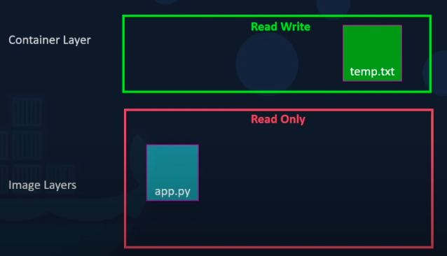

# Docker

## Šta je Docker?

`Docker` je projekat otvorenog koda koji nam omogućava `isporuku (deployment)` aplikacija unutar `kontejnera (container)` tako što nam daje dodatni nivo apstraktnosti i automatizacije [OS-level virtualization](https://en.wikipedia.org/wiki/OS-level_virtualization) za `Linux`.

Ideja je da zapakujemo kod i sve zavisnosti u jednu standardizovanu jedinicu koja se naziva `kontejner (container)`. To nam omogućava da brzo i pouzdano instaliramo aplikaciju na više okruženja. 

`Docker slika kontejnera (container image)` je samostalan paket softvera koji sadrži:
* kod
* okruženje
* sistemske alate
* biblioteke
* opcije

Slike kontejnera postaju kontejneri tokom izvršavanja. U slučaju `Docker slika`, slike postaju kontejneri u kada se pokrenu preko `Docker engine`-a.

Slike definišemo (izgrađujemo) preko `Dockerfile` datoteke koja se sastoji iz niza instrukcija. 


## Virtuelne mašine ili kontejneri?


Virtuelne mašine i kontejneri daju slične benefite i sličnu izolaciju, ali funkcionišu drugačije. 

**Kontejneri:**
- Apstrakcija na aplikacionom sloju koji spaja kod i zavisnosti u jedno.
- Više kontejnera mogu da budu na jednom operativnog sistemu i da dele isto jezgro (kernel).
- Obično su znatno manji od virtuelnih mašina: merna jedinica `MB`.
- Brzo se pokreću.

**Virtuelne mašine:**
- Apstrakcija na fizičkom nivou. Više servera umesto jednog servera na istoj mašini.
- `Hipervizor (Hypervisor)` omogućava da se više VM pokreće na jednoj mašini. 
- Svaka VM ima svoju kopiju operativnog sistema, aplikaciju, datoteke... (sve nezavisno). Zbog toga
    zauzimaju više memorije: merna jedinica `GB`.
- Sporo se pokreću. 

**Kad da koristimo kontejnere, a kad virtuelne mašine?**
- Virtuelne mašine su bolje rešenje kada aplikacije zahtevaju sve resurse i funkcionalnosti operativnog sistema ili kada nam je potrebno da imamo više različitih operativnih sistema na raspolaganju.
- Kontejneri su bolje rešenje kada želimo da maksimizujemo broj pokrenutih aplikacija na minimalnom broju servera.


## Prednosti i slučajevi upotrebe Docker-a

- Pojednostavljivanje konfiguracije;
- Izvoz razvojnog koda u produkcioni;
- `Multi-tenant` aplikacije: Više klijenata koristi istu aplikaciju. Kao da je aplikacija proizvod koji se prodaje više puta;
- Produktivnost razvijaoca;
- `Konsolidacija servera`: Jeftinije je imati više kontejner servera nego VM servera;
- Docker nudi alate za debagovanje;
- Brz izvoz (pokretanje kontejnera traje par milisekundi).

## Popularnost Docker-a

Vrlo moguće da će u budućnosti barem osnovno poznavanje `Docker`-a biti neophodno za većinu programerskih poslova.


## Instalacija Docker-a

Upustvo za instalaciju se nalazi na sledećem [linku](https://docs.docker.com/get-docker/).

- Neophodno je da se konfiguriše `docker` tako da može da se koristi i bez `sudo` opcije. 

## Osnovne komande (01_basic)

Napravili smo `Hello World!` program i želimo da ga `dokerizujemo`. Pišemo `Dockerfile`:
```dockerfile
FROM gcc:latest

COPY . /usr/src/hello-world

WORKDIR /usr/src/hello-world

RUN g++ -o hello-world main.cpp

CMD ["./hello-world"]
```
Analiza svake instrukcije:
* `FROM gcc:latest`: Dohvati već postojeću sliku za `gcc` kao `osnovni sloj` (detaljnije objašnjenje kasnije).
* `COPY . /usr/src/hello-world`: Kopiraj trenutni direktorijum `.` u `Docker sliku` na putanju `/usr/src/hello-world`.
* `WORKDIR /usr/src/hello-world`: Postavi putanju `/usr/src/hello-world` kao putanju za radni direktorijum.
* `RUN g++ -o hello-world main.cpp`: Izvrši komandu (u ovom slučaju kompiliraj c++ kod).
* `CMD ["./hello-world"]`: Podrazumevana opcija (komanda) za kontejner. Ovo npr. može da bude pokretanje servera.

Sada je potrebno da izgradimo našu novu sliku preko komande `docker build [PATH]`. **Napomena:** Za sve `docker` komande postoje `man` strane. Argument ove komande je putanja do direktorijuma gde se nalazi `Dockerfile`. U našem slučaju je to trenutni direktorijum `.`. Opcijom `-t` dajemo ime slici (inače je ime `none`):
* `docker build -t hello-world .`

Recimo da naš program ima grešku u kodu:

```c++
#include <iostream>

int main()
{
    std::cout << "Hello World!" << std::endl;
    return 0;
}
```
Očekivani oblik izlaza:

```
Sending build context to Docker daemon  3.072kB
Step 1/5 : FROM gcc:latest
latest: Pulling from library/gcc
6c33745f49b4: Pull complete 
ef072fc32a84: Pull complete 
c0afb8e68e0b: Pull complete 
d599c07d28e6: Pull complete 
f2ecc74db11a: Pull complete 
1d0bc4d838cf: Pull complete 
fe0232482858: Pull complete 
9e3dd67247b0: Pull complete 
c88ba171063a: Pull complete 
Digest: sha256:9a4fa1492f601ac4dbdca4c6ab4879499a4ac513a5c16bd17f03f48dbdb77383
Status: Downloaded newer image for gcc:latest
 ---> f39d9e39afdb
Step 2/5 : COPY . /usr/src/hello-world
 ---> cfa9937378d4
Step 3/5 : WORKDIR /usr/src/hello-world
 ---> Running in 51b0a310a38e
Removing intermediate container 51b0a310a38e
 ---> f21a201bf8bc
Step 4/5 : RUN g++ -o hello-world main.cpp
 ---> Running in cad02a16ce37
main.cpp: In function 'int main()':
main.cpp:5:32: error: expected ';' before 'return'
    5 |     std::cout << "Hello World!"
      |                                ^
      |                                ;
    6 |     return 0;
      |     ~~~~~~                      
The command '/bin/sh -c g++ -o hello-world main.cpp' returned a non-zero code: 1
```
Prvi put čekamo jako dugo za izgradnju slike, ali nakon toga je znatno brže, jer su slojevi keširani. Svaki korak nam predstavlja jedan sloj. Osnovni sloj je zasnovan na instrukciji `FROM gcc:latest`. To je 
zapravo slika koja predstavlja osnovu za našu sliku. Svaki sloj predstavlja ulaz u sledeći sloj koji se "nadograđuje". `Docker` je već uspešno izgradio prva četiri sloja. Ako ispravimo kod i pokrenemo opet sliku, dobićemo sledeći očekivani rezultat:

```
Sending build context to Docker daemon  3.072kB
Step 1/5 : FROM gcc:latest
 ---> f39d9e39afdb
Step 2/5 : COPY . /usr/src/hello-world
 ---> 5d1c3c9908ea
Step 3/5 : WORKDIR /usr/src/hello-world
 ---> Running in ab401403a6ce
Removing intermediate container ab401403a6ce
 ---> 5d938885e2e1
Step 4/5 : RUN g++ -o hello-world main.cpp
 ---> Running in 1d4c1a3e74ea
Removing intermediate container 1d4c1a3e74ea
 ---> 62eb52395158
Step 5/5 : CMD ["./hello-world"]
 ---> Running in eb1235f928ee
Removing intermediate container eb1235f928ee
 ---> e83e41d7d431
Successfully built e83e41d7d431
Successfully tagged hello-world:latest
```
Proverimo da li se slika nalazi na listu postojećih slika:
* `docker image ls`. Očekivani rezultat:

```
REPOSITORY          TAG                 IMAGE ID            CREATED             SIZE
hello-world         latest              c329d9d73ac7        55 seconds ago      1.19GB
gcc                 latest              f39d9e39afdb        23 hours ago        1.19GB
```
Informacije (Zanemarimo ostale slike pored ove dve):

* `REPOSITORY`: ime
* `TAG`: verzija 
* `IMAGE ID`: jedinstveni `ID` 
* `CREATED`: proteklo vreme od kreiranja
* `SIZE`: dimenzija

Ako stavimo za `TAG` `latest` dobijamo poslednju verziju te slike. Puno ime slike je `REPOSITORY:TAG`. Primeri: `gcc:10.2`, `gcc:9`, `gcc:latest`.

Ostalo je još samo da pokrenemo kontejner komandom `docker run [OPTIONS] [IMAGE:TAG]`
* `docker run --name helloworld hello-world:latest`. Očekivani izlaz:

```
Hello World!
```
Možemo da pokrenemo `docker ps` da izlistamo sve aktivne kontejnere:
* `docker ps`. Očekivani izlaz:

```
CONTAINER ID        IMAGE               COMMAND             CREATED             STATUS              PORTS               NAMES
```
Nemamo `helloworld` u aktivnim kontejnerima, jer se aplikacija završila. Možemo da izlistamo sve kontejnere tako što dodamo opciju `-a`:

* `docker ps -a`. Očekivani oblik rezulata:

```
CONTAINER ID        IMAGE                COMMAND             CREATED             STATUS                     PORTS               NAMES
6268111c8dfd        hello-world:latest   "./hello-world"     2 minutes ago       Exited (0) 2 minutes ago                       helloworld
```
- Kontejner je pokrenut i završen pre `2` minuta.

- Sada znamo da izvedemo ceo sledeći proces:


**Napomena:** Ako pokušamo da pokrenemo neku sliku koji trenutno nemamo, a postoji na "internetu", onda će se izvršiti `docker pull` tj. dohvatiće se slika. Primer `docker run nginx`.

## Docker Hub (01_basic)

`Docker Hub` je `cloud-based` sistem za čuvanje `docker` slika. Na taj način možemo da delimo slike sa drugim korisnicima. Potrebno je da napravimo nalog na sledećem [linku](https://hub.docker.com/).

- Imamo baš dobru i korisnu sliku. Želimo da je podelimo na `Docker Hub`.
- Idemo na [Docker repositories](https://hub.docker.com/repositories) i pravimo repozitorijum:


- Potrebno je da se ulogujemo na `Docker hub` preko terminala:
    * `docker login --username=[YourHubUsername]`
- Nakon ove komande je potrebno da unesemo šifru. Očekivani oblik rezultata:
```
Password: 
WARNING! Your password will be stored unencrypted in SOME/PATH
Configure a credential helper to remove this warning. See
https://docs.docker.com/engine/reference/commandline/login/#credentials-store

Login Succeeded
```

- Postavljamo `tag` na sliku komandom: `docker tag`:
    * U mom slučaju: `docker tag hello-world:latest robotmurlock/helloworld:1.0`
    * U opštem slučaju: `docker tag local-image-name:local-image-tag docker-hub-username/docker-hub-repo:docker-hub-image-tag`
- Guramo sliku na `Docker Hub`:
    * `docker push robotmurlock/helloworld:1.0`
- Očekivani oblik rezultata:
```
The push refers to repository [docker.io/robotmurlock/helloworld]
be292643693d: Pushed 
9418ea5f025d: Pushed 
c680d3a2590f: Mounted from library/gcc 
39b9e1d962cf: Mounted from library/gcc 
0f2dba48740e: Mounted from library/gcc 
bc9cf3b95e72: Mounted from library/gcc 
da87e334550a: Mounted from library/gcc 
c5f4367d4a59: Mounted from library/gcc 
ceecb62b2fcc: Mounted from library/gcc 
193bc1d68b80: Mounted from library/gcc 
f0e10b20de19: Mounted from library/gcc 
1.0: digest: sha256:5c9fcada5cc1276a324072588027e978ef8c330e90fefd129c231da28b6013a4 size: 2630
```
- Očekivani oblik rezultata na `Docker Hub`-u:


- Očekivani rezultat za `docker image ls`:
```
REPOSITORY                TAG                 IMAGE ID            CREATED             SIZE
hello-world               latest              c329d9d73ac7        38 minutes ago      1.19GB
robotmurlock/helloworld   1.0                 c329d9d73ac7        38 minutes ago      1.19GB
gcc                       latest              f39d9e39afdb        23 hours ago        1.19GB
```
Sada želimo da obrišemo `hello-world` i `robotmurlock/helloworld` slike komandom `docker image rm` ili `docker rmi` skraćeno. Potencijalno je potrebno da se doda opcija `-f` za forsiranje brisanja ako neki kontejner koristi ovu sliku (brisanje je neophodno čak i ako taj kontejner nije trenutno aktivan):
* `docker rmi hello-world:latest`
* `docker rmi robotmurlock/helloworld:1.0 -f`

Izgubili smo našu sliku, ali nema potrebe za brigom. Možemo opet da je dohvatimo sa `Docker Hub`-a, preko `docker pull` komande:
* `docker pull robotmurlock/helloworld:1.0`

- Očekivani oblik rezultata za `docker image ls`:
```
REPOSITORY                TAG                 IMAGE ID            CREATED             SIZE
robotmurlock/helloworld   1.0                 c329d9d73ac7        43 minutes ago      1.19GB
gcc                       latest              f39d9e39afdb        24 hours ago        1.19GB
```
- Poslednju stvar koju želimo da odradimo je da testiramo ovu sliku tako što napravimo kontejner:
    * `docker run --name another-helloworld robotmurlock/helloworld:1.0`
- Očekivani rezultat:
```
Hello World!
```
- Ako pokrenemo komandu `docker ps -a`, trebalo bi da vidimo da je kontejner `another-helloworld` sa slikom `robotmurlock/helloworld:1.0` bio prethodno pokrenut.

## Promenljive i portovi (02_flaskserver)

Imamo [flask](https://flask.palletsprojects.com/en/2.0.x/) server koji se sastoji od `app.py` (aplikacija) i `index.html` (sadržaj):
- `app.py`:
```python
from flask import Flask, render_template
import os
app = Flask(__name__)

color = os.environ.get('BACKGROUND_COLOR')

@app.route('/')
def hello_world():
    return render_template('index.html', color=color)

if __name__ == '__main__':
    app.run(host='0.0.0.0')
```
- `index.html`:
```python
<!doctype html>
<html>
  <head>
    <title>Pirate server</title>
  </head>
    <body style="background-color:{{color}}">
    <p>Under a black flag we sail and the sea shall be our empire.</p>
    <p>Who am I? I’m Captain Jack Sparrow!</p>
  </body>
</html>
```
- Server prikazuje jednu stranicu sa odgovarajućom bojom pozadine `color`.
- Instalacija:
    * `sudo apt install python3`
    * `sudo pip3 install flask`
- Pokretanje:
    * `export FLASK_APP=app.py`
    * `flask run`
- **Napomena:** Potencijalno je neophodno da se napravi virtuelno okruženje da bi prethodna komanda radila:
    - `sudo apt install python3-venv`
    - `python3 -m venv venv`
    - `source venv/bin/activate`
    - `pip install Flask`
- Očekivani izlaz:
```
 * Serving Flask app "app.py"
 * Environment: production
   WARNING: This is a development server. Do not use it in a production deployment.
   Use a production WSGI server instead.
 * Debug mode: off
 * Running on http://127.0.0.1:5000/ (Press CTRL+C to quit)
```
- Potrebno je da otvorimo link u pretraživaču. Očekivani rezultat:


- Pogledajmo sledeću liniju:
```python
color = os.environ.get('BACKGROUND_COLOR')
```
- Želimo da promenimo boju pozadine i potrebno je da pokrenemo sledeću komandu `export BACKGROUND_COLOR=[COLOR]`:
    * `export BACKGROUND_COLOR=red`
- Pokrećemo opet server. Očekivani rezultat:


Zašto je ovo ovako komplikovano realizovano kad može u kodu da stoji `color = 'red'`? Ako želimo da dokerizujemo aplikaciju, a ova promenljiva može potencijalno da se menja kasnije (kao i mnoge druge), onda je potrebno da opet izgradimo sliku za aplikaciju nakon svake promene u kodu. Umesto toga možemo da stavimo `promenljivu okruženja (enviroment promenljivu)` za boju pozadine. Ako je potrebno da se promeni pozadina, dovoljno je samo da opet pokrenemo sliku sa drugom vrednosću za tu promenljivu.


Želimo da dokerizujemo naš server kako bismo mogli da postavimo na unajmljeni server. Neophodne stvari:

- Potrebno je da se instalira `python`, ako već nije instaliran.
- Potrebno je da se instalira `pip`, ako već nije instaliran.
- Potrebno je da se instalira `flask`, ako već nije instaliran.
- Potrebne biblioteke se obično definišu u `requirements.txt` i instaliraju se sledećom komandom:
    * `pip install -r requirements.txt`
- Na osnovu ovih informacije možemo da napišemo naš `Dockerfile`:
```dockerfile
FROM ubuntu:20.04

RUN apt-get update -y && \
    apt-get install -y python3-pip python3-dev

COPY . /usr/src/flaskserver

WORKDIR /usr/src/flaskserver

RUN pip install -r requirements.txt

CMD ["python3", "app.py"]
```
- **Slojevi**:
  - Osnovni sloj je `ubuntu:20.04`
  - Instalacija `python`-a.
  - Kopiranje datoteka.
  - Postavljanje radnog direktorijuma.
  - Instalacija svih potrebnih biblioteka za `python`, što je u ovom slučaju samo `flask`.

- Pravimo sliku:
    `docker build -t flaskserver .`
- Očekivani rezultat za komandu `docker image ls`:
```
REPOSITORY                TAG                 IMAGE ID            CREATED             SIZE
flaskserver               latest              c10ae5336e0d        13 seconds ago      432MB
```

- Sada možemo da pokrenemo server sa crvenom bojom pozadine kao kontejner:
    * `docker run --name red --network="host" -e BACKGROUND_COLOR=red flaskserver:latest`
- **Napomena:** Da bismo imali pristup dokerizovanom serveru na `localhost`-u, potrebno je da se doda opcija `--network="host"`.
- Možemo da pokrenemo i server sa plavom bojom bez da pravimo opet sliku:
    * `docker run --name blue --network="host" -e BACKGROUND_COLOR=blue flaskserver:latest`
- Ako hoćemo da pokrenemo opet isti kontejner (isto ime), potrebno je da obrišemo stari:
    * `docker rm red`
    * `docker rm blue`

Sve informacije o kontejneru možemo da vidimo preko komande `docker inspect [NAME]`. Rezultat je `json`. Filtrirajmo `ENV` promenljive. Očekivani oblik rezultata za `docker inspect blue` (ako je obrisan, treba da se napravi opet ili da se koristi drugi kontejner):

```
"Env": [
    "BACKGROUND_COLOR=blue",
    "PATH=/usr/local/sbin:/usr/local/bin:/usr/sbin:/usr/bin:/sbin:/bin"
],
```
- Ako imamo više takvih promenljivih, efikasnije je da ih zapišemo u datoteku. Pravimo `env.txt` datoteku sa sledećim sadržajem:

```
BACKGROUND_COLOR=pink
```
- Pravimo novi kontejner na osnovu iste slike:
    * `docker run --name pink --network="host" --env-file env.txt flaskserver:latest`
- **Napomena:** Umesto `--network="host"` možemo da pišemo i `-p 5000:5000` i da otvorimo server preko `localhost:5000`:
    * `docker run --name pink -p 5000:5000 --env-file env.txt flaskserver:latest`
- Svaki kontejner ima svoji `IP + PORT`. Možemo da preslikamo ovo na port na `localhost`-u preko opcije `-p` kao što smo i uradili u prethodnom slučaju. Ovo nam omogućava da pokrenemo više servera u isto vreme na različitim portovima.
- Hoćemo da napravimo još jedan server sa belom pozadinom na portu `5005` (može u drugom terminalu):
    * `docker run --name white -p 5005:5000 flaskserver:latest`
- Očekivani rezultat:
    * `http://localhost:5005/` ima belu pozadinu.
    * `http://localhost:5000/` ima roze pozadinu.

- **Napomena:** Ako želimo da pokrenemo kontejner, ali da nam ne ostane u terminalu, potrebno je da dodamo opciju `-d`.


## ENTRYPOINT i CMD (03_anotherhello)

- Imamo sledeći program:
```c++
#include <iostream>
#include <cstring>

int main(int argc, char** argv)
{
    if(argc < 2)
    {
        std::cout << "Wrong number of arguments!" << std::endl;
        return -1;
    }

    int n = atoi(argv[1]);
    for(int i=0; i<n; i++)
        std::cout << "Hello World!" << std::endl;

    return 0;
}
```
- Sve što ovaj program radi je: Prima kao argument komandne linije broj `n` i ispisuje `n` puta `Hello World!`.
- Imamo već napisan `Dockerfile` koji je veoma sličan onom iz `01_basic` zadataka:
```dockerfile
FROM gcc:latest

COPY . /usr/src/hello

WORKDIR /usr/src/hello

RUN g++ -o hello main.cpp

ENTRYPOINT ["./hello"]

CMD ["5"]
```
- **Koja je razlika između ENTRYPOINT i CMD?**
    * `ENTRYPOINT` možemo da posmatramo kao "prefiks komande" tj. deo koji je "uvek" tu kao prefiks.
    * `CMD` možemo da posmatramo kao podrazumevani "sufiks komande" tj. deo koji je "uvek" tu, osim ako se drugačije ne kaže.
- Pravimo sliku:
    * `docker build -t hello .`
- Pokrenimo kontejner:
    * `docker run hello`
- Očekivani rezultat:
```
Hello World!
Hello World!
Hello World!
Hello World!
Hello World!
```
- Ako ništa ne navedemo, poziva se komanda oblika `[ENTRYPOINT] [CMD]`.
- Pokrenimo kontejner sa argumentom `3`:
    * `docker run hello 3`
- Očekivani rezultat:
```
Hello World!
Hello World!
Hello World!
```
- Ako pokrećemo kontejner kao `docker run [IMGNAME] [ARGS]`, poziva se komanda oblika `[ENTRYPOINT] [ARGS]` tj. zamenjuje se podrazumevani deo `[CMD]` sa `[ARGS]`.
- Možemo čak i da zamenimo `[ENTRYPOINT]` deo opcijom `--entrypoint [VALUE]`:
    * `docker run --entrypoint ls`
- Očekivani rezultat:
```
Dockerfile
hello
main.cpp
```

## Kontejneri i skladište (04_database)

Pogledajmo kod `04_database/main.cpp`. Imamo program koji dodaje rezultate ispita u bazu podataka koju ovde simuliramo preko `database.txt` datoteke. Ako prevedemo program, očekivani sadržaj datoteke `database.txt` je:
```
indeks: mi22173, ocena: 7
indeks: mi22174, ocena: 8
indeks: mi22175, ocena: 9
indeks: mi22176, ocena: 5
indeks: mi22177, ocena: 7
```

- Napisan je i odgovarajući `Dockerfile`:

```dockerfile
FROM gcc:latest

COPY . /usr/src/database

WORKDIR /usr/src/database

RUN g++ -o database main.cpp

CMD ["./database"]
```

- Želimo da dokerizujemo ovaj program:
    * `docker build -t database .`
- Pokrećemo kontejner:
    * `docker run --name database_v1.0 database`
- Očekivani rezultat:
```
indeks: mi22173, ocena: 7
indeks: mi22174, ocena: 8
indeks: mi22175, ocena: 9
indeks: mi22176, ocena: 5
indeks: mi22177, ocena: 7
```
- **Problem**: Pri završetku kontejnera se brišu sve izmene nastale u tom kontejneru (izmene su lokalizovane). Ovo je veoma nezgodno ako imamo bazu podataka na serveru i pukne nam server. U tom slučaju gubimo celu bazu podataka, jer se izmene na kontejnerima ne odražavaju na slike. 
- Ako pokrenemo opet isti kontejner, dobićemo isti rezultat, a želimo da dobijemo nešto ovako (sa očuvanom memorijom):
```
indeks: mi22173, ocena: 7
indeks: mi22174, ocena: 8
indeks: mi22175, ocena: 9
indeks: mi22176, ocena: 5
indeks: mi22177, ocena: 7
indeks: mi22173, ocena: 7
indeks: mi22174, ocena: 8
indeks: mi22175, ocena: 9
indeks: mi22176, ocena: 5
indeks: mi22177, ocena: 7
```



- Srećom postoji opcija da se podaci čuvaju nezavisno od kontejnera. Pravimo `stalnu memoriju/particiju (volume)` koja se deli između korisnika i kontejnera.
- Kada pokrećemo novi `docker` kontejner, potrebno je da izvršimo povezivanje preko opcie `-v [VOLUME]:[PATH]`:
    * `mkdir data`
    * `docker run -v ${PWD}/data:/data database`, gde `${PWD}` predstavlja trenutnu radnu putanja (ne možemo direktno da navedemo relativnu putanju).
- Očekivani rezultat za `cat data/database.txt`:
```
indeks: mi22173, ocena: 7
indeks: mi22174, ocena: 8
indeks: mi22175, ocena: 9
indeks: mi22176, ocena: 5
indeks: mi22177, ocena: 7
```
- Ako pokrenemo opet kontejner, očekivani rezultat je:
```
indeks: mi22173, ocena: 7
indeks: mi22174, ocena: 8
indeks: mi22175, ocena: 9
indeks: mi22176, ocena: 5
indeks: mi22177, ocena: 7
indeks: mi22173, ocena: 7
indeks: mi22174, ocena: 8
indeks: mi22175, ocena: 9
indeks: mi22176, ocena: 5
indeks: mi22177, ocena: 7
```
- Alternativa je da napravimo posebno `docker` skladište:
    `docker volume create data_volume`
- Ovo skladište spajamo sa kontejnerom na sličan način:
    `docker run -v data_volume:/data database`

## Vežbanje (05_practice)

**Zadatak:** Pogledajte kod `main.py`. Potrebno je da se napravi slika za izvoz ove aplikacije.

## Vežbanje (06_practice)

**Zadatak:** Pogledajte kod za `server.py` i `client.py`. Potrebno je dokerizovati server tako da važi sledeće:

- Server se pokreće na `host` portu `12345`. 
- Server prihvata `GET` zahtev na sledećem url-u: `http://localhost:[PORT]/hello`
- Server vraća odgovor sa prefiksom `PREFIX` koji predstavlja `env` promenljivu okruženja. Podrazumevana vrednost za prefiks je `hey`.
- Server čuva `IP klijenta`, `vreme dobijanja zahteva` i `tekst zahteva` u bazu podataka koja se simulira kao `database.txt`
- Postarati se da se `database.txt` očuvava kada se kontejner prekine. 
- Nakon testiranja servera, podići sliku na `Docker Hub`.

# Docker - Napredni koncepti

## Docker - MySQL (07_mysql_server)

Ako nam je potrebna `mysql` baza podataka brzo i bez korišćenja mnogo resursa, možemo da napravimo `mysql` kontejner. Ovo je rešenje za manje aplikacije (u tom slučaju je čak i solidno rešenje).

Detaljno objašnjenje o postavljanju `mysql` servera možemo da pronađemo na sledećem [linku](https://phoenixnap.com/kb/mysql-docker-container). Odavde je izvučena `mysql/setup-mysql-server-container.sh` skripta:
```bash
docker pull mysql/mysql-server:latest

docker run --name=simple-mysql-server-db -d mysql/mysql-server:latest

apt-get install mysql-client

docker exec -it simple-mysql-server-db mysql -u root -p \
| echo "ALTER USER 'root'@'localhost' IDENTIFIED BY 'Root_12345';"

mkdir -p /root/docker/simple-mysql-server-db/conf.d
echo '[mysqld]' >> /root/docker/simple-mysql-server-db/conf.d/my-custom.cnf
echo 'max_connections=250' >> /root/docker/simple-mysql-server-db/conf.d/my-custom.cnf
```
- Prethodna skripta podrazumeva preuzimanje slike, ažuriranje naloga (root) i konfigurisanje `mysql`-a.
- Za pokretanje `simple-mysql-server-db` kontejnera koristimo `mysql/run-mysql-server.sh` skriptu:
```bash
docker run \
--detach \
--name=simple-mysql-server-db \
--env="MYSQL_ROOT_PASSWORD=Root_12345" \
--publish 6603:3306 \
--volume=/root/docker/simple-mysql-server-db/conf.d:/etc/mysql/conf.d \
mysql
```
- `--detach` ili `-d` opciju koristimo ako ne želimo da nam terminal ostane otvoren u kontejneru tj. želimo da se kontejner pokreće u "pozadini".
- `--publish` je isto što i `-p`.
- `--volume` je isto što i `-v`.

- Testiranje da li sve radi kako treba preko skripte `test.sh`:
```bash
mysql -uroot -pRoot_12345 -h127.0.0.1 -P6603 -e 'show global variables like "max_connections"';
```
- Opcije:
    * `-u`: Ime korisnika. U ovom slučaju je ime korisnika `root`.
    * `-p`: Šifra korisnika.
    * `-h`: IP adresa. Dobijena na osnovu: `docker inspect simple-mysql-server-db | grep IPAddress`.
    * `-e`: komanda.
    * `-P`: port.
- Šta smo ovime dobili za sada? Imamo kontejner koji koristimo kao `mysql-server` i kojem možemo da pristupimo preko odgovarajuće adrese (IP + port). Za testiranje kontejnera postoje dve skripte:
    * `mysql/test.sh`
    * `mysql/connect.sh`
- Ovo su komande koje možemo ručno ivršiti u terminalu (skripte predstavljaju jednu komandu koja nije toliko dugačka), ali poznavanje `mysql` komandi nam nije trenutno neophodno toliko.
- Prva skripta treba da da kao rezultat `250`. Ova skripta samo testira da li `mysql-server` radi kako treba.
```bash
mysql -uroot -pRoot_12345 -h127.0.0.1 -P6603 -e 'show global variables like "max_connections"';
```
- Preko druge skripte mogu da se testiraju upiti:
```bash
mysql -uroot -pRoot_12345 -h127.0.0.1 -P6603
```
- Primeri za testiranje:
```sql
create database practice;
```
```sql
use practice;
```

```sql
create table customer(name varchar(255), surname varchar(255));
```
```sql
insert into customer (name, surname) values ("Hello", "World!");
```
```sql
select * from customer;
```

- Očekivani rezultat:

```
+-------+---------+
| name  | surname |
+-------+---------+
| Hello | World!  |
+-------+---------+
```

- **Napomena:** Pošto smo izdvojili skladište za kontejner. Kada se kontejner isključi, može opet da se pokrene i baza podataka će ostati očuvana. Uključivanje i isključivanje kontejnera:
    * `docker start simple-mysql-server-db`
    * `docker stop simple-mysql-server-db`
- Za vežbu možemo da napravimo jednostavnu sliku koja dodaje par klijenata u bazu podataka. Kontejner pokrećemo na sledeći način:
    * `docker run --network="host" new-customers`
- Ovde se podrazumeva komunikacije između dva kontejnera. To može direktno preko `bridge` mreže, ali zbog jednostavnosti, ovde mreža novog kontejnera nije izolovana od `host`-a (nas). To znači da možemo bez problema da pristupamo `http://localhost:[PORT]` adresama `host`-a. Setimo se da je adresa za `mysql-server` sledeća: 
    * `http://localhost:6603`
- Kako ovo znamo? Ako opet pogledamo `mysql/run-mysql-server.sh`, vidimo da je izvšeno mapiranje porta u `6603:3306`. **Napomena:** `localhost` je `alias` za `127.0.0.1`.
- Pogledajmo `sql` skriptu `mysql-test-image/input.sql` koju treba da dokerizujemo:

```mysql
create database if not exists practice;
use practice;

create table if not exists customer(
    name varchar(255),
    surname varchar(255)
);

insert into 
    customer (name, surname)
values 
    ('Jeff', 'Mynameis'),
    ('Robot', 'Murlock'),
    ('Hell', 'boy');
```
- Upiti redom:
    * Pravi se baza `practice` (ako ne postoji);
    * Postavlja `practice` bazu kao podrazumevanu u narednim upitima;
    * Pravi se tabela `customer` (ako ne postoji);
    * Dodaju se redovi u `customer` tabelu u `practice` bazi.
- Možemo da iskoristimo `mysql` sliku kao osnovu za našu sliku. To čini naš posao poprilično jednostavnim. U suštini, sve što je potrebno da uradimo je da pokrenemo `input.sql` skriptu preko `mysql` servera na odgovarajućoj adresi:
```dockerfile
FROM mysql:latest

COPY . /usr/src/database

WORKDIR /usr/src/database

CMD mysql -uroot -pRoot_12345 -h127.0.0.1 -P6603 < input.sql
```
- Ovo je nalik na `mysql/connect.sh`, samo što `input.sql` zamenjuje ulaz preko terminala.
- Sada možemo da napravimo sliku:
    * `docker build -t mysql-test-image .`
- Preko nove slike možemo da pravimo kontejnere koji izvršavaju `input.sql` skriptu:
    * `docker run --network=host mysql-test-image`
- Treba da testiramo da li je pokretanje kontejnera uspešno tj. da li je pokrenuta operacija ispravno izvršena. Za to možemo opet da iskoristimo `connect.sh` tj. `mysql-test-image/connect.sh`:
    * `bash connect.sh`
- Testiranje:
    * `use practice;`
    * `select * from customer;`
- Očekivani rezultat:
```
+-------+----------+
| name  | surname  |
+-------+----------+
| Jeff  | Mynameis |
| Robot | Murlock  |
| Hell  | boy      |
+-------+----------+
3 rows in set (0.00 sec)
```

## Docker Compose (08_compose)


Prethodni zadatak je bio uvod za `Docker Compose` alat. Tada smo koristili dva kontejnera koji su komunicirali međusobno kako bismo izvršili neku operaciju. Imali smo dva kontejnera:
    * `simple-mysql-server-db` tj. baza podataka.
        * `mysql-test-image` čiji je zadatak samo da testira drugi kontejner.

- U realnom slučaju nema smisla da pravimo `mysql-test-image` kontejner, jer njega može da zameni jedna komanda u terminalu. Realniji slučaj je da umesto ove slike koristimo `flaskserver` (što ćemo i da radimo u ovom primeru):


### Projekat
- Napravljen je `flaskserver` koji je implementiran u `server/app.py` i nudi sledeće usluge klijentima.
- Server se pokreće na portu `5000`.
- Server nudi sledeće usluge:
    * `GET http://localhost:5000/` vraća broj iz uniforme raspodele `U[0, 1]` tj. realan broj između `0` i `1`;
    * `GET http://localhost:5000/range?start=X&end=Y` vraća broj iz diskretne ravnomerne raspodele tj.
    vraća ceo broj između `X` i `Y`;
    * `GET http://localhost:5000/sequence?size=X` vraća X brojeva iz `U[0, 1]`.
- Server čuva sledeće informacije u bazi podataka za svaki zahtev:
    * `type`: Tip zahteva. Moguće vrednosti su `basic`, `range`, `sequence`.
    * `result`: Odgovor servera.
    * `client_ip`: IP klijenta koji je poslao zahtev.
    * `time`: Datum i vreme kada je dobijen zahtev.

- Skripta `client.py` služi za testiranje servera.
- Skripta `connect.sh` služi za testiranje baze podataka.
- Šifra za `root` nalog za bazu podataka je `MYSQL_ROOT_PASSWORD=Root_12345`, ako je `mysql` instaliran preko skripte iz prethodnog zadatka.

### Analiza zahteva
1. Potrebno je da se dokerizuje aplikacija. 
2. Napraviti posebnu sliku za `mysql-server` i posebnu sliku za `flaskserver`
3. Server baze podataka se pokreće na portu `10001` na `host`-u.
4. Server aplikacije se pokreće na portu `5000`.
5. Postarati se da se podaci iz baze podataka ne brišu u slučaju prekida rada.
6. Server aplikacije ne može da radi bez baze podataka, pa je potrebno naći rešenje kad ovaj slučaj nije ispunjen.

### Yaml datoteke

Pre nego što pređemo na priču o `docker-compose`, potrebno je da naučimo da pišemo i čitamo `yaml` datoteke. Ideja ovog jezika je da se pišu struktuirani podaci za konfiguraciju i da bude veoma čitljiv. Sličan je `json`-u. Ekstenzija za ove datoteke je `.yml`

- Ovo je primer `yaml` datoteke:
```yaml
quiz: 
  description: >
    "This Quiz is to learn YAML."
  questions:
    - ["How many planets are there in the solar system?", "Name the non-planet"]
    - "Who is found more on the web?"
    - "What is the value of pi?"
    - "Is pluto related to platonic relationships?"
    - "How many maximum members can play TT?"
    - "Which value is no value?"
    - "Don't you know that the Universe is ever-expanding?"
 
  answers:
    - [8, "pluto"]
    - cats
    - 3.141592653589793
    - true
    - 4
    - null
    - no
# explicit data conversion and reusing data blocks
extra:
  refer: &id011 # give a reference to data
    x: !!float 5 # explicit conversion to data type float
    y: 8
  num1: !!int "123" # conversion to integer
  str1: !!str 120 # conversion to string
  again: *id011 # call data by giving the reference
```

### docker-compose.yml

Alat `docker-compose` služi za definisanje i pokretanje `Docker` aplikacija sa više kontejnera. Konfigurisanje se definiše u `docker-compose.yml` datoteci. 
- Postoji više verzija `docker-compose` i to je prva stavka koja se definiše:
    * `version '3'`
- Nove verzije imaju nove funkcionalnosti.
- Sledeća stavka su servisi tj. `services`. Ovde nabrajamo slike i unutar svake od tih slika definišemo njihove konfiguracije. Naše slike su (2):
    * `mysql-server-db`
    * `flask-server`
- Ideja je da sve slike koje treba da `build`-ujemo čuvamo u poddirektorijumima. To znači da naš glavni direktorijum treba da izgleda ovako:

```bash
08_compose/*
    docker-compose.yml
    server/*
        app.py
        Dockerfile
        requirements.txt
```

#### Konfiguracija za `mysql-server-db`

-  Nije potrebno da se `build`-uje nova slika tj, koristi se već postojeća. Potrebno je da se to naglasi opcijom `image: mysql`. Ovim se traži odgovarajuća slika preko koje se pokreće neophodan kontejner.
-  Definisanje promenljivih okruženja: 
```yaml
environment:
    - MYSQL_ROOT_PASSWORD=Root_12345
```
- Mapiranje portova (3):
```yaml
ports:
    - 10001:3306
```
- Podešavanje skladišta (5):
```yaml
volumes:
    - /root/docker/mysql-server-db/conf.d:/etc/mysql/conf.d
```
- Konačna konfiguracija za `mysql-server`:
```yaml
mysql-server-db:
    image: mysql
    environment:
        - MYSQL_ROOT_PASSWORD=Root_12345
    ports:
        - 10001:3306
    volumes:
        - /root/docker/mysql-server-db/conf.d:/etc/mysql/conf.d
```

#### Konfiguracija za `flask-server`

- **Napomena:** Da bi se server testirao bez Docker-a, neophodno je da se instalira odgovarajuća biblioteka: `pip3 install mysql-connector-python`
- Potrebno je prvo da napravimo `Dockerfile` za naš `flaskserver`. Ovo smo već radili u prethodnim zadacima:
```dockerfile
FROM python:latest

COPY . /usr/src/flaskserver

WORKDIR /usr/src/flaskserver

RUN pip install -r requirements.txt

CMD ["python", "app.py"]
```
- Sve potrebno za `build`-ovanje ovog kontejnera poddirektorijumu `server`. Zbog toga je prva stvar za konfiguraciju ove slike `build: ./server`, gde je `./server` relativna putanja do `flaskserver` direktorijuma gde se nalazi `Dockerfile`.
- Ne vršimo izolaciju od `host` mreže: `network_mode: host`. To znači da će server da se pokreće na portu `5000` tj. onako kako je specifikovano u `app.py`.
- Server može da se prekine ako se počne sa radom pre nego što se baza podataka pripremi (prekid programa), a baza podataka se sporije pokreće od servera. Naivno rešenje je `restart: on-failure`. Svaki put kada server pukne (jer nije mogao da se poveže sa bazom podataka), on se opet pokreće.
- Konačna konfiguracija za `flask-server`:
```yaml
flask-server:
    build: ./server
    network_mode: host
    restart: on-failure
```

#### Konačno rešenje:

```yaml
version: '3'
services: 
    mysql-server-db:
        image: mysql
        environment:
            - MYSQL_ROOT_PASSWORD=Root_12345
        ports:
            - 10001:3306
        volumes:
            - /root/docker/mysql-server-db/conf.d:/etc/mysql/conf.d

    flask-server:
        build: ./server
        network_mode: host
        restart: on-failure
```

- Sada server pokrećemo sa `docker-compose up` ili `docker-compose up --build`, ako je potrebno da se opet `build`-uju slike.

### Docker cmake (09_cmake) 

U ovom primeru je dokerizovan proces kompilacije nekog `C++` programa, gde se izlaz izlaz nakon podizanja kontejnera nalazi u `build` direktorijumu.

Ako se pozicioniramo u direktorijum `09_cmake` možemo da prevedemo `cmake` projekat tako što koristimo `docker`. Novije verzije `ubuntu` bi navodno trebalo da imaju `cmake` instaliran odmah. Ideja je da se ovaj primer proširi tako da mogu da se prevedu `qt` aplikacije. 

```yaml
version: '3'
services:
  app:
    build: ./code
    volumes:
      - ./build:/usr/workdir/result
```

- Pokrenuti sa `docker-compose up`.

## Reference

[\[1\] docker](https://www.docker.com/)

[\[2\] vm-vs-container](https://www.backblaze.com/blog/vm-vs-containers/)

[\[3\] docker-use-case](https://data-flair.training/blogs/docker-use-cases/)

[\[4\] free-code-camp-docker](https://www.youtube.com/watch?v=fqMOX6JJhGo&t=5897s&ab_channel=freeCodeCamp.org)

[\[5\] c++-docker-container](https://devblogs.microsoft.com/cppblog/c-development-with-docker-containers-in-visual-studio-code/)

[\[6\] mysql-server](https://phoenixnap.com/kb/mysql-docker-container)

[\[7\] yaml-tutorial](https://www.softwaretestinghelp.com/yaml-tutorial/)